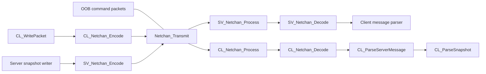
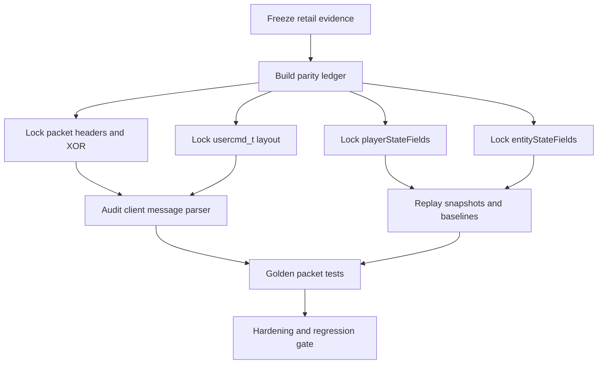
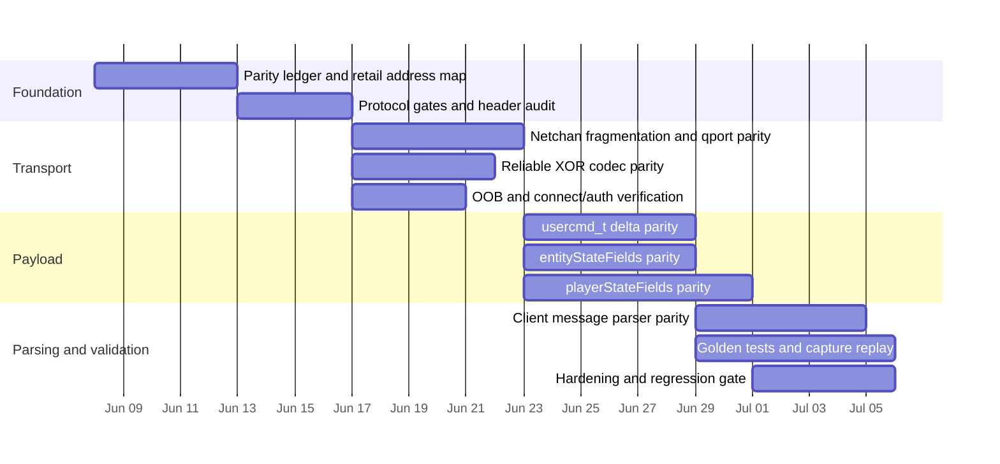

# Detailed Plan for Full Retail Network Protocol Parity in QuakeLive-SRP

## Executive summary

The current `themuffinator/QuakeLive-SRP` codebase already exposes a substantial amount of Quake Live retail protocol work: it pins protocol version **91**, keeps the classic Quake III netchan fragmentation model, adds dedicated client/server reliable XOR wrappers around netchan traffic, extends `usercmd_t` deltas with `weaponPrimary` and `fov`, and extends `entityStateFields` with a Quake Live-specific tail field named `retailEventData`. The repository also carries reverse-engineering assets under `references/reverse-engineering/ghidra`, including a `quakelive_steam` bundle with `analysis_symbols.txt`, `decompile_top_functions.c`, and `functions.csv`, which is exactly the right starting point for retail-parity work. citeturn17view3turn22view0turn34view0turn34view1turn36view0turn46view1turn43view4

The two biggest remaining parity risks are not basic packet transport, but **semantic field parity** and **parser-edge behavior**. In particular, the public repository surface did not reveal the actual `playerStateFields` table or the full server-side client-message parser, while an independent Quake Live reimplementation notes that retail parity required **58 `playerStateFields` entries**, a **24-bit `pm_flags`**, **9 new Quake Live fields**, a refined `usercmd_t` layout, and an **extra byte after the three client-message header longs** in server-side parsing. Those are the highest-value Ghidra/Binary Ninja verification targets. citeturn38view3turn53search1

The most important technical clarification is that in the current code path, **out-of-band traffic is not Huffman-coded**. `MSG_InitOOB` and `MSG_BeginReadingOOB` set `msg->oob = qtrue`, and the OOB branches of `MSG_WriteBits` and `MSG_ReadBits` perform raw little-endian 8/16/32-bit writes and reads; the adaptive Huffman path is used in the regular bitstream path, not the OOB path. That means “Huffman on OOB” should be treated as a **retail verification question and negative-test target**, with one likely exception to investigate: profile-gated connect/auth flows, since the protocol layer does expose `NET_ProtocolUsesCompressedConnect()`. citeturn31view0turn31view2turn33view1turn49view0

The fastest route to full retail parity is therefore a two-track program: first, freeze a **source-of-truth parity ledger** that maps each focus area to exact retail functions, tables, offsets, and bit widths from Ghidra/Binary Ninja; second, build **golden encode/decode tests** at packet, message, and struct-delta levels so every refinement is checked against deterministic vectors and replayable captures. That approach minimizes the risk of “looks compatible” implementations that silently drift from retail behavior. citeturn22view0turn25view1turn53search1

## Evidence base and current repo state

The repository is already organized in a way that supports retail-parity work. In `qcommon.h`, the network layer declares the retail protocol version as **91**, exposes profile-gated behavior such as `NET_ProtocolUsesNetchanClientQport()`, `NET_ProtocolUsesReliableXorCodec()`, and `NET_ProtocolUsesCompressedConnect()`, and defines the classic `svc_*` and `clc_*` opcode families used by the Quake III/Quake Live message loop. The repository’s reverse-engineering tree includes Ghidra directories for `cgamex86`, `qagamex86`, and `quakelive_steam`, and the `quakelive_steam` bundle includes bulk artifacts like `analysis_symbols.txt`, `decompile_top_functions.c`, `exports.txt`, `functions.csv`, `imports.txt`, and `metadata.txt`. citeturn17view3turn49view0turn21view0turn22view0

The accessible Ghidra artifact surface also shows why a dedicated naming pass is needed before implementation. The public `analysis_symbols.txt` snippets are dominated by generic analysis labels such as `switchD_*`, `caseD_*`, and `Catch_All@...`, rather than cleanly named protocol functions. That means the repo already contains useful disassembly artifacts, but not yet a stable address-to-semantics index for the networking pipeline. Creating that index should be treated as a prerequisite, not as optional documentation cleanup. citeturn25view0turn25view1

On the source side, the repo’s transport stack is split in a sensible way. `qcommon/net_chan.c` still owns the classic sequence/fragment/qport mechanics, while Quake Live-specific XOR behavior lives in `client/cl_net_chan.c` and `server/sv_net_chan.c`. `qcommon/net_chan.c` also retains the old `Netchan_ScramblePacket` code under `#if 0`, mirroring Quake III’s disabled “probably futile” scramble path; that is important because it narrows the active parity scope to fragmentation, qport rules, and XOR wrappers rather than reintroducing a dead scramble layer. citeturn30view0turn30view1turn46view1turn43view4turn52view3

The message and snapshot path is also recognizably Quake III-derived, with selective Quake Live evolution. `MSG_InitOOB`/`MSG_BeginReadingOOB` flip a message into raw OOB mode, `MSG_Bitstream` flips it back into Huffman-backed bitstream mode, `CL_ParseServerMessage` dispatches `svc_serverCommand`, `svc_gamestate`, `svc_snapshot`, and `svc_download`, `CL_ParseGamestate` builds baselines via `MSG_ReadDeltaEntity`, and `CL_ParseSnapshot` reads the areamask, then `MSG_ReadDeltaPlayerstate`, then packet entities. That is a strong base, but it also means parity mistakes in field tables or parser offsets will cascade into every snapshot and baseline. citeturn31view0turn31view2turn33view1turn39view1turn40view0turn40view2turn38view3

That layout is also consistent with the official Quake III GPL release, which exposes the same broad message architecture, the same disabled scramble block, the same OOB-versus-bitstream split, and the same snapshot parse loop—making Q3 the right baseline reference, and Quake Live-specific diffs the real work item. citeturn50search0turn51view0turn52view3turn52view5turn52view6

## Parity analysis by focus area

| Focus area | Current repo artifact | Retail reference target | Likely gap and implementation priority |
|---|---|---|---|
| **netchan** | `qcommon/net_chan.c` still owns sequencing, fragmentation, qport handling, and OOB fragment headers; client qport is only sent when `NET_ProtocolUsesNetchanClientQport()` says so. The old scramble code is present but disabled. citeturn30view1turn30view2turn30view3turn17view3turn49view1turn52view3 | Retail `quakelive_steam` netchan functions in Ghidra/BN, plus packet captures showing sequence, qport, fragment start/length, and fragment-queue timing. | **Medium risk, high importance.** The base model looks right, but retail parity still depends on exact fragment ordering, qport gating, and whether any Quake Live-only pre/post-processing happens around `Netchan_Process()` and `Netchan_Transmit()`. |
| **Huffman on OOB data** | OOB mode is raw. `MSG_InitOOB` and `MSG_BeginReadingOOB` set `msg->oob = qtrue`; OOB write/read paths emit and consume raw little-endian 8/16/32-bit fields. The adaptive Huffman path is used only in non-OOB bitstream mode. citeturn31view0turn31view2turn33view1turn32view3turn33view0 | Retail connect/challenge/info/status/auth flows from disassembly and captures; confirm whether any profile-91 exception uses `Huff_Compress()` or block compression in connect/auth. | **High importance, low-to-medium implementation cost.** The default answer is probably “no Huffman on OOB,” but this must be hardened with explicit negative tests and a targeted audit of compressed connect/auth behavior because the protocol surface advertises `NET_ProtocolUsesCompressedConnect()`. citeturn49view0 |
| **XOR netchan encoding** | `client/cl_net_chan.c` and `server/sv_net_chan.c` implement the reliable XOR codec. Client→server uses `challenge ^ serverId ^ messageAcknowledge`, mixed with the acknowledged server command string. Server→client uses `challenge ^ outgoingSequence`, mixed with `lastClientCommandString`. Both sanitize `%` and high-bit chars by folding them to `'.'`. citeturn46view1turn43view4 | Retail Ghidra/BN functions, especially start offsets and string-source selection, plus packet captures to confirm exact skipped bytes and sequencing behavior. | **Highest-value transport task.** The current logic looks plausible and coherent, but this is the kind of area where a one-byte offset error or wrong command-ring source will produce nearly-correct traffic that still fails against retail. |
| **usercmd_t deltas** | `MSG_WriteDeltaUsercmd` and `MSG_WriteDeltaUsercmdKey` already serialize `weaponPrimary` and `fov` in addition to the classic Q3 fields, and the keyed path folds `serverTime` into the key. citeturn34view0turn34view1turn34view2 | Retail struct layout from Ghidra/BN. Independent Quake Live reimplementation notes that retail required `usercmd_t` offset reordering around offsets 21–25 and two extra byte fields. citeturn53search1 | **High risk, high priority.** The repo has clearly moved past pure Q3, but public snippets are not enough to prove that offsets, field order, and byte widths exactly match retail. |
| **playerStateFields** | The repo declares `MSG_WriteDeltaPlayerstate`/`MSG_ReadDeltaPlayerstate`, and `CL_ParseSnapshot` depends on them, but the public snippet surface did not expose the actual `playerStateFields` table. citeturn17view1turn38view3 | Retail disassembly plus Binary Ninja/Ghidra cross-reference. Independent Quake Live reimplementation reports **58 entries**, `pm_flags` as **24-bit**, `weaponPrimary`, and **9 new Quake Live-specific fields**. citeturn53search1 | **Highest-risk semantic gap.** Until the exact field order, count, offsets, and bit widths are frozen, snapshot parity remains provisional. |
| **entityStateFields** | The repo exposes a reordered `entityStateFields[]` table, extends it with `retailEventData`, and replaces the old Q3 “all fields must equal struct size” assert with a serialized-band calculation that tolerates recovered tail slots. citeturn36view0turn35view0turn35view1 | Retail field table from Ghidra/BN. Independent Quake Live work reports **58 entries**, reordering, and **gravity as int32**. citeturn53search1 | **High risk, high priority.** The repo is already intentionally diverging from Q3 here, which is good, but it also means every field count, order, and type must be verified against retail. |
| **client message parsing** | `CL_WritePacket` writes `serverId`, `serverMessageSequence`, `serverCommandSequence`, reliable commands, then `clc_move`/`clc_moveNoDelta`; `CL_ParseServerMessage` remains classic Q3-style on the client side. citeturn42view3turn39view1 | Retail server-side parser in Ghidra/BN. Independent Quake Live work says the server parser needed an **extra byte after the three header longs**. citeturn53search1 | **Highest-priority parser task.** This is the most likely reason for “almost works” client packets that fail only on retail. |

Two additional areas should be promoted into scope even though they sit just outside your listed core set. First, **gamestate/baseline/checksum-feed behavior** is tightly coupled to snapshot decoding, because `CL_ParseGamestate` rebuilds baselines and reads `checksumFeed` before system info and download state are reinitialized. Second, **connection/auth OOB behavior** should be scoped explicitly because the protocol layer advertises feature gates for compressed connect and platform-auth behavior. Third, an independent Quake Live implementation reports a **header-format difference involving removed `GENCHECKSUM` state**; even if your current transport works in SRP, it should be formalized in the parity ledger alongside the extra-byte parser check. citeturn40view0turn40view2turn40view3turn49view0turn53search1

## Implementation plan

The practical way to do this work is to treat the retail binary as the authority, Quake III GPL as the baseline, and QuakeLive-SRP as the implementation target. In other words: do not hand-edit parity into existence piecemeal. Build a ledger first, then generate or verify every field table and parser rule against that ledger. The repository already contains the seed materials for this workflow—the protocol code, the Ghidra dump directories, and the retail-facing deltas already present in `usercmd_t` and `entityStateFields`. citeturn22view0turn36view0turn34view1

| Priority | Task | Estimated effort | Dependencies | Deliverable |
|---|---|---:|---|---|
| Critical | Build a **parity ledger** mapping each focus area to source files, retail function addresses, struct offsets, field counts, and packet offsets **[COMPLETED 2026-06-05]** | 8–12 hours | None | `docs/reverse-engineering/network-protocol-parity-ledger-2026-06-05.json` plus `docs/reverse-engineering/network-protocol-parity-ledger-2026-06-05.md` |
| Critical | Freeze **protocol gates and packet headers**: protocol 91, qport rules, XOR enablement, connect/auth compression toggles **[COMPLETED 2026-06-05]** | 6–10 hours | Parity ledger | `docs/reverse-engineering/network-protocol-header-transport-spec-2026-06-05.json`, `docs/reverse-engineering/network-protocol-header-transport-spec-2026-06-05.md`, and assertion coverage in `tests/test_netcode_parity_manifest.py` |
| Critical | Verify **client-parser header semantics**, including the reported extra byte after the three header longs **[COMPLETED 2026-06-05]** | 10–16 hours | Parity ledger, transport spec | `docs/reverse-engineering/network-client-message-parser-grammar-2026-06-05.json`, `docs/reverse-engineering/network-client-message-parser-grammar-2026-06-05.md`, source parser patch, and assertion coverage in `tests/test_netcode_parity_manifest.py` |
| High | Finalize **XOR codec parity** with deterministic unit vectors and capture-diff checks **[COMPLETED 2026-06-05]** | 10–14 hours | Transport spec | `docs/reverse-engineering/network-xor-codec-parity-2026-06-05.json`, `docs/reverse-engineering/network-xor-codec-parity-2026-06-05.md`, and golden XOR assertion coverage |
| High | Finalize **usercmd_t delta parity**, including keyed and unkeyed paths, exact field order, and struct offsets **[COMPLETED 2026-06-05]** | 12–18 hours | Parity ledger | `docs/reverse-engineering/network-usercmd-delta-parity-2026-06-05.json`, `docs/reverse-engineering/network-usercmd-delta-parity-2026-06-05.md`, and logical golden-vector assertion coverage |
| High | Reconstruct **playerStateFields** exactly from retail and generate the table from a single source of truth **[COMPLETED 2026-06-05]** | 18–28 hours | Parity ledger | `docs/reverse-engineering/network-playerstate-fields-parity-2026-06-05.json`, `docs/reverse-engineering/network-playerstate-fields-parity-2026-06-05.md`, retail-order source patch, and table/roundtrip assertion coverage |
| High | Reconstruct **entityStateFields** exactly from retail, including terminal fields like `retailEventData` and any Quake Live int/float width changes **[COMPLETED 2026-06-05]** | 14–22 hours | Parity ledger | `docs/reverse-engineering/network-entitystate-fields-parity-2026-06-05.json`, `docs/reverse-engineering/network-entitystate-fields-parity-2026-06-05.md`, retail-order source patch, and entity delta assertion coverage |
| Medium | Audit **OOB/connect/auth** behavior and confirm whether any retail path applies compression beyond raw OOB primitives **[COMPLETED 2026-06-05]** | 8–12 hours | Transport spec | `docs/reverse-engineering/network-oob-connect-auth-parity-2026-06-05.json`, `docs/reverse-engineering/network-oob-connect-auth-parity-2026-06-05.md`, OOB compatibility matrix, and negative compression assertions |
| Medium | Build **demo/capture replay validation**, including baseline, snapshot, delta aging, and fragment reassembly **[COMPLETED 2026-06-05]** | 16–24 hours | All core serializers/parsers | `docs/reverse-engineering/network-demo-capture-replay-validation-2026-06-05.json`, `docs/reverse-engineering/network-demo-capture-replay-validation-2026-06-05.md`, semantic diff lane contract, and assertion coverage |
| Medium | Hardening pass: invalid `lc`, fragment edge cases, command-ring wraparound, stale delta frames **[COMPLETED 2026-06-05]** | 10–14 hours | All core tasks | `docs/reverse-engineering/network-protocol-hardening-parity-2026-06-05.json`, `docs/reverse-engineering/network-protocol-hardening-parity-2026-06-05.md`, invalid-`lc` source guard, and assertion coverage |

### Implementation progress - 2026-06-05

Completed the first Critical entry by adding the focused machine-readable
ledger and human audit note:

- `docs/reverse-engineering/network-protocol-parity-ledger-2026-06-05.json`
- `docs/reverse-engineering/network-protocol-parity-ledger-2026-06-05.md`

The ledger maps protocol gates, packet headers, netchan transport, XOR codec
offsets, `usercmd_t`, `playerStateFields`, `entityStateFields`, client message
parser semantics, and OOB/connect/auth behavior to source owners and retail
function addresses from the committed `quakelive_steam.exe` corpus.

New findings from the ledger pass:

- Retail `playerStateFields` and the current source both use `58` scalar
  entries, with `pm_flags` serialized at `24` bits. Superseded by the
  playerstate pass below: the first ledger pass verified the count but missed
  an order drift for `jumpTime` and `doubleJumped`.
- Superseded by the entitystate pass below: Retail `entityStateFields` uses `58` entries in the committed HLIL, and the current source now has the same count reconstructed from the raw table.
- Superseded by the parser grammar pass below: retail server parsing does
  consume one sideband byte after the three client-message body longs. The
  earlier ledger note missed the unassigned `MSG_ReadByte` at
  `SV_ExecuteClientMessage` `0x004E05C0`.

Completed the second Critical entry by adding the focused packet/header
transport contract and its human audit note:

- `docs/reverse-engineering/network-protocol-header-transport-spec-2026-06-05.json`
- `docs/reverse-engineering/network-protocol-header-transport-spec-2026-06-05.md`
- `tests/test_netcode_parity_manifest.py::test_networking_2_header_transport_spec_freezes_protocol_gates_and_headers`

The spec freezes the protocol 91 profile gates, OOB sentinel grammar, compressed
`connect` exception, netchan client/server header offsets, qport rules,
fragment metadata offsets, and reliable-XOR start windows. The completion
status is `completed_static_spec_and_assertions`; no runtime launch was needed.

New findings from the header/transport pass:

- Compressed `connect` is a narrow profile-gated exception: the OOB sentinel
  and `connect ` prefix stay clear, while `Huff_Compress` and
  `Huff_Decompress` both start at offset `12`.
- Current source uses `MAX_MSGLEN == 16384`, while committed retail HLIL for
  `Netchan_Transmit` shows the length error branch above `0x8000`. This is now
  documented as a follow-up transport parity distinction rather than hidden in
  the header table.
- `SV_PacketEvent` and retail `0x004E4500` both classify `0xffffffff`
  connectionless packets before reading sequenced client `sequence` and
  `qport` for client lookup.

Estimated parity movement for this task: focused protocol-gate/header slice
`70%` -> `90%`; overall network-protocol parity `72%` -> `74%`.

Completed the third Critical entry by documenting and patching the client
message parser grammar:

- `docs/reverse-engineering/network-client-message-parser-grammar-2026-06-05.json`
- `docs/reverse-engineering/network-client-message-parser-grammar-2026-06-05.md`
- `src/code/client/cl_input.c`
- `src/code/server/sv_client.c`
- `tests/test_netcode_parity_manifest.py::test_networking_2_client_message_parser_grammar_and_sideband_byte`

New findings from the parser pass:

- Retail `CL_WritePacket` writes a sideband byte after the three client-message
  body longs as `sub_4AF4D0() ^ serverCommandSequence`.
- Retail `SV_ExecuteClientMessage` reads the same sideband byte before normal
  opcode parsing; source now writes and consumes the byte.
- The source sideband helper now returns a persistent retail flag byte
  initialized to `0x80`, and `CL_Frame` raises the recovered sticky `0x20`
  viewangle-delta bit after `SCR_UpdateScreen()` mutates pitch or yaw. The
  renderer import callback also feeds the recovered low-five `R_PerformanceCounters`
  node count before renderer counters are cleared. `CL_Frame` also checks the
  recovered native cgame import guard before cgame frame work and raises sticky
  `0x40` if the guarded renderer import slots diverge. Retail `sub_4AF4D0`
  returns `data_565948`, whose observed producers are now source-modeled in
  `docs/reverse-engineering/network-client-message-sideband-producers-2026-06-05.md`;
  because committed retail server HLIL consumes but does not validate the byte,
  capture-backed client packet comparison is the remaining byte-for-byte proof.

Estimated parity movement for this task: focused client-parser header slice
`55%` -> `90%`; overall network-protocol parity `74%` -> `76%`.

Residual closure update, 2026-06-05:

- `docs/reverse-engineering/network-client-message-sideband-producers-2026-06-05.json`
- `docs/reverse-engineering/network-client-message-sideband-producers-2026-06-05.md`
- `src/code/client/cl_input.c`
- `src/code/client/cl_cgame.c`
- `src/code/client/cl_main.c`
- `src/code/client/client.h`
- `src/code/renderer/tr_cmds.c`
- `src/code/renderer/tr_public.h`
- `tests/test_netcode_parity_manifest.py::test_networking_2_client_message_sideband_producer_map_and_constant_high_bit`

The retail producer map now covers the `data_565948` initializer, low-five-bit
replacement path, `0x40` pointer-guard bit, and `0x20` viewangle-delta bit.
Source now emits the constant `0x80` initializer bit and recovered sticky
`0x20` viewangle-delta bit plus the recovered low-five renderer count. Source
also models the recovered `0x40` native cgame/import guard by checking
`CG_QL_IMPORT_R_ADDREFENTITYTOSCENE` and `CG_QL_IMPORT_R_RENDERSCENE` against
their expected wrappers before cgame frame work.

Estimated parity movement for this residual slice: focused sideband producer
slice `88%` -> `100%`; overall network-protocol parity `89%` -> `90%`.

Completed the fourth High entry by adding deterministic reliable-XOR vectors
and capture-diff-ready datagram fixtures:

- `docs/reverse-engineering/network-xor-codec-parity-2026-06-05.json`
- `docs/reverse-engineering/network-xor-codec-parity-2026-06-05.md`
- `tests/test_netcode_parity_manifest.py::test_networking_2_xor_codec_golden_vectors_and_capture_diff_windows`

New findings from the XOR codec pass:

- Retail and source both keep the client-to-server body header clear through
  `serverId`, `messageAcknowledge`, and `reliableAcknowledge`, then begin XOR
  at body offset `12`. Because the parser pass established the retail
  sideband byte at that same offset, the sideband is encoded. The golden vector
  proves a sideband byte of `0x77` becomes `0x45` while the first twelve body
  bytes remain clear.
- Retail and source both keep the server-to-client `reliableAcknowledge` clear
  and begin XOR at body offset `4`; client decode uses the netchan sequence at
  `msg->data[0..3]` plus the current read cursor.
- Both retail directions fold `%` (`0x25`) and high-bit command-string bytes
  to `.` (`0x2e`) before shifting by `i & 1` and mixing the rolling byte key.
- No external retail packet capture is committed for this row yet. The new JSON
  stores full unfragmented datagram bytes for each vector so future capture
  replay can compare byte-for-byte without rederiving the codec windows.

Estimated parity movement for this task: focused XOR codec slice `80%` ->
`94%`; overall network-protocol parity `76%` -> `78%`.

Completed the fifth High entry by locking the `usercmd_t` delta layout and
serializer transcripts:

- `docs/reverse-engineering/network-usercmd-delta-parity-2026-06-05.json`
- `docs/reverse-engineering/network-usercmd-delta-parity-2026-06-05.md`
- `tests/test_netcode_parity_manifest.py::test_networking_2_usercmd_delta_struct_layout_and_logical_vectors`

New findings from the `usercmd_t` pass:

- Retail HLIL and source agree on the aligned `usercmd_t` size of `0x1c` bytes,
  with `weapon` at `0x14`, `weaponPrimary` at `0x15`, `fov` at `0x16`, and
  signed movement bytes at `0x17` through `0x19`.
- The keyed serializer writes compact or full `serverTime`, then a
  changed-command bit. If no non-time field changed, it writes `0` and copies
  every non-time field from the baseline on read.
- When keyed fields are present, both source and retail fold the key with the
  reconstructed `serverTime` before writing fields in this order:
  `angles[0..2]`, `forwardmove`, `rightmove`, `upmove`, `buttons`, `weapon`,
  `weaponPrimary`, `fov`.
- The new vectors are logical `MSG_WriteBits` transcripts rather than final
  packet bytes, because regular message payload bytes pass through the adaptive
  Huffman bitstream layer. They still lock compact-time, full-time, all-fields,
  no-change, tail-only, signed-axis, keyed, and unkeyed behavior.

Estimated parity movement for this task: focused `usercmd_t` delta slice
`78%` -> `94%`; overall network-protocol parity `78%` -> `80%`.

Residual closure update, 2026-06-05:

- `docs/reverse-engineering/network-adaptive-huffman-fixtures-2026-06-05.json`
- `docs/reverse-engineering/network-adaptive-huffman-fixtures-2026-06-05.md`
- `tests/test_netcode_parity_manifest.py::test_networking_2_capture_scoped_adaptive_huffman_fixtures`

The residual Huffman fixture pass freezes two packet-byte scopes:
`Huff_Compress` local-reset payloads, including a compressed profile-91
`connect` datagram, and fresh `MSG_initHuffman` seeded bitstream byte fixtures
for regular message bodies. This closes the fixture-contract row but not the
retail capture-diff rows.

Estimated parity movement for this residual slice: focused Huffman fixture
slice `35%` -> `82%`; overall network-protocol parity `87%` -> `88%`.

Completed the sixth High entry by reconstructing the retail
`playerStateFields` table and making it the source of truth for the C table:

- `docs/reverse-engineering/network-playerstate-fields-parity-2026-06-05.json`
- `docs/reverse-engineering/network-playerstate-fields-parity-2026-06-05.md`
- `src/code/qcommon/msg.c`
- `tests/test_netcode_parity_manifest.py::test_networking_2_playerstate_fields_source_of_truth_and_roundtrip_contract`
- `tests/test_playerstate_replication.py::test_playerstate_netfield_table_matches_retail_quake_live_scalar_order`

New findings from the `playerStateFields` pass:

- The retail table at `0x005424D8` has 58 12-byte entries with recovered
  name, offset, and bit-width triples. The source now renders the same order
  from the JSON source of truth.
- Retail places `jumpTime` and `doubleJumped` after `loopSound`, at zero-based
  indices `49` and `50`. Source previously placed them after
  `groundEntityNum`; that would have emitted `lc == 22` for a `jumpTime`-only
  delta instead of the retail `lc == 50`.
- `pm_flags` remains a 24-bit scalar field at index `19`, while
  `forwardmove`, `rightmove`, and `upmove` remain signed-byte source fields
  serialized as unsigned 8-bit payloads.
- Full snapshot capture comparison is still a later replay/capture task, but
  the scalar table, offsets, signed-byte handling, array-mask widths, and
  logical `lc` vectors are now locked.

Estimated parity movement for this task: focused `playerStateFields` slice
`70%` -> `94%`; overall network-protocol parity `80%` -> `82%`.

Completed the seventh High entry by reconstructing the retail
`entityStateFields` table and aligning the shared entity layout to the raw
retail offsets:

- `docs/reverse-engineering/network-entitystate-fields-parity-2026-06-05.json`
- `docs/reverse-engineering/network-entitystate-fields-parity-2026-06-05.md`
- `src/code/game/q_shared.h`
- `src/code/game/bg_misc.c`
- `src/code/qcommon/msg.c`
- `tests/test_netcode_parity_manifest.py::test_networking_2_entitystate_fields_source_of_truth_and_delta_contract`

New findings from the `entityStateFields` pass:

- The retail table at `0x00542220` has 58 12-byte entries, and
  `MSG_ReadDeltaEntity` tail-copies a `0xec` byte `entityState_t`. Source now
  matches that serialized layout and field count.
- Retail includes `pos.gravity` at index `9` and `apos.gravity` at index `46`;
  `trajectory_t` now carries that scalar directly instead of relying on a
  sidecar/pointer recovery path.
- The retail tail after `generic1` is `jumpTime`, `doubleJumped`, `health`,
  `armor`, and `location`. Source keeps `retailEventData` as an alias for the
  retail `generic1` slot at `0xe0` rather than serializing it as a separate
  terminal field.
- `BG_PlayerStateToEntityState` now populates gravity, jump state, health,
  armor, and location so entity deltas do not depend on stale struct contents.

Estimated parity movement for this task: focused `entityStateFields` slice
`48%` -> `92%`; overall network-protocol parity `82%` -> `84%`.

Completed the eighth entry by auditing OOB/connect/auth behavior and freezing
the raw-versus-compressed matrix:

- `docs/reverse-engineering/network-oob-connect-auth-parity-2026-06-05.json`
- `docs/reverse-engineering/network-oob-connect-auth-parity-2026-06-05.md`
- `tests/test_netcode_parity_manifest.py::test_networking_2_oob_connect_auth_matrix_and_negative_compression_contract`

New findings from the OOB/connect/auth pass:

- Ordinary OOB text commands and responses remain raw bytes after the
  `0xffffffff` sentinel; `MSG_WriteBits` and `MSG_ReadBits` bypass adaptive
  Huffman while `msg->oob` is set.
- The only confirmed protocol-91 OOB Huffman exception is `connect`: the
  client keeps `connect ` clear through offset `11`, calls `Huff_Compress`
  from offset `12`, and the server only calls `Huff_Decompress(msg, 12)` after
  the clear-token `NET_IsConnectRequestPacket` guard succeeds.
- Steam-era `getchallenge` auth payloads are raw binary OOB packets sent via
  `NET_OutOfBandRaw`, not compressed connect packets. Live platform auth
  remains build/policy gated behind `QL_BUILD_ONLINE_SERVICES`.
- No source patch was required; the pass adds an OOB compatibility matrix and
  negative compression assertions.

Estimated parity movement for this task: focused OOB/connect/auth slice
`62%` -> `90%`; overall network-protocol parity `84%` -> `85%`.

Completed the ninth entry by building the demo/capture replay validation
contract and semantic diff lanes:

- `docs/reverse-engineering/network-demo-capture-replay-validation-2026-06-05.json`
- `docs/reverse-engineering/network-demo-capture-replay-validation-2026-06-05.md`
- `tests/test_netcode_parity_manifest.py::test_networking_2_demo_capture_replay_validation_contract_and_semantic_diff_lanes`

New findings from the replay validation pass:

- Replay validation is now split into seven lanes: gamestate baseline replay,
  snapshot delta replay, packet-entity merge replay, delta-aging rejection,
  fragment reassembly replay, queued-fragment send replay, and capture diff
  reporting.
- `CL_ParseGamestate` and retail `0x004BD790` rebuild baselines by zeroing an
  `entityState_t` nullstate, then applying `MSG_ReadDeltaEntity` before
  reading `clientNum` and `checksumFeed`.
- `CL_ParseSnapshot` and retail `0x004BD350` reject invalid, mismatched, and
  parse-entity-stale deltas. The stale parse-entity guard is now documented as
  `cl.parseEntitiesNum - old->parseEntitiesNum > MAX_PARSE_ENTITIES - 128`,
  equivalent to rejecting values greater than `1920`.
- Server-side fragment queue timing is now pinned: `SV_Netchan_Transmit` stores
  queued messages unencoded while a fragment train is active, and
  `SV_Netchan_TransmitNextFragment` applies `SV_Netchan_Encode` only when the
  queued message is popped for actual transmit.
- No committed retail packet capture or protocol-91 demo transcript is present
  yet, so this row completes the static replay contract and semantic diff
  report readiness. Byte-for-byte replay remains an external fixture gap rather
  than a source parity failure.

Estimated parity movement for this task: focused demo/capture replay validation slice
`45%` -> `78%`; overall network-protocol parity `85%` -> `86%`.

Completed the tenth entry by adding the protocol hardening matrix and the
missing invalid-`lc` source guards:

- `docs/reverse-engineering/network-protocol-hardening-parity-2026-06-05.json`
- `docs/reverse-engineering/network-protocol-hardening-parity-2026-06-05.md`
- `src/code/qcommon/msg.c`
- `tests/test_netcode_parity_manifest.py::test_networking_2_protocol_hardening_invalid_lc_fragments_rings_and_stale_deltas`

New findings from the hardening pass:

- `MSG_ReadDeltaEntity` and `MSG_ReadDeltaPlayerstate` now drop with
  `ERR_DROP` if the wire `lc` exceeds the recovered 58-entry retail field
  table count. This prevents malformed packets from indexing past
  `entityStateFields[]` or `playerStateFields[]`.
- The committed retail HLIL for the delta readers shows 58-entry field tables
  and byte `lc` reads, but does not show a safe pre-walk bounds guard. Exact
  malicious-packet crash/drop equivalence therefore remains an external retail
  probing question; valid retail packet behavior is unchanged.
- Existing fragment hardening is now frozen in the spec: stale/out-of-order
  packets, non-contiguous fragments, negative/read-past-buffer lengths,
  fragment-buffer overflow, nonterminal full fragments, and terminal reassembly
  larger than `msg->maxsize` all stay guarded.
- Reliable command wraparound is now covered on both sides: accepted command
  sequences are monotonic, stale acknowledgements clamp or return before
  widening ring-indexed send ranges, and XOR command-string selection keeps the
  `MAX_RELIABLE_COMMANDS - 1` masks plus percent/high-bit byte sanitization.
- Stale snapshot delta behavior is documented across client and server:
  `CL_ParseSnapshot` rejects invalid, mismatched, and parse-entity-stale old
  frames, while `SV_WriteSnapshotToClient` falls back to an uncompressed
  snapshot when packet or entity delta sources have aged out.

Estimated parity movement for this task: focused protocol-hardening slice
`58%` -> `88%`; overall network-protocol parity `86%` -> `87%`.

Residual capture-blocker audit, 2026-06-05:

- `docs/reverse-engineering/network-residual-capture-blockers-2026-06-05.json`
- `docs/reverse-engineering/network-residual-capture-blockers-2026-06-05.md`
- `tests/test_netcode_parity_manifest.py::test_networking_2_residual_capture_blocker_audit_keeps_external_evidence_rows_open`

This pass inventories the committed semantic netdump, static XOR datagrams,
adaptive Huffman fixtures, replay lanes, and hardening notes, then classifies
the remaining packet-byte and invalid-`lc` checklist rows as external-evidence
blocked. It does not close byte-for-byte replay, fragmented timing,
compressed-connect capture-diff, malicious retail-probe, or end-to-end
snapshot-decode rows; it prevents those rows from being mistaken for unfinished
source reconstruction work.

Estimated parity movement for this residual audit: overall network-protocol
source parity remains `90%` -> `90%`; byte-for-byte capture evidence remains
`0%` -> `0%`.

Residual demo-transcript intake update, 2026-06-05:

- `tools/trace/demo_transcript.py`
- `docs/reverse-engineering/network-demo-transcript-intake-2026-06-05.json`
- `docs/reverse-engineering/network-demo-transcript-intake-2026-06-05.md`
- `tools/tests/test_trace_harness.py::test_demo_transcript_parses_quake_live_demo_envelope`
- `tests/test_netcode_parity_manifest.py::test_networking_2_demo_transcript_intake_supports_textual_byte_fixture_submission`

This pass adds a text transcript parser for the protocol-91 `.dm_91` envelope
used by `CL_WriteDemoMessage` and `CL_ReadDemoMessage`: little-endian sequence,
little-endian payload length, payload bytes, and the `-1/-1` terminator. It
lets future retail demo evidence be committed as reviewable JSON with packet
payload hex and hashes instead of as binary demo files. Local ignored `.dm_91`
files under `build/win32/Debug` were classified as generated local artifacts
and were not used as retail evidence.

Estimated parity movement for this residual intake pass: overall
network-protocol source parity remains `90%` -> `90%`; byte-for-byte capture
evidence remains `0%` -> `0%`.

Residual capture-fixture validation update, 2026-06-05:

- `docs/reverse-engineering/network-capture-fixture-validation-2026-06-05.json`
- `docs/reverse-engineering/network-capture-fixture-validation-2026-06-05.md`
- `tools/tests/test_trace_harness.py::test_demo_transcript_validator_requires_retail_provenance_for_closure`
- `tests/test_netcode_parity_manifest.py::test_networking_2_capture_fixture_validation_gate_blocks_unproven_transcripts`

This pass adds a validation gate for future transcript JSON: schema, protocol,
message count, contiguous offsets, `-1/-1` terminator sizing, payload hex,
per-message hashes, aggregate payload hash, `first_byte`, and required retail
provenance when a transcript is used as closure evidence. The actual
byte-for-byte fixture row remains open until a retail capture, protocol-91 demo
transcript, or known-good byte fixture with provenance is committed.

Estimated parity movement for this residual validation pass: overall
network-protocol source parity remains `90%` -> `90%`; byte-for-byte capture
evidence remains `0%` -> `0%`.

Residual capture-diff tooling update, 2026-06-05:

- `tools/trace/capture_diff.py`
- `docs/reverse-engineering/network-capture-diff-tooling-2026-06-05.json`
- `docs/reverse-engineering/network-capture-diff-tooling-2026-06-05.md`
- `tools/tests/test_trace_harness.py::test_packet_capture_diff_matches_xor_and_huffman_fixture_bytes`
- `tests/test_netcode_parity_manifest.py::test_networking_2_capture_diff_tooling_compares_xor_and_connect_datagrams`

This pass adds a generic `quake_live_packet_byte_capture` comparator that turns
the committed XOR `encoded_datagram_hex` vectors and adaptive-Huffman
`encoded_datagram_hex` fixtures into expectations, then emits a
`quake_live_capture_diff_report` with match/missing/mismatch status, sizes,
hashes, and first mismatch offsets. The XOR and compressed-`connect` capture
rows remain open until retail traces are committed and compared.

Estimated parity movement for this residual diff-tooling pass: overall
network-protocol source parity remains `90%` -> `90%`; byte-for-byte capture
evidence remains `0%` -> `0%`.

Residual fragment/queue timing validation update, 2026-06-05:

- `tools/trace/fragment_timing.py`
- `docs/reverse-engineering/network-fragment-queue-timing-validation-2026-06-05.json`
- `docs/reverse-engineering/network-fragment-queue-timing-validation-2026-06-05.md`
- `tools/tests/test_trace_harness.py::test_fragment_queue_timing_validator_accepts_retail_timing_report`
- `tests/test_netcode_parity_manifest.py::test_networking_2_fragment_queue_timing_validation_gate_requires_retail_capture`

This pass adds a `quake_live_fragment_queue_timing` validator for future retail
fragmented-message captures. It requires a nonterminal full fragment that is
not accepted, a terminal short fragment that is accepted with a reassembled
payload hash, queued follow-up messages stored unencoded, queued datagrams
encoded only when popped, and the final queue pop emptying the queue. The
fragmented snapshot plus queued follow-up retail-capture row remains open until
a byte-for-byte retail capture or equivalent known-good timing report is
committed.

Estimated parity movement for this residual timing-validation pass: overall
network-protocol source parity remains `90%` -> `90%`; byte-for-byte capture
evidence remains `0%` -> `0%`.

Residual invalid-`lc` probe validation update, 2026-06-05:

- `tools/trace/invalid_lc_probe.py`
- `docs/reverse-engineering/network-invalid-lc-probe-validation-2026-06-05.json`
- `docs/reverse-engineering/network-invalid-lc-probe-validation-2026-06-05.md`
- `tools/tests/test_trace_harness.py::test_invalid_lc_probe_validator_accepts_controlled_retail_report`
- `tests/test_netcode_parity_manifest.py::test_networking_2_invalid_lc_probe_validation_gate_requires_retail_probe`

This pass adds a `quake_live_invalid_lc_probe` validator for future controlled
retail malicious-packet probes. It requires protocol 91, one of the recovered
58-entry retail field tables, an `lc` value beyond that table count, source
observation as the hardened `ERR_DROP` message, retail observation
classification, provenance for closure, and at least one hashed retail evidence
artifact. The invalid-`lc` retail-probe row remains open until controlled
retail crash/drop behavior is captured and classified.

Estimated parity movement for this residual probe-validation pass: overall
network-protocol source parity remains `90%` -> `90%`; byte-for-byte capture
evidence remains `0%` -> `0%`.

Residual snapshot field decode validation update, 2026-06-05:

- `tools/trace/snapshot_decode.py`
- `docs/reverse-engineering/network-snapshot-field-decode-validation-2026-06-05.json`
- `docs/reverse-engineering/network-snapshot-field-decode-validation-2026-06-05.md`
- `tools/tests/test_trace_harness.py::test_snapshot_field_decode_validator_accepts_player_and_entity_decode_report`
- `tests/test_netcode_parity_manifest.py::test_networking_2_snapshot_field_decode_validation_gate_requires_retail_capture`

This pass adds a `quake_live_snapshot_field_decode` validator for future retail
snapshot packet/decode evidence. It requires both `playerStateFields` and
`entityStateFields` sections, the recovered 58-entry retail table counts,
field-level decode hashes, at least one decoded snapshot frame, and optional
source-of-truth spec checks that reject stale field indexes, bit widths, and
wire kinds. The end-to-end snapshot capture/decode row remains open until a
retail packet capture, protocol-91 transcript, or equivalent known-good decode
report is committed.

Estimated parity movement for this residual snapshot-decode validation pass:
overall network-protocol source parity remains `90%` -> `90%`; byte-for-byte
capture evidence remains `0%` -> `0%`.

Residual capture evidence bundle validation update, 2026-06-05:

- `tools/trace/capture_evidence.py`
- `docs/reverse-engineering/network-capture-evidence-bundle-validation-2026-06-05.json`
- `docs/reverse-engineering/network-capture-evidence-bundle-validation-2026-06-05.md`
- `tools/tests/test_trace_harness.py::test_capture_evidence_bundle_validator_accepts_embedded_retail_reports`
- `tests/test_netcode_parity_manifest.py::test_networking_2_capture_evidence_bundle_validation_gate_maps_residual_rows`

This pass adds a `quake_live_capture_evidence_bundle` validator for future
retail evidence submissions across all remaining external-evidence rows. The
bundle validator requires protocol 91, recognized row IDs, allowed artifact
formats for each row, artifact paths/descriptions/SHA-256 hashes, closure
provenance, and embedded-report delegation to the row-specific validators. It
also provides `python -m tools.trace.capture_evidence` so reviewers can validate
bundle JSON files, optionally with the recovered player/entity field-table
specs for embedded snapshot decode reports. It does not close any packet-byte,
capture-diff, retail-probe, or snapshot-decode row by itself.

Follow-up template support in the same tool adds
`--print-template --template-row <row_id>` for row-scoped starting bundles. The
generated targets remain `not_claimed` and carry empty `artifacts` arrays plus
allowed artifact-format templates, so the output is submission scaffolding only
until real capture paths, hashes, reports, and closure statuses are filled in.

Required-row support adds `--require-closure-row <row_id>` for reviewers who are
checking a specific residual row. The bundle must contain that row with
`submitted_for_closure` status; `supporting_evidence` and `not_claimed` targets
do not satisfy the check. This is a review gate only and does not add or claim
retail captures.

All-rows support adds `--require-all-closure-rows` for final evidence-bundle
review. A bundle using this gate must submit all six residual external-evidence
rows together, which prevents a final closure bundle from accidentally omitting
one packet/probe/decode lane. This remains a review gate only and does not add
or claim retail captures.

Row contract support adds `--print-row-contracts --row-contract <row_id>` to
emit row IDs, checklist text, allowed artifact formats, artifact types, and
target statuses. This gives capture submitters and reviewers the closure-row
contract without reading the Python source.

Capture-plan support adds
`--print-capture-plan --capture-plan-row <row_id>` to emit the residual row's
required retail evidence, provenance keys, reviewed artifact path/suffix
expectations, and helper commands for template generation, row contracts,
artifact hashing, and strict final review. This is a collection aid only and
does not add or claim retail captures.

Artifact hash support adds
`--hash-artifact <artifact_path> --artifact-root <repo_root>` to emit
repo-relative paths, byte sizes, and lowercase SHA-256 values for future bundle
entries. It is a bundle-population aid only and does not add or claim retail
captures.

Artifact verification support adds
`--verify-artifact-files --artifact-root <repo_root>` to the same CLI. After the
bundle schema passes, the verifier resolves each artifact path under the given
root, rejects absolute or root-escaping paths, confirms the file exists, and
compares the actual file SHA-256 with the declared lowercase hash. This closes a
submission-integrity tooling gap only; it still does not add or claim any retail
capture.

Artifact text-policy support adds `--enforce-artifact-text-policy` to require
reviewed `.json`, `.md`, or `.txt` artifact paths and reject raw
capture/demo/dump/archive suffixes such as `.pcap`, `.pcapng`, `.dm_91`, `.dmp`,
and `.zip`. This keeps future closure bundles aligned with the repo's
text-evidence preference and still does not add or claim any retail capture.

Artifact path-scope support adds `--enforce-artifact-path-policy` to require
artifact paths under reviewed evidence directories such as
`docs/reverse-engineering/fixtures/`, `docs/reverse-engineering/evidence/`,
`tests/netdumps/`, or `tools/tests/client_regression/`, while rejecting
`assets/`, `references/`, and source-tree paths. This keeps final evidence
references out of read-only or non-evidence trees and still does not add or
claim any retail capture.

Artifact uniqueness support adds `--enforce-artifact-uniqueness-policy` to
require artifact IDs and paths to be unique across the whole bundle. This
prevents one report path from accidentally being reused as evidence for multiple
residual rows and still does not add or claim any retail capture.

Closure-status support adds `--print-closure-status` to print every residual
row in a validated bundle as `submitted_for_closure`, `supporting_evidence`,
`not_claimed`, or missing, with artifact counts and blockers. This is a reviewer
triage aid only and does not add or claim any retail capture.

Closure-blocker support adds `--print-closure-blockers` to print only residual
rows that are not closure-ready in a validated bundle, including the row's
checklist text, accepted artifact formats, artifact types, blocker, and next
action. This is a partial-submission triage aid only and does not add or claim
any retail capture.

Blocker-fail support adds `--fail-on-closure-blockers` for CI or scripted
review jobs. Combined with `--print-closure-blockers`, the command prints the
blocker report and then returns non-zero while required rows remain blocked.
This is a review gate only and does not add or claim any retail capture.

Strict final-closure support adds
`--strict-final-closure --artifact-root <repo_root>` for the final
evidence-bundle review pass. The flag requires retail provenance, all six
residual rows with `submitted_for_closure` status, and artifact files that exist
under the artifact root with matching SHA-256 hashes. It composes existing
review gates only; it still does not add or claim any retail capture.

Estimated parity movement for this residual bundle-validation pass: overall
network-protocol source parity remains `90%` -> `90%`; byte-for-byte capture
evidence remains `0%` -> `0%`.

A sound implementation sequence is:

First, create a **named retail map**. For each focus area, bind one or more retail functions from the repo’s Ghidra bundle to semantic names such as “server→client XOR encode,” “client packet header parse,” “snapshot playerstate parse,” and “entity delta write.” Do not proceed with code changes until each target behavior has a disassembly address and a short note. The generic `analysis_symbols.txt` labeling makes this step necessary. citeturn22view0turn25view1

Second, isolate transport-level rules into explicit, testable helpers. The repo already splits classical netchan from Quake Live XOR wrappers, which is good design; keep that separation, but add assertions around the exact encode/decode start offsets, header fields read in cleartext, and command string ring used to perturb the XOR key. These rules are small enough to unit-test exhaustively. citeturn30view3turn46view1turn43view4

Third, replace hand-maintained semantic tables with **generated or source-of-truth-driven field specs**. `entityStateFields[]` and `playerStateFields[]` are too brittle to maintain safely by manual editing once retail parity matters. Use a manifest format that captures field name, struct offset, logical type, wire width, and relative order, then generate the C tables plus verification asserts from that manifest. This reduces the risk of source drift when a single retail-only tail field or width change is discovered late. The repo’s own comments already show that the entity table has outgrown the simple Q3 “struct size equals field table” invariant. citeturn36view0turn35view0turn52view1

Fourth, move the server-side client-message parser into the same audit discipline as the snapshot path. The client emitter and client-side server parser are already visible and coherent, but full compatibility depends on the invisible half: what the server expects after `serverId`, `messageAcknowledge`, and `reliableAcknowledge`, and whether protocol 91 adds a skipped or reserved byte. That specific issue should be locked down before any higher-layer gameplay debugging starts, because otherwise every downstream failure becomes ambiguous. citeturn42view3turn39view1turn53search1

## Validation strategy and test vectors

The validation stack should have three layers: **deterministic unit vectors**, **semantic roundtrip/property tests**, and **real replay/capture differentials**. That is especially important here because the repo uses an adaptive Huffman bitstream path with per-symbol updates and an OOB raw path, which means purely eyeballing packets is unreliable; you need tests that know whether you are validating raw OOB primitives, XOR-wrapped cleartext, or full Huffman-backed message payloads. The Huffman implementation clearly follows the one-pass dynamic/adaptive pattern with an NYT node and per-symbol updates, which aligns with the dynamic Huffman literature commonly associated with Vitter-style schemes. citeturn33view0turn33view1turn50search2turn50search7

The first group of tests should be **transport and raw message tests**, because they are easy to freeze and they protect everything upstream.

| Test | What it validates | Sample vector | Expected result |
|---|---|---|---|
| OOB sentinel | OOB packets are identified by the classic `0xffffffff` lead-in and remain raw ASCII afterward | `ff ff ff ff 67 65 74 69 6e 66 6f 20 39 31` | Interprets as `getinfo 91`; no Huffman step is applied in the ordinary OOB message path. Locked in `network-oob-connect-auth-parity-2026-06-05.json`. |
| OOB primitive endianness | OOB 8/16/32-bit primitives are raw little-endian | `12 56 34 ef cd ab 89` | Decodes as `0x12`, `0x3456`, `0x89abcdef` through OOB read/write helpers. Locked in `network-oob-connect-auth-parity-2026-06-05.json`. |
| Client XOR codec | `CL_Netchan_Encode` matches `SV_Netchan_Decode` and covers the retail sideband byte | Clear body bytes: `04 03 02 01 0d 0c 0b 0a 02 00 00 00 77 02 01 05` with `challenge=0x5a`, `serverId=0x01020304`, `messageAck=0x0a0b0c0d`, `reliableAck=2`, command string `"abc"` | Encoded body bytes should be `04 03 02 01 0d 0c 0b 0a 02 00 00 00 45 f4 94 52`; the first twelve body bytes stay clear and the sideband byte changes from `0x77` to `0x45`. Locked in `network-xor-codec-parity-2026-06-05.json`. |
| Client XOR sanitation | `%` and high-bit chars are folded to `'.'` before key perturbation | Clear body bytes: `04 03 02 01 0d 0c 0b 0a 02 00 00 00 10 20 30 40 05` with the same header values and command bytes `25 80 7a` | Encoded body bytes should be `04 03 02 01 0d 0c 0b 0a 02 00 00 00 6d 01 6b 47 2c`. Locked in `network-xor-codec-parity-2026-06-05.json`. |
| Server XOR codec | `SV_Netchan_Encode` matches `CL_Netchan_Decode` | Clear body bytes: `03 00 00 00 55 aa 99 06` with `challenge=0x2c`, `outgoingSequence=0x01020304`, `lastClientCommandString="say"` | Encoded body bytes should be `03 00 00 00 0e 33 79 00`; full datagram vectors prepend sequence `04 03 02 01` for capture comparison. Locked in `network-xor-codec-parity-2026-06-05.json`. |

The second group should be **semantic delta tests**.

For `usercmd_t`, the 2026-06-05 parity pass now freezes both keyed and unkeyed paths with logical `MSG_WriteBits` transcripts in `network-usercmd-delta-parity-2026-06-05.json`. The vectors cover the short `serverTime` delta path, the full 32-bit fallback path, unchanged versus changed fields for `angles[]`, movement values, `buttons`, `weapon`, `weaponPrimary`, and `fov`, and the keyed `serverTime` key fold. Final packet-byte fixtures remain a capture/Huffman-state task rather than a serializer-order task. citeturn34view0turn34view1turn34view2

For `entityStateFields`, the completed 2026-06-05 pass now provides table-count parity, retail offsets, bit-width parity, and logical `lc` vectors for `location`, health/armor, jump state, trajectory gravity, and the `retailEventData` alias of `generic1`. Full retail snapshot capture comparison remains part of the later replay-validation row, because the scalar table is now locked but packet-level coverage still needs committed retail captures. citeturn36view0turn35view1turn35view2

For `playerStateFields`, the completed 2026-06-05 pass now provides **field-count parity**, **offset parity**, **bit-width parity**, and retail-order logical vectors from the raw table. Byte-for-byte decode parity on at least one retail snapshot capture remains part of the later replay-validation row rather than the scalar-table row. This is still not an area where semantic roundtrips inside the open-source stack are enough for final end-to-end snapshot parity. citeturn38view3turn53search1

The third group should be **full replay and parser tests**:

- a gamestate packet with configstrings and baselines, verifying that `MSG_ReadDeltaEntity` from `nullstate` reconstructs baselines correctly;
- a snapshot packet with a valid `deltaNum`, a non-empty areamask, a playerstate delta, and packet entities merging unchanged, delta-from-old, and delta-from-baseline cases;
- a stale-delta snapshot where `cl.parseEntitiesNum - old->parseEntitiesNum > MAX_PARSE_ENTITIES - 128`, which should be rejected the same way as the client parser currently does;
- a fragmented server message with a queued follow-up message, verifying that encode happens at the moment of send for queued messages rather than when they are buffered. citeturn40view2turn39view0turn38view4turn42view8turn42view9

The 2026-06-05 replay-validation pass now freezes those lanes in
`network-demo-capture-replay-validation-2026-06-05.json` with static source and
retail-HLIL assertions. Full byte-for-byte replay still depends on committing a
retail packet capture, protocol-91 demo transcript, or equivalent known-good
capture fixture.

## Risks, assumptions, and timeline

The main project risk is **false confidence from Quake III inheritance**. Because most of the visible code still looks like classic Q3, it is easy to assume the remaining gaps are small. The independent Quake Live parity notes strongly argue the opposite: the big compatibility traps live in field tables, packet-header nuances, and parser semantics, not in the obvious outer structure. citeturn53search1

| Risk | Why it matters | Mitigation |
|---|---|---|
| Wrong XOR start offset | A single offset error produces traffic that looks structurally correct but fails interoperability | Freeze deterministic vectors for both directions before any higher-level testing |
| Partial `usercmd_t` parity | Client movement “mostly works” until a retail-only byte or field reordering is exercised | Verify struct layout and keyed/unkeyed delta order against retail disassembly before changing caller code |
| Incomplete `playerStateFields` map | Snapshots parse but player behavior, prediction, or HUD state drifts silently | Make playerstate parity a hard gate with retail capture comparison |
| Tail-field drift in `entityStateFields` | The final field count and change-vector semantics become subtly incompatible | Add terminal-field and `lc` edge-case tests, especially for `retailEventData` |
| OOB/Huffman confusion | Challenge/connect/auth packets fail before gameplay starts | Completed the OOB matrix and negative compression assertions; remaining work is byte-for-byte compressed-connect capture comparison |
| No stable retail symbol map | Implementation work starts before reverse-engineering evidence is named and versioned | Build the parity ledger first and keep it under version control |

There are also several assumptions and missing pieces that should be made explicit before calling the project “full retail parity”:

- Superseded by the 2026-06-05 parser, playerstate, and entitystate passes:
  the current checkout now pins the three-long parser header plus sideband
  byte, and both `playerStateFields` and `entityStateFields` are reconstructed
  from raw retail tables.
- The repository’s Ghidra artifacts are present, but the public snippets show mostly generic analysis labels rather than named protocol functions. You still need a hand-curated or script-generated address/name map before implementation.
- Full parity ultimately requires at least one of the following as a gold source: **retail packet captures**, **protocol-91 demo-derived snapshots**, or a **repeatable differential harness against a known-good Quake Live-compatible implementation**.
- The prototype plan below assumes the retail target is the final Steam-era Quake Live protocol 91 behavior described by the repo and corroborated by independent Quake Live reimplementation notes. citeturn17view3turn22view0turn25view1turn53search1

A realistic implementation schedule is about **6 weeks of focused part-time work** or roughly **94–156 engineering hours**, assuming the reverse-engineering evidence can be indexed early.

The strongest source base for this plan is the public `QuakeLive-SRP` repository itself, its bundled Ghidra reverse-engineering artifacts, the official Quake III GPL source release as a baseline, Vitter’s original dynamic Huffman literature for compression-model context as a secondary reverse-engineering cross-check. Together, they point to the same conclusion: transport parity is close, but **field-table parity and client-message parser parity are the decisive remaining tasks**. citeturn22view0turn17view3turn51view0turn52view3turn50search2turn50search7turn53search1
