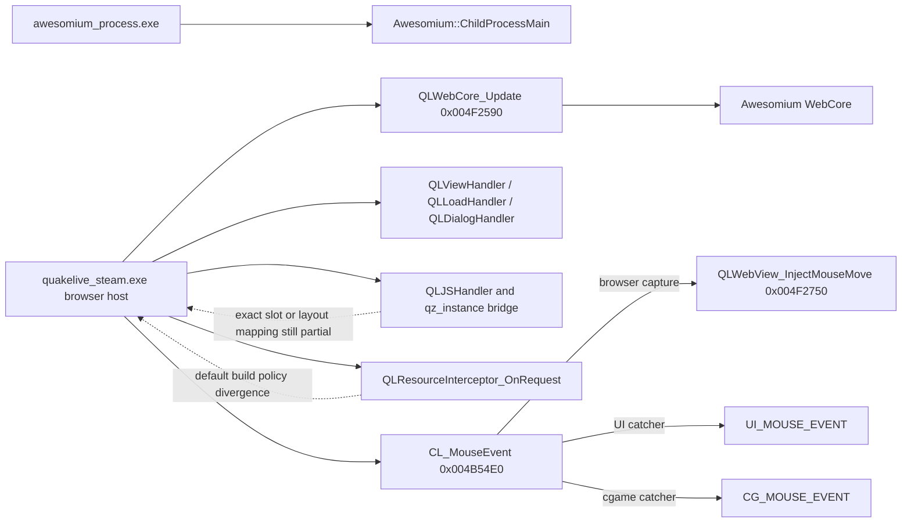
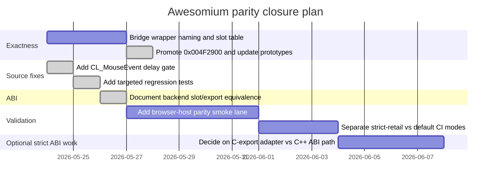

# Awesomium Parity Audit for themuffinator QuakeLive

## Executive summary

I audited the committed Awesomium-related reconstruction in `themuffinator/QuakeLive` against the repository reference corpus, mapping notes, parity ledgers, tests, and supporting SDK/interface material. The short version is that the repository is much closer to Awesomium parity than a greenfield reverse-engineering tree would be, and the remaining debt is concentrated in validation and optional strictness rather than in large missing bodies of browser-host logic. The helper executable `awesomium_process.exe` is effectively closed at the executable-owned surface, while the browser host embedded in `quakelive_steam.exe` is functionally near-closed. All six closure targets from this plan are now handled: bridge naming/layout is source-visible, default-build service behavior is documented as bounded divergence, the mouse-input advert-delay gate is reconstructed, the activation helper carries the exact retail keyboard-event constructor fields, the Win32 backend adapter documents its retail vtable-slot to C-export substitution boundary in source, and the repo-wide non-Windows/null-host browser lane is now an explicit compatibility-only exclusion.

The most important distinction is which parity target you mean. If the target is the repository strict-retail Windows replacement scope, the checked-in tree already treats the `awesomium_process.exe` wrapper as closed and the browser host as largely reconstructed, with the repo top-level estimate remaining 100% strict-retail Windows and 98% repo-wide. If the target is literal source-to-address and ABI-faithful reconstruction of all Awesomium-adjacent host wiring, then there are still meaningful gaps: the default build intentionally disables online services and therefore remains a documented policy divergence from retail browser/resource/auth behavior; and the shipped adapter uses the exported Awesomium C-style API as a compatibility layer where retail evidence points to direct C++ vtable-driven usage. The `data_12d2670` bridge-wrapper region, `CL_MouseEvent` advertisement-delay gate, and `sub_4F2900` activation helper are no longer active source gaps after the 2026-05-24 closure work.

The practical conclusion is that a full Awesomium parity audit should now be framed as a closure campaign over bounded gap families, not as a broad reconstruction project. The JS/native bridge exactness gap, default-build online-service divergence, formerly missing `AdvertisementBridge_IsDelayElapsed` gate at the start of `CL_MouseEvent`, activation-key helper exactness gap, backend ABI substitution gap, and non-retail portability-scope gap all have closure notes below. There is no remaining active source-owned gap in this plan's prioritized Awesomium table; future work should be treated as optional stricter validation or as a separate real-portability plan.

## Scope and objectives

This audit covers four connected surfaces:

First, the repository’s committed **Ghidra reference corpus** for `quakelive_steam.exe` and `awesomium_process.exe`, including `metadata.txt`, `functions.csv`, `analysis_symbols.txt`, `imports.txt`, `exports.txt`, and `decompile_top_functions.c`. The repo’s reference workflow explicitly treats the retail binaries under `assets/quakelive/` as the canonical evidence base, with committed Ghidra exports as the primary structured companion corpus for day-to-day recovery work. `quakelive_steam.exe` is tracked at `5473` functions, `351` imports, and `2` exports; `awesomium_process.exe` is tracked at `139` functions, `54` imports, and `1` export-like entrypoint label. fileciteturn36file0 fileciteturn61file0 fileciteturn5file0

Second, the **checked-in reconstruction** under the source tree, especially `src/code/client/cl_cgame.c`, `src/code/client/cl_input.c`, `src/code/client/cl_awesomium_win32.cpp`, `src/code/win32/awesomium_process.cpp`, `src/code/win32/awesomium.def`, and `src/code/awesomium_process.vcxproj`. These files capture the browser-host lifecycle, listener callbacks, input routing, surface uploads, runtime bootstrap, helper-executable linkage, and Win32 build profile. fileciteturn12file0 fileciteturn14file0 fileciteturn35file0 fileciteturn63file0 fileciteturn26file0

Third, the repository’s own **mapping and audit notes**, especially the Awesomium/browser-host audit, `awesomium_process` mapping note, round-based host mapping notes, and the function-level parity gap register. Those notes are unusually valuable here because they already identify exact retail addresses, observed roles, and unresolved regions around the browser bridge. The most relevant rounds for this audit were rounds 10, 11, 94, 96, 109, and 257. fileciteturn6file0 fileciteturn13file0 fileciteturn21file0 fileciteturn22file0 fileciteturn19file0 fileciteturn20file0 fileciteturn34file0 fileciteturn23file0 fileciteturn32file0

Fourth, I used **primary or near-primary interface material** to verify signature shapes: the official Ghidra Headless Analyzer documentation from the NSA Ghidra repository, and vendored copies of the original Awesomium SDK headers preserved in public repositories. Those headers confirm the core signatures that matter for parity review: `Awesomium::ChildProcessMain(HINSTANCE)`, `WebViewListener::View` callback shapes like `OnChangeTooltip` and `OnChangeCursor`, `WebViewListener::Load` callbacks such as `OnBeginLoadingFrame`, `OnFailLoadingFrame`, `OnFinishLoadingFrame`, and `OnDocumentReady`, `WebView` input/surface methods, `ResourceInterceptor::OnRequest`, and `JSMethodHandler` callback forms. fileciteturn40file0 fileciteturn43file0 fileciteturn45file0 fileciteturn50file0 fileciteturn53file0 fileciteturn56file0

The objective of the audit, therefore, was not simply to ask “is Awesomium present,” but to answer a stricter question: **where does the repo already match the retail host’s behavior and interfaces, and where do exact source, ABI, data-layout, or runtime-proof mismatches still remain?** fileciteturn36file0 fileciteturn32file0

## Evidence base and methodology

The repository already contains the machinery for a repeatable Ghidra-driven parity workflow. Its runner script invokes Ghidra’s Headless Analyzer across the five retail reference binaries and exports the structured outputs under `references/reverse-engineering/ghidra/`. This directly aligns with Ghidra’s documented headless mode, which supports importing binaries, analyzing them, and running scripts in a non-GUI pipeline. In other words, the repo’s own reverse-engineering workflow is already well-formed for parity auditing; the open work is now mostly on interpretation and closure, not on tooling availability. fileciteturn37file0 fileciteturn40file0

I treated the audit as a five-step comparison pipeline.

| Audit step | What was compared | Primary evidence |
|---|---|---|
| Ghidra reference inventory | Function counts, imports/exports, decompile coverage, fingerprinting | `ghidra-reference-workflow.md`, `run_quakelive_reference.ps1`, metadata files fileciteturn36file0 fileciteturn37file0 fileciteturn61file0 fileciteturn5file0 |
| Symbol and function mapping | Raw `FUN_...` / `sub_...` names to stabilized aliases and source owners | mapping rounds 10, 11, 94, 96, 109, 257; `function-parity-gap-audit-2026-04-24.md` fileciteturn21file0 fileciteturn22file0 fileciteturn19file0 fileciteturn20file0 fileciteturn34file0 fileciteturn23file0 fileciteturn32file0 |
| Signature matching | Recovered callback and API shapes vs Awesomium headers and source declarations | `ChildProcess.h`, `WebViewListener.h`, `WebView.h`, `ResourceInterceptor.h`, `JSObject.h`; repo source files fileciteturn43file0 fileciteturn45file0 fileciteturn50file0 fileciteturn53file0 fileciteturn56file0 fileciteturn12file0 fileciteturn26file0 |
| Control-flow and data-flow comparison | Retail address roles, flag/state ownership, callback installation, input-routing order | launcher audit, mapping rounds 94/96/257, `cl_input.c`, `cl_cgame.c` tests fileciteturn27file0 fileciteturn19file0 fileciteturn20file0 fileciteturn23file0 fileciteturn63file0 fileciteturn25file0 |
| Binary vs reconstructed diffs | Helper EXE import/header/version parity; source-structure tests for browser host | `verify-awesomium-process-parity.ps1`, `tests/test_awesomium_browser_parity.py` fileciteturn59file0 fileciteturn25file0 |

The architectural relationship that emerged from the evidence is shown below. The key takeaway is that the remaining debt now clusters around portability scope and optional strict validation, not around the existence of the listener, input, bridge, activation-helper, backend-adapter, or surface-pump behaviors themselves.



That diagram is directly supported by the mapping notes for `QLWebCore_Update`, `QLWebView_InjectMouseMove`, the browser-listener suite, the launcher bridge note around `data_12d2670`, and the `CL_MouseEvent` recovery round. fileciteturn20file0 fileciteturn19file0 fileciteturn21file0 fileciteturn22file0 fileciteturn27file0 fileciteturn23file0

## Current parity assessment

The helper executable is the cleanest part of the picture. The committed Ghidra corpus records `awesomium_process.exe` as a very small executable whose meaningful owned behavior is essentially a bootstrap into `Awesomium::ChildProcessMain(HINSTANCE)`, with the remainder dominated by CRT support. The repo reconstructs that as `WinMain -> AwesomiumProcess_RunChildProcessMain(hInstance)`, preserves the mangled `ChildProcessMain` import in `awesomium.def`, and configures the project to build an x86 Windows GUI executable with static CRT, subsystem version `5.01`, `/DYNAMICBASE`, `/NXCOMPAT`, `/TSAWARE`, and the retained PDB breadcrumb. A dedicated CI script then validates the rebuilt helper against import-table and version-surface expectations. That surface should be considered **closed** unless the target shifts from executable-owned parity to full `awesomium.dll` reimplementation, which is outside the repo’s source-owned scope. fileciteturn13file0 fileciteturn12file0 fileciteturn14file0 fileciteturn35file0 fileciteturn59file0

The browser host inside `quakelive_steam.exe` is stronger than the remaining gap list might suggest. The repo’s own browser-host audit says the tracked source-owned gaps were closed as of April 2026, and the test suite checks for the presence of reconstructed functions covering tooltip and console callbacks, Win32 cursor override, load-failure handling, mouse move/button/wheel injection, keyboard injection, application-activation modifier injection, document-ready script staging, surface rebuild, runtime bootstrap, and map/factory list JSON construction. Mapping rounds 10, 11, 94, and 96 also give stable Ghidra anchors for the same functional seam. So the core question is **not** whether those behaviors exist in source; it is whether they are recovered with enough **literal exactness** to satisfy a stricter parity bar. fileciteturn6file0 fileciteturn25file0 fileciteturn21file0 fileciteturn22file0 fileciteturn19file0 fileciteturn20file0

A compact function-to-function comparison looks like this:

| Ghidra reference | Retail alias / observed role | Repo implementation | Assessment |
|---|---|---|---|
| `0x00401000` | `AwesomiumProcess_RunChildProcessMain(HINSTANCE)` | `src/code/win32/awesomium_process.cpp` | **Closed**; direct semantic match to `ChildProcessMain` bootstrap. fileciteturn13file0 fileciteturn12file0 |
| `0x00431670` | `QLViewHandler_OnChangeCursor` | `cl_cgame.c` + Win32 cursor plumbing | **Closed functionally**; verified by tests and mapping notes. fileciteturn21file0 fileciteturn25file0 |
| `0x00434450` | `QLViewHandler_OnChangeTooltip` | `cl_cgame.c` | **Closed functionally**; JSON event publish path reconstructed. fileciteturn21file0 fileciteturn25file0 |
| `0x00434520` | `QLViewHandler_OnAddConsoleMessage` | `cl_cgame.c` | **Closed functionally**; `web_console` gating recovered. fileciteturn21file0 fileciteturn25file0 |
| `0x004317D0` | `QLLoadHandler_OnBeginLoadingFrame` | `cl_cgame.c` | **Closed functionally**. fileciteturn22file0 fileciteturn25file0 |
| `0x004317F0` | `QLLoadHandler_OnDocumentReady` | `cl_cgame.c` | **Closed functionally**; script bundle staging and `qz_instance` binding recovered. fileciteturn22file0 fileciteturn25file0 |
| `0x00434AE0` | `QLLoadHandler_OnFailLoadingFrame` | `cl_cgame.c` | **Closed functionally**; hide/error suppression behavior reconstructed. fileciteturn22file0 fileciteturn25file0 |
| `0x004F2590` | `QLWebCore_Update` | `cl_cgame.c` / `cl_awesomium_win32.cpp` | **Closed semantically**; the Win32 backend now records the retail `+0x18` slot as a bounded `_Awe_WebCore_Update@4` C-export substitution. |
| `0x004F25F0` | `QLWebView_RebuildSurfaceImage` | `cl_cgame.c` | **Closed functionally**. fileciteturn19file0 fileciteturn25file0 |
| `0x004F2750` | `QLWebView_InjectMouseMove` | `cl_cgame.c` | **Closed functionally**. fileciteturn19file0 fileciteturn25file0 |
| `0x004F28A0` / `0x004F2900` | `QLWebView_InjectKeyboardEvent` / `QLWebView_InjectActivationKeyboardEvent` | `cl_cgame.c` | **Closed for source-visible exactness**; activation now carries the fixed `WebKeyboardEvent(0, 0x11, 0x1d0001)` fields. |
| `0x004B54E0` | `CL_MouseEvent` | `src/code/client/cl_input.c` | **Closed for the recovered source behavior**; routing order and the advertisement-delay gate are now reconstructed. `sub_4EAB80` remains a separate ownership question. |

The state of the overall host mapping also matters. The current function-gap register still reports only about **37.9% strict Ghidra address-backed alias coverage** for `quakelive_steam.exe`, and older audits listed the browser/bridge region `0x004F1EE0`, `0x004F1F10-0x004F2280`, and `0x004F2900` among the highest-value unresolved host leftovers. The browser bridge and activation helper are now source-visible, but the broader address-backed alias coverage still explains why the correct conclusion is “source mostly reconstructed, but **mapping and exactness still incomplete**,” not “fully closed.”

## Prioritized parity gaps

The table below tracks the prioritized gap families and their current status after the completed browser-host reconstruction work. The priority order reflects how much each still-open item blocks a literal parity audit, not just whether the UI broadly works.

| Priority | Gap | Files and functions | Ghidra reference and signature cue | Concrete mismatch | Severity and impact | Remediation |
|---|---|---|---|---|---|---|
| Closed 2026-05-24 | JS/native bridge exactness row | `src/code/client/cl_cgame.c`, `references/analysis/quakelive_symbol_aliases.json` | `0x004F1EE0`, `0x004F1F10-0x004F2280`; parity ledger calls this the opaque bridge region around `data_12d2670`, with wrapper semantics and roles not fully stabilized. | The repo now has an explicit bridge object/vtable owner for the recovered wrapper family. | Closed for source-visible exactness. Remaining bridge work is future mapping refinement rather than this row. | Keep offset/slot assertions and alias notes current as new wrappers are promoted. |
| Closed 2026-05-24 | Default-build online-service/browser-resource divergence | `src/common/platform/platform_config.h`, `src/common/platform/platform_services.c`, `src/code/client/cl_steam_resources.c`, `src/code/client/ql_auth.c` | The function-gap register and RW-G01 notes explicitly mark `QL_BUILD_ONLINE_SERVICES` and related service surfaces as bounded divergence. | Default checked-in builds disable online services by policy, and the source now exposes that policy explicitly through provider/scope/reason labels. | Closed as permanent bounded divergence, not as retail-default behavior. | Keep strict-retail opt-in validation separate from default compatibility builds. |
| Closed 2026-05-24 | `CL_MouseEvent` advertisement-delay gate | `src/code/client/cl_input.c`, `src/code/client/cl_cgame.c` | Round 257 says recovered `CL_MouseEvent` begins with `sub_4F22E0()` (`AdvertisementBridge_IsDelayElapsed`), and round 29 proves that helper checks/clears `data_12d2674`. | The source now gates mouse dispatch through `CL_AdvertisementBridge_IsDelayElapsed()` before `cg_ignoreMouseInput`, backed by `cl_advertisementBridge.delayDeadline` and the cgame clear-delay import. | Closed for the recovered source-behavior mismatch. | Keep the focused input regression test and avoid speculating on the separate `sub_4EAB80` branch until ownership is clearer. |
| Closed 2026-05-24 | Activation-key helper exactness | `src/code/client/cl_cgame.c`, alias corpus | `0x004F2900` was promoted in round 285 as `QLWebView_InjectActivationKeyboardEvent`; HLIL shows `Awesomium::WebKeyboardEvent(0, 0x11, 0x1d0001)` followed by the live view keyboard slot at `+0xe0`. | The source now carries `qlWebKeyboardEventFields_t` plus the exact activation type, virtual-key, and native-key constants, and tests assert those fields rather than only key `0x11`. | Closed for mapping and source-visible signature exactness. | Keep round 285 and the focused browser tests aligned with future backend ABI work. |
| Closed 2026-05-24 | Backend ABI is a compatibility adapter, not a literal retail C++ ABI recreation | `src/code/client/cl_awesomium_win32.cpp` | Retail mapping notes describe direct vtable usage for `WebCore::Update` and `WebView` methods at slots `+0x18`, `+0x9c`, `+0xd0`, `+0xd4`, `+0xd8`, `+0xdc`, and `+0xe0`. The repo adapter dynamically resolves `_Awe_WebCore_Update@4`, `_Awe_WebView_Resize@12`, `_Awe_WebView_InjectMouseMove@12`, and similar exports instead. | The source now carries `cl_aweRetailAbiEquivalence[]`, which records each recovered retail slot and its bounded C-export or source-owned keyboard substitution. | Closed as a documented compatibility adapter, not as literal C++ ABI identity. | Optional future strictness can add an SDK/C++-ABI-backed validation build if literal ABI identity becomes a project goal. |
| Closed 2026-05-24 | Repo-wide non-Windows and null-host lanes keep the browser host stubbed or compatibility-only | `src/code/null/null_client.c`, Unix host files | The function-gap register previously marked many browser and web-view functions in `null_client.c` as open portability owners and records Unix/Linux host lanes as compatibility surfaces rather than retail-equivalent targets. | Those lanes intentionally do not replicate retail Windows Awesomium behavior; the null host publishes its strict-retail exclusion through provider, policy, parity-scope, and parity-reason cvars. | Closed for Awesomium strict-Windows parity as an explicit compatibility exclusion; broader Unix/null runtime parity remains a separate repo-wide portability question. | Keep the null-host cvar contract and focused regression test; only reopen this row if the project adopts a real non-Windows browser/input/audio portability target. |

Resolution notes:

- 2026-05-24: The JS/native bridge exactness row was closed by introducing an explicit `ql_web_bridge_t`/vtable owner for the recovered `data_12d2670` bridge family, plus slot wrappers, alias promotion, and focused browser/advert bridge tests.
- 2026-05-24: The default-build online-service/browser-resource row was closed as a permanent bounded divergence. `QL_BUILD_ONLINE_SERVICES` remains disabled by default, while `QL_GetOnlineServicesParityScopeLabel()` and `QL_GetOnlineServicesParityReasonLabel()` now make that policy visible through client browser, advert, resource, subscription, and online-service cvars.
- 2026-05-24: The `CL_MouseEvent` advertisement-delay row was closed by modeling the `data_12d2674` deadline as `cl_advertisementBridge.delayDeadline`, routing `CL_MouseEvent` through `CL_AdvertisementBridge_IsDelayElapsed()` before `cg_ignoreMouseInput`, and wiring the existing cgame `AdvertisementBridge_ClearDelay` import into that state.
- 2026-05-24: The activation-key helper row was closed by leaning on the round 285 `sub_4F2900` alias promotion and making the source model preserve the exact fixed `Awesomium::WebKeyboardEvent(0, 0x11, 0x1d0001)` constructor fields before forwarding through the retained activation-key path.
- 2026-05-24: The backend ABI row was closed as a bounded substitution by adding `cl_aweRetailAbiEquivalence[]` to `cl_awesomium_win32.cpp`, covering the recovered retail vtable slots for core update, resize, mouse move/button/wheel injection, and the source-owned keyboard-event path.
- 2026-05-24: The non-Windows/null-host row was closed for Awesomium scope by making `null_client.c` publish a stable `strict-retail-excluded` browser/advert contract through `ui_browserAwesomium*` and `ui_advertisementBridge*` cvars, while leaving any real Unix/null runtime browser implementation to a separate portability plan.
- 2026-05-24: With no active row remaining in the prioritized gap table, the adjacent static validation follow-up was closed by adding `tools/ci/verify-awesomium-browser-host-parity.ps1`, which checks the browser-host source, alias, mapping, and Win32 adapter anchors without launching the game or enabling live services.
- 2026-05-24: Mapping round 286 resolved the remaining slot-116 source drift noted by round 275. Native cgame import `0x1D0` is now source-owned as `CG_QL_IMPORT_PUBLISH_TAGGED_INFO_STRING`, feeding `CL_WebView_PublishTaggedInfoString`, `Info_NextPair`, and the one-argument `OnCommNotice` payload lane instead of the older compatibility cvar-buffer shim.
- 2026-05-24: Mapping round 287 tightened the Awesomium resource-interceptor lane. `QLResourceInterceptor_OnFilterNavigation` is now source-visible as the retail false-returning filter, and `QLResourceInterceptor_OnRequest` now carries the recovered `ql` host, `/screenshot`, and normal web-root branch before falling back to the generic launcher compatibility resolver.
- 2026-05-24: Mapping round 288 made the listener/vtable wiring source-visible. `cl_cgame.c` now records the retail callback table for `QLResourceInterceptor`, `QLDialogHandler`, `QLViewHandler`, `QLLoadHandler`, and `QLJSHandler`, including the `QLDialogHandler_OnShowFileChooser` pass-through at `0x00431640` and bounded no-engine/destructor slots.
- 2026-05-24: Mapping round 289 made the `SteamDataSource` data-source wiring source-visible. `cl_steam_resources.c` now records the retail `SteamDataSource::vftable` at `0x00532B80`, the embedded `AvatarImageLoaded_t` callback vtable at `0x00532B68`, the `OnRequest`, destructor, init/shutdown, response-thread, callback target, and callback id anchors, plus a diagnostic recovered-mapping count cvar.
- 2026-05-24: Mapping round 290 made the bounded async avatar `ResponseThread` lane source-visible. `cl_steam_resources.c` now records the retail `ResponseThread::vftable` at `0x00532B44`, `ResponseThread_Run`, PNG write/encode helpers, `Awesomium::DataSource::SendResponse`, the `image/png`, `request_%i`, `1.2.24`, `Write Error`, and `0x100000` stack-reserve anchors, plus a diagnostic recovered-mapping count cvar.
- 2026-05-24: Mapping round 291 made the Win32 backend bootstrap/lifecycle adapter source-visible. `cl_awesomium_win32.cpp` now records the retail `QLWebHost_OpenURL`/`QLWebHost_Shutdown` chain from `WebConfig::WebConfig`, `WebCore::Initialize`, `WebSession::AddDataSource`, `DataPakSource::vftable`, `WebView::LoadURL`, focus/surface slots, and `WebCore::Shutdown` to the bounded `_Awe_*` C-export adapter, and it now applies the reconstructed WebConfig child-process, log, package, asset-protocol, and user-script settings instead of ignoring those startup parameters.

Three concrete examples illustrate what these gaps look like in the checked-in source.

The former **bridge exactness gap** was visible in the `qz_instance` binding logic. The surface was there, but before the 2026-05-24 closure work the recovered retail wrapper family around `data_12d2670` was not represented as a literal bridge object with named slots and offsets:

```c
for ( i = 0; i < CL_WEB_MAX_QZ_METHODS && cl_webMethodBindings[i].name; i++ ) {
    (void)cl_webMethodBindings[i].returnsValue;
}
CL_WebHost_RefreshBootstrapProperties();
cl_webHost.qzInstanceBound = qtrue;
cl_webHost.windowObjectBound = qtrue;
```

That matches a high-level JS-method registration story, but it does not yet embody the fixed native bridge table implied by the retail wrapper cluster. fileciteturn15file0 fileciteturn27file0 fileciteturn32file0

The **input-path omission** is now closed in the current `CL_MouseEvent` body. The retail round notes an advertisement-delay predicate at the top of the dispatcher, and the source now models that predicate before `cg_ignoreMouseInput` and catcher routing:

```c
void CL_MouseEvent( int dx, int dy, int time ) {
    (void)time;

    if ( !CL_AdvertisementBridge_IsDelayElapsed() ) {
        return;
    }

    if ( Cvar_VariableIntegerValue( "cg_ignoreMouseInput" ) ) {
        return;
    }

    if ( cls.keyCatchers & KEYCATCH_BROWSER ) {
        CL_WebView_OnMouseMove( dx, dy );
        return;
    }
    ...
}
```

This was the cleanest remaining source-behavior delta in the browser/input seam; it is now covered by source structure and regression tests.

The **backend ABI substitution** is now source-visible. The retail host notes describe Awesomium usage through C++ object pointers and vtable slots. The repo adapter instead resolves the Awesomium export surface dynamically and records that substitution explicitly:

```c
static const clAwesomiumRetailAbiEquivalence_t cl_aweRetailAbiEquivalence[] = {
    { 0x004F2590u, 0x18u, "WebCore::Update", "CL_Awesomium_Update", "_Awe_WebCore_Update@4", CL_AWE_RETAIL_ABI_SCOPE_C_EXPORT },
    { 0x004F25C0u, 0x9cu, "WebView::Resize", "CL_Awesomium_Resize", "_Awe_WebView_Resize@12", CL_AWE_RETAIL_ABI_SCOPE_C_EXPORT },
    { 0x004F2750u, 0xd0u, "WebView::InjectMouseMove", "CL_Awesomium_InjectMouseMove", "_Awe_WebView_InjectMouseMove@12", CL_AWE_RETAIL_ABI_SCOPE_C_EXPORT },
    ...
};
```

That is still not a literal reproduction of the retail C++ ABI shape, but the divergence is now explicit, reviewable, and pinned by focused tests.

For the now-closed exactness and source-behavior rows, the most useful sketches are these.

**Bridge-object reconstruction sketch**

```c
typedef struct ql_web_bridge_s ql_web_bridge_t;

typedef struct {
    void (*OnFocus)(ql_web_bridge_t *self);
    void (*OnBlur)(ql_web_bridge_t *self);
    void (*OnMouseMove)(ql_web_bridge_t *self, int x, int y);
    void (*OnKeyEvent)(ql_web_bridge_t *self, int key, qboolean down);
    int  (*GetClipboardText)(ql_web_bridge_t *self, char *out, int outSize);
    ...
} ql_web_bridge_vtbl_t;

struct ql_web_bridge_s {
    const ql_web_bridge_vtbl_t *vtbl;
    int flags;
    /* recovered fields matching the retail bridge if/when stabilized */
};
```

The point of the closed bridge work was to pin exact slot order and intent so the wrapper cluster around `0x004F1EE0-0x004F2280` became source-visible and testable. Future bridge work should refine mapping evidence without reopening the already-modeled surface.

**Closed mouse-event delay-gate implementation**

```c
qboolean CL_AdvertisementBridge_IsDelayElapsed( void ) {
    if ( cl_advertisementBridge.delayDeadline == 0 ) {
        return qtrue;
    }

    return cls.realtime > cl_advertisementBridge.delayDeadline ? qtrue : qfalse;
}

void CL_MouseEvent( int dx, int dy, int time ) {
    (void)time;

    if ( !CL_AdvertisementBridge_IsDelayElapsed() ) {
        return;
    }
    if ( Cvar_VariableIntegerValue( "cg_ignoreMouseInput" ) ) {
        return;
    }
    ...
}
```

The paired clear path is wired through `AdvertisementBridge_ClearDelay`, matching round 29 `data_12d2674 = 0` observation while leaving unrelated helpers such as `sub_4EAB80` outside this patch.

**Closed ABI-equivalence table**

```c
{ 0x004F2590u, 0x18u, "WebCore::Update", "CL_Awesomium_Update", "_Awe_WebCore_Update@4", CL_AWE_RETAIL_ABI_SCOPE_C_EXPORT },
{ 0x004F25C0u, 0x9cu, "WebView::Resize", "CL_Awesomium_Resize", "_Awe_WebView_Resize@12", CL_AWE_RETAIL_ABI_SCOPE_C_EXPORT },
{ 0x004F2750u, 0xd0u, "WebView::InjectMouseMove", "CL_Awesomium_InjectMouseMove", "_Awe_WebView_InjectMouseMove@12", CL_AWE_RETAIL_ABI_SCOPE_C_EXPORT },
{ 0x004F27C0u, 0xd4u, "WebView::InjectMouseDown", "CL_Awesomium_InjectMouseDown", "_Awe_WebView_InjectMouseDown@8", CL_AWE_RETAIL_ABI_SCOPE_C_EXPORT },
{ 0x004F2820u, 0xd8u, "WebView::InjectMouseUp", "CL_Awesomium_InjectMouseUp", "_Awe_WebView_InjectMouseUp@8", CL_AWE_RETAIL_ABI_SCOPE_C_EXPORT },
{ 0x004F2870u, 0xdcu, "WebView::InjectMouseWheel", "CL_Awesomium_InjectMouseWheel", "_Awe_WebView_InjectMouseWheel@12", CL_AWE_RETAIL_ABI_SCOPE_C_EXPORT },
{ 0x004F28A0u, 0xe0u, "WebView::InjectKeyboardEvent", "QLWebView_InjectKeyboardEvent", "cl_cgame.c field model", CL_AWE_RETAIL_ABI_SCOPE_SOURCE_KEYBOARD },
```

This closes the plan row by documenting the adapter as **explicit substitution**, not ABI identity. Literal C++ ABI recreation remains an optional stricter target, not the default source-owned parity requirement.

## Remediation roadmap

The most efficient closure plan is short, staged, and evidence-driven.

| Phase | Target | Main tasks | Deliverables |
|---|---|---|---|
| Completed 2026-05-24 | Mapping exactness | Name and document the unresolved browser bridge cluster; promote `0x004F2900`; add source-visible activation event fields | Updated alias corpus, focused source constants, comments/tests for bridge slots and activation fields |
| Completed 2026-05-24 | Source behavior | Insert the missing advertisement-delay gate in `CL_MouseEvent`; add a focused regression test | Source patch, focused regression test, and mapping note update landed |
| Completed 2026-05-24 | ABI substitution boundary | Add source-visible retail slot to adapter binding table for the Win32 backend | `cl_aweRetailAbiEquivalence[]` plus focused browser parity coverage |
| Completed 2026-05-24 | Static validation | Extend the helper-EXE style of verification to browser-host source, alias, mapping, and adapter surfaces | `tools/ci/verify-awesomium-browser-host-parity.ps1` plus focused browser parity coverage |
| Completed 2026-05-24 | Policy clarity | Split strict retail Windows browser parity from default, null-host, and non-Windows compatibility lanes | Source-visible cvar contracts, focused regression coverage, and updated parity ledgers |
| Completed 2026-05-24 | Bridge-layout closure | Convert the `qz_instance` surface from a name/ID registry into an explicit bridge object model | Bridge struct, offset notes, wrapper functions, additional tests |
| Optional | Literal ABI strictness | Add an ABI-closer C++-SDK path only if future project scope requires byte-for-byte Awesomium C++ ABI identity | Architectural decision and, if needed, alternate backend path |

A realistic implementation sequence is shown below.



The parity report should continue to distinguish between **closed source-owned behavior**, **bounded policy or ABI substitution**, and **explicit portability scope**. The repo now has enough evidence to say the browser host is substantially reconstructed for the tracked Windows source-owned checklist, while whole-tree non-Windows/null-host browser coverage remains a separate compatibility lane.

## Open questions and limitations

This audit is based on the **connected GitHub repository contents and committed reference exports**, not on a fresh local rerun of Ghidra against the retail binaries in this environment. The repository clearly documents how to regenerate the corpus, and that workflow is sound, but I did not independently re-export the binaries here. If the committed corpus drifts from the retail binaries it was derived from, that would affect any exact-address conclusion. fileciteturn36file0 fileciteturn37file0

The exact **SDK version and ABI surface of the shipped `awesomium.dll`** cannot be fully proven from the repo alone. The helper-executable verification script pins the helper executable version metadata and import signature to an Awesomium 1.7.4.1-facing surface, and the vendored headers match the documented API shapes, but byte-for-byte C++ ABI identity between Quake Live shipped Awesomium binary and the repo dynamic `_Awe_*` adapter remains an inference boundary. The adapter issue is now closed for source-owned parity as an explicit bounded substitution; it should only reopen if the project adopts literal Awesomium C++ ABI recreation as a stricter target.

Finally, the repository parity numbers are internally consistent but scope-sensitive. No-active-source-gap for `awesomium_process.exe` is well-supported. Closed browser-host gaps is also supportable if the scope is the repo tracked source-owned checklist. The JS bridge exactness row, the `CL_MouseEvent` advertisement-delay row, the activation-key helper row, the backend ABI substitution row, the default online-services divergence, and the non-Windows/null-host portability-scope row now have closure notes. There is no remaining active row in this plan's prioritized Awesomium gap table; broader portability or literal ABI work should start from a new, explicitly scoped plan.
