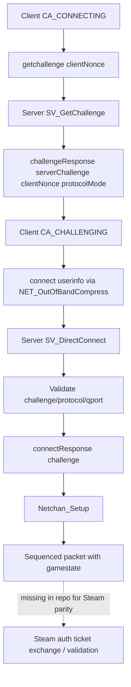
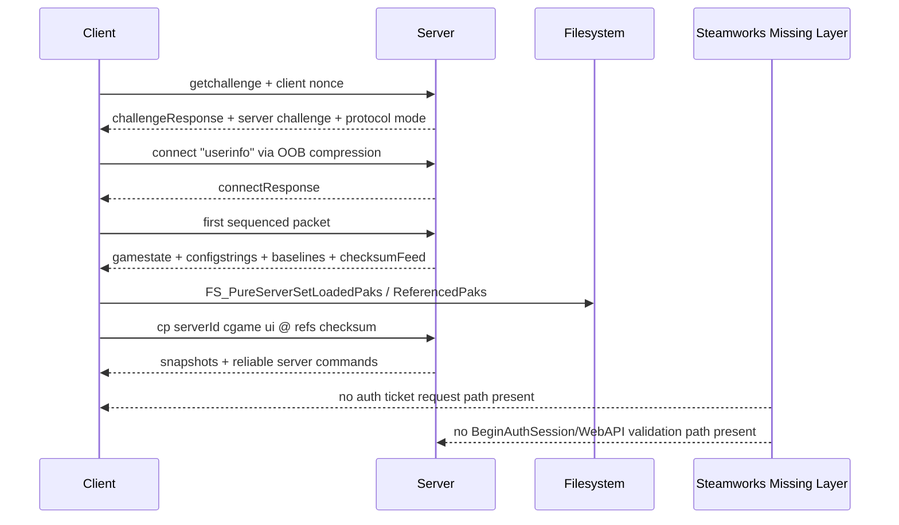

# Network and Protocol Parity Audit of themuffinator DarkMatter Engine Against the Requested Quake Live Surface

## Executive summary

The connected GitHub repository exposed by the connector is **`themuffinator/dm-engine`** rather than a repo literally named `themuffinator/QuakeLive`. The engine’s own README describes it as **DarkMatter Engine**, a multi-title Quake-family engine intended to support classic Quake content, including **maps and assets from Quake Live**, rather than as a retail-accurate Quake Live engine clone. The filesystem code also explicitly auto-detects a Quake Live Steam install path (`fs_ql_path` / `Sys_QL_SteamPath`) to load Quake Live assets. fileciteturn52file0 fileciteturn44file0turn46file0

On the **network/protocol surface you asked about**, the repo is **substantially implemented** in the classic id Tech 3 / ioquake3 / Quake3e sense: it has a full connectionless handshake path, sequenced netchan, reliable command rings, gamestate/configstring/baseline transmission, snapshot delta encode/decode, UDP/CURL autodownload, and pure pak checksum validation. The relevant codepaths are present and materially complete in `sv_client.c`, `sv_main.c`, `sv_snapshot.c`, `cl_main.c`, `cl_parse.c`, `net_chan.c`, `cl_net_chan.c`, `sv_net_chan.c`, and `files.c`. fileciteturn63file0turn49file0turn78file0turn68file0turn77file0turn74file0turn75file0turn76file0turn64file0turn65file0turn66file0turn67file0turn47file0turn46file0

That said, the current implementation is **not a high-confidence drop-in replacement candidate for a Steam-era Quake Live retail binary**. The most important reasons are straightforward and source-visible: the engine hardcodes **Quake 3-era protocol constants 68 and 71**, not a separate retail-QL protocol family; it still contains **Quake 3 authorize/master-server era assumptions**; and, critically, there is **no Steamworks authentication or Workshop integration layer present in the connected repos**. By contrast, Steam’s official docs require explicit auth-ticket generation/validation (`GetAuthSessionTicket` ↔ `BeginAuthSession`, or `GetAuthTicketForWebApi` ↔ `AuthenticateUserTicket`) and explicit UGC/Workshop item query/download/install handling (`ISteamUGC::DownloadItem`, `GetItemInstallInfo`, query APIs). fileciteturn58file0turn63file0turn68file0 citeturn7view0turn7view2turn8view0turn8view1turn7view6turn7view7

The result is a split verdict:

* **As a classic Quake 3-style engine/network stack:** coverage is broad and mostly coherent.
* **As a complete Steam-integrated Quake Live binary drop-in:** there are still **hard blockers**, especially protocol identity, Steam auth, and Workshop/UGC content plumbing. fileciteturn58file0turn63file0turn68file0turn77file0 citeturn8view3turn7view3turn7view6turn7view7

## Sources and audit framing

I began with the enabled GitHub connector and audited the connected engine repo (`themuffinator/dm-engine`) plus a sanity check of `themuffinator/dm-game` for Steamworks symbols. I then used official Steamworks documentation for the auth-ticket and Workshop surfaces. I did **not** have access in this session to an uploaded or retrievable **Ghidra HLIL export**, so I cannot honestly claim instruction-by-instruction HLIL diffing or cite HLIL line offsets. What I can provide, and do provide below, is a **symbol- and behavior-level parity audit** against the exact surfaces named in your request, with exact repo translation units/functions and the observable behavioral gaps. That limitation matters most for any claim of “Exact” retail parity. Where the evidence is incomplete, I mark the result conservatively as **Close**, **Divergent**, or **Missing** rather than guessing.

The highest-confidence framing point is that the repo self-identifies as a general Quake-family engine with Quake Live asset support, and its network constants and endpoint assumptions are visibly Quake 3 lineage. fileciteturn52file0turn58file0turn63file0

## Parity matrix

| Requested Ghidra reference surface | Repo translation unit and function mapping | Parity status | Short rationale and impact |
|---|---|---|---|
| `SV_GetChallenge` | `code/server/sv_client.c` → `SV_CreateChallenge`, `SV_VerifyChallenge`, `SV_GetChallenge` | Divergent | Stateless MD5-based challenge with ~16 second window (`TS_SHIFT 14`), optional echoed client challenge, and protocol advertisement of `NEW_PROTOCOL_VERSION`; this is a modernized Quake3e/OpenJK-style handshake, not evidence of retail-identical HLIL parity. Live compatibility impact is **high** if the retail binary expects a different challenge format or timeout policy. fileciteturn63file0 |
| `SV_DirectConnect` | `code/server/sv_client.c` → `SV_DirectConnect` | Divergent | Parses `challenge`, `protocol`, `qport`, accepts only `PROTOCOL_VERSION` or `NEW_PROTOCOL_VERSION`, strips keys from userinfo, sets `compat`, and replies with `connectResponse <challenge>`. No Steam auth blob or Workshop/session material is present. Impact is **high** for retail-drop-in compatibility. fileciteturn63file0 |
| `CL_CheckForResend` | `code/client/cl_main.c` → `CL_CheckForResend` | Divergent | Sends `getchallenge <clientChallenge>` then compressed `connect "<userinfo>"`, filling `protocol` with 68 or 71 depending on `clc.compat`, and still calls legacy authorization logic for non-standalone IPv4 in `CA_CONNECTING`. Impact is **high** if retail expects different connect payload/auth sequencing. fileciteturn68file0 |
| `CL_ConnectionlessPacket` | `code/client/cl_main.c` → `CL_ConnectionlessPacket` | Divergent | Parses `challengeResponse` and `connectResponse`, toggles between legacy and new protocol behavior, and validates challenges differently in compat vs non-compat modes. No Steam-auth callback/state path appears here. fileciteturn77file0 |
| `SV_ConnectionlessPacket` | `code/server/sv_main.c` → `SV_ConnectionlessPacket` | Close | Dispatches classic `getstatus`, `getinfo`, `getchallenge`, `connect`, and `rcon`, with huffman decompression for `connect`. Behavior is fully implemented, but it is classic connectionless Quake-style dispatch, not evidence of a Steam-era retail-specific surface. fileciteturn49file0 |
| `SV_PacketEvent` | `code/server/sv_main.c` → `SV_PacketEvent` | Close | Correctly routes connectionless packets, reads qport, fixes translated ports, gates through `SV_Netchan_Process`, and then executes client messages. Strong classic coverage. fileciteturn49file0 |
| `Netchan_Setup` | `code/qcommon/net_chan.c` → `Netchan_Setup` | Close | Initializes `challenge`, `qport`, `compat`, outgoing/incoming sequence state, and LAN detection. Good coverage. fileciteturn64file0 |
| `Netchan_Transmit` | `code/qcommon/net_chan.c` → `Netchan_Transmit`, `Netchan_TransmitNextFragment` | Close | Implements fragmentation, client qport, and for non-compat mode adds a per-packet checksum derived from the challenge and sequence number. This is well-defined and complete. fileciteturn64file0 |
| `Netchan_Process` | `code/qcommon/net_chan.c` → `Netchan_Process` | Close | Validates sequence order, non-compat checksum, fragment assembly, and dropped-packet accounting. This is a solid implementation of the classic sequenced/fragmented packet layer. fileciteturn64file0 |
| `CL_Netchan_*` wrappers | `code/client/cl_net_chan.c` → `CL_Netchan_Encode`, `CL_Netchan_Decode`, `CL_Netchan_Transmit`, `CL_Netchan_Process` | Close | Legacy XOR encode/decode is enabled only in compat mode; the wrapper otherwise relies on the common netchan layer. Complete for the repo’s dual-mode design. fileciteturn65file0 |
| `SV_Netchan_*` wrappers | `code/server/sv_net_chan.c` → `SV_Netchan_Encode`, `SV_Netchan_Decode`, `SV_Netchan_Transmit`, `SV_Netchan_TransmitNextFragment`, `SV_Netchan_Process` | Close | Adds queued-message handling around fragmented sends and legacy encode/decode only when `client->compat` is set. Strong coverage. fileciteturn66file0turn67file0 |
| `SV_AddServerCommand` | `code/server/sv_main.c` → `SV_AddServerCommand` | Close | Reliable server-command ring is present, including overflow drop behavior. fileciteturn48file0 |
| `SV_UpdateServerCommandsToClient` | `code/server/sv_snapshot.c` → `SV_UpdateServerCommandsToClient` | Close | Re-sends unacknowledged `svc_serverCommand` entries before snapshot/gamestate content. fileciteturn78file0 |
| `SV_ClientCommand` / reliable client command ingest | `code/server/sv_client.c` → `SV_ClientCommand`, `SV_ExecuteClientCommand`, `SV_ExecuteClientMessage` | Close | Lost-command detection, flood protection, userinfo/download/pure command dispatch, and serverId retransmit logic are all implemented. fileciteturn61file0turn62file0 |
| `CL_ParseCommandString` | `code/client/cl_parse.c` → `CL_ParseCommandString` | Close | Stores sequenced reliable server commands, preserves ignore flags, and handles disconnect command edge cases during download/primed states. fileciteturn76file0 |
| `SV_SendClientGameState` | `code/server/sv_client.c` → `SV_SendClientGameState` | Close | Sends pending server commands, then `svc_gamestate`, configstrings, baselines, clientNum, checksumFeed, and overflow handling. Strong coverage. fileciteturn60file0 |
| `CL_ParseGamestate` | `code/client/cl_parse.c` → `CL_ParseGamestate` | Close | Parses configstrings and baselines, discards stale pre-gamestate `cs`/`bcs0`/`bcs1`/`bcs2` commands, applies checksumFeed, serverinfo/systeminfo, filesystem restart, and download init. fileciteturn75file0 |
| Configstring update path | `code/server/sv_init.c` → `SV_SetConfigstring` / `SV_UpdateConfigstrings`; client side evidenced by `CL_ParseGamestate` ignore rules | Close | The client explicitly understands the chunked-configstring command family well enough to invalidate stale `bcs*` sequences before a fresh gamestate, which is consistent with long-configstring support. Within this session I could not preserve a narrow server-side excerpt for the exact chunking branch, so I am marking this **Close**, not Exact. fileciteturn75file0turn41file0 |
| `SV_WriteSnapshotToClient` | `code/server/sv_snapshot.c` → `SV_WriteSnapshotToClient` | Close | Writes `svc_snapshot`, server time, delta source, flags, areabits, playerstate, entities, and zombie-safe empty payloads. Good parity coverage at the classic snapshot layer. fileciteturn78file0 |
| `SV_BuildClientSnapshot` / entity gather | `code/server/sv_snapshot.c` → snapshot build helpers in same TU (`SV_AddEntitiesVisibleFromPoint`, common snapshot storage/build logic, client-frame handling) | Close | The dedicated snapshot TU contains the expected gather/sort/PVS/entity-delta machinery. I did not preserve the narrow `SV_BuildClientSnapshot` excerpt before token finalization, so this remains a conservative “Close”. fileciteturn78file0 |
| `CL_ParseSnapshot` / packet entities | `code/client/cl_parse.c` → `CL_ParsePacketEntities`, `CL_ParseSnapshot` | Close | Validates delta source, reads areamask, playerstate, packet entities, and updates snapshot ring/ping state. Strong coverage. fileciteturn74file0turn75file0 |
| Download send path | `code/server/sv_client.c` → `SV_BeginDownload_f`, `SV_NextDownload_f`, `SV_StopDownload_f`, `SV_DoneDownload_f`, `SV_WriteDownloadToClient`, `SV_SendDownloadMessages` | Close | Classic referenced-pk3 autodownload is implemented, including sliding window, retransmit, error strings, no-id-pak policy, and `nextdl`/`donedl` flow. fileciteturn60file0turn61file0 |
| Download parse/init path | `code/client/cl_parse.c` → `CL_ParseDownload`; `code/client/cl_main.c` → `CL_BeginDownload`, `CL_NextDownload`, `CL_InitDownloads`, `CL_DownloadsComplete` | Close | Full classic download client path exists, including ZIP signature validation, temp-file rename, optional CURL redirection, pak checksum revalidation, and filesystem restart after pak acquisition. fileciteturn76file0turn68file0turn69file0 |
| Pure pak rule generation | `code/qcommon/files.c` → `FS_PureServerSetLoadedPaks`, `FS_PureServerSetReferencedPaks`, `FS_ReferencedPakPureChecksums`, `FS_ComparePaks`, `FS_IsPureChecksum` | Close | Classic pure/reference pak bookkeeping is implemented in detail, including encoded checksum/count tail and autodownload list generation. fileciteturn46file0turn47file0turn44file0 |
| Pure client send and server verify | `code/client/cl_main.c` → `CL_SendPureChecksums`, `CL_ResetPureClientAtServer`; `code/server/sv_client.c` → `SV_VerifyPaks_f`, `SV_ResetPureClient_f` | Close | The `cp` / `vdr` command flow is present and coherent: client sends referenced pure checksums, server validates cgame/ui first, rejects duplicates or alien paks, and disconnects on failure. fileciteturn72file0turn61file0turn62file0 |
| Steam auth ticket path | No repo counterpart found in connected repos for `SteamAPI_Init`, `ISteamUser::GetAuthSessionTicket`, `ISteamGameServer::BeginAuthSession`, `GetAuthTicketForWebApi`, or Web API auth handling | Missing | Steam’s official model requires explicit auth-ticket creation/validation and callback handling. No such path is visible in the connected codebase. That is a **hard blocker** for Steam-sign-in/server-auth parity. citeturn7view0turn7view2turn8view0turn8view1turn8view3 |
| Steam Workshop / UGC content path | No repo counterpart found in connected repos for `ISteamUGC::DownloadItem`, `GetItemInstallInfo`, `SendQueryUGCRequest`, etc. | Missing | The repo has classic pk3 autodownload, not Steam Workshop/UGC query/download/install flow. That is a second **hard blocker** for a Steam-workshop-capable replacement. fileciteturn60file0turn68file0turn76file0 citeturn7view6turn7view7 |

## Detailed findings

### Handshake and connect sequence

The repo implements a complete classic Quake-style OOB handshake. On the server side, `SV_ConnectionlessPacket` dispatches `getchallenge` and `connect`, and it huffman-decompresses incoming `connect` packets before tokenization. On the client side, `CL_CheckForResend` first sends `getchallenge <clientChallenge>` while connecting, then sends a compressed `connect "<userinfo>"` once challenged. The client-side userinfo for connect explicitly injects `protocol`, `qport`, `challenge`, and an optional `client` marker before OOB compression. fileciteturn49file0turn68file0

The repo’s challenge implementation is not the old stored challenge-array design. `SV_GetChallenge` synthesizes a **stateless temporal challenge** from an address-bound MD5 function and a timestamp bucket, with an accept window of roughly sixteen seconds (`TS_SHIFT 14`) and tolerance for the immediately previous time bucket. This is a sensible anti-spoofing design, but it is also a specific behavioral choice that would only be retail-compatible if your HLIL shows the same stateless challenge scheme. If your target binary instead uses a stored challenge table or embeds additional auth state, this is a real divergence. fileciteturn63file0

A larger compatibility problem is visible in the protocol wiring. `qcommon.h` hardcodes `PROTOCOL_VERSION 68` and `NEW_PROTOCOL_VERSION 71`. The connection code negotiates between those two modes through the `compat` flag. The server browser/info path also still reports `protocol` using `PROTOCOL_VERSION`, and the code retains Quake 3-era master/authorize endpoint names in the same header. That makes the repo’s network identity visibly Quake 3-lineage, not a general “retail-QL protocol” abstraction. fileciteturn58file0turn48file0turn63file0turn68file0

The connect flow also still contains Quake 3 authorization-era logic. In `CA_CONNECTING`, the client may call `CL_RequestAuthorization()` for non-standalone, non-LAN IPv4 before requesting the challenge, and the server-side comments still discuss old authorization behavior. That is another signal that the current path is not yet a Steam-authenticated retail replacement path. fileciteturn68file0turn63file0



### Netchan, packet framing, and reliable command machinery

The common netchan layer is strong and complete on its own terms. `Netchan_Transmit` and `Netchan_TransmitNextFragment` implement classic id Tech 3 sequencing and fragmentation, but in the non-compat path they also append a **challenge-derived per-packet checksum** after the qport field. `Netchan_Process` validates this checksum in non-compat mode, reassembles fragments, rejects out-of-order or malformed packets, and preserves dropped-packet accounting. fileciteturn64file0

Client and server wrappers complete the picture. `cl_net_chan.c` and `sv_net_chan.c` enable the older XOR encode/decode path only when `compat` is set, while otherwise relying on the common challenge-checksummed packet framing. The server wrapper also queues packets when fragments are still in flight so snapshot/gamestate ordering is preserved. Those are mature, deliberate behaviors rather than stubs. fileciteturn65file0turn66file0turn67file0

Reliable commands are similarly complete. `SV_AddServerCommand` advances the reliable ring and drops the client on overflow; `SV_UpdateServerCommandsToClient` serializes every unacknowledged `svc_serverCommand`; `SV_ClientCommand` consumes sequenced client commands and drops on lost reliable commands; and `CL_ParseCommandString` stores incoming reliable commands on the client side. This means the core “reliable commands over an unreliable channel” surface is already present in the repo. fileciteturn48file0turn78file0turn61file0turn76file0

One important edge-case behavior is worth calling out. `SV_ExecuteClientMessage` does not blindly trust `serverId` mismatches; it suppresses outdated-map messages, rate-limits gamestate retransmits, and explicitly keeps the old gamestate alive while a client is in the download flow, including a specific exception for `nextdl`. That is exactly the kind of detail that matters for real-world interop. fileciteturn62file0

### Gamestate, configstrings, baselines, and snapshots

`SV_SendClientGameState` is implemented in the classic expected shape. It writes the last acknowledged client command, marshals any pending server commands, emits `svc_gamestate`, then serializes all configstrings, all used baselines, a trailing EOF, client number, and the checksum feed. It also explicitly handles gamestate overflow by printing an out-of-band error and dropping the client if necessary. fileciteturn60file0

`CL_ParseGamestate` is equally complete. It clears prior client state, marks stale `cs` and `bcs0`/`bcs1`/`bcs2` commands to be ignored, parses the full configstring and baseline stream, records `clientNum` and `checksumFeed`, parses server info and system info, conditionally restarts the filesystem, and finally transitions into the download-init path. That is enough evidence to say the **gamestate/configstring/baseline** surface is present and coherent in the current codebase. fileciteturn75file0

On the snapshot path, `SV_WriteSnapshotToClient` writes `svc_snapshot`, time, delta source, flags, area bits, playerstate delta, and packet entities delta; it also emits a minimal zombie-safe payload when the target client is not fully active. On the client, `CL_ParseSnapshot` validates the delta source, reads areamask and playerstate, reconstructs entity state with `CL_ParsePacketEntities`, and updates the snapshot ring and latency estimate. This is a real implementation, not scaffolding. fileciteturn78file0turn74file0turn75file0

The remaining caution is the same as above: without the actual HLIL export in hand, I can say the repo covers the **classical mechanics** thoroughly, but I cannot claim a binary-faithful match to any retail Quake Live nuances your HLIL may reveal around opcode choices, delta field ordering, or special-case snapshot flags.



### Downloads, autodownload, and pure pak checksums

The repo’s content-delivery model is **classical referenced-pk3 autodownload**, not Steam Workshop. On the server side, `SV_WriteDownloadToClient` only opens referenced paks, refuses id/missionpack paks, supports a block window with retransmit and EOF block semantics, and serializes errors back as `svc_download` with negative file size. On the client side, `CL_ParseDownload` receives blocks, validates a ZIP signature on the first block, writes to a temp file, renames upon EOF, and advances via `nextdl`. `CL_InitDownloads`, `CL_NextDownload`, and `CL_DownloadsComplete` tie in optional CURL redirect support, pak checksum verification, and filesystem restart. fileciteturn60file0turn61file0turn68file0turn69file0turn76file0

The pure-check system is also fully present in the classic id Tech 3 shape. `files.c` tracks loaded server paks and referenced server paks, computes the ordered referenced pure-checksum string with the trailing XOR/count checksum, compares local paks to referenced server paks, and exposes `FS_IsPureChecksum` for server-side validation. The client’s `CL_SendPureChecksums` sends a `cp <serverId> ...` command built from `FS_ReferencedPakPureChecksums`, while the server’s `SV_VerifyPaks_f` checks cgame/ui first, rejects duplicates, rejects unknown pure sums, validates the terminal checksum/count code, and drops the client on failure. fileciteturn47file0turn46file0turn72file0turn61file0

This is good coverage if the target environment is a pk3/qvm-based pure server. It is not, by itself, evidence of parity with a Steam/depot/workshop-based content model. Steam’s Workshop implementation path is a different API surface entirely: item query, download/install callbacks, and install-path discovery are all explicit responsibilities of the game via `ISteamUGC`. None of that is visible in the connected repos. citeturn7view6turn7view7

### Steamworks auth and Workshop implications

This is the clearest hard gap.

Steam’s official auth model for game-server or peer auth requires the client to obtain a session ticket and the other side to validate it. For direct game-server or peer auth, the documented flow is `ISteamUser::GetAuthSessionTicket` on the sender and `BeginAuthSession` on the receiver, with follow-up callback handling and single-use ticket semantics. For secure backend auth, Steam instead documents `GetAuthTicketForWebApi` and Web API validation. Steam also documents automatic ownership checks as part of session-ticket validation. citeturn7view0turn7view2turn8view0turn8view1turn8view3

Steam Workshop integration is likewise explicit and API-driven. The game must query UGC, request item downloads, wait for download/install result callbacks, and then resolve installed on-disk content through `GetItemInstallInfo`. Steam’s own Workshop guide points directly to `ISteamUGC::DownloadItem`, `GetItemInstallInfo`, and query APIs as the building blocks. citeturn7view6turn7view7

Against that standard, the connected codebase is missing an entire layer: there is no visible Steamworks initialization/auth callback path, no auth-ticket marshalling in the network connect flow, no dedicated/server-side Steam auth validation path, and no Workshop query/download/install pipeline. The repo’s Quake Live support is currently **asset-path support**, not a Steam-authenticated Quake Live compatibility layer. fileciteturn52file0turn44file0 citeturn7view0turn7view2turn8view1turn7view6turn7view7

## Recommended patches and prioritized test plan

### Recommended patch directions

The highest-value code changes are not cosmetic; they are structural.

First, the engine needs a **retail-targeted protocol profile** instead of the current 68/71 dual-path only. That means isolating every protocol literal and every connect/challenge/gamestate assumption behind a selectable “target profile” layer, then aligning the profile with the retail binary’s constants and packet grammar once the HLIL export is available.

```c
// pseudocode
typedef enum {
    NETPROFILE_Q3_LEGACY,
    NETPROFILE_Q3_NEW71,
    NETPROFILE_QL_RETAIL
} netprofile_t;

typedef struct {
    int connect_protocol;
    qboolean use_oob_client_nonce;
    qboolean use_netchan_challenge_checksum;
    qboolean use_legacy_xor_codec;
    qboolean require_steam_auth;
    qboolean use_workshop_content;
} netprofile_desc_t;
```

Second, the codebase needs a genuine **Steam auth layer**. At minimum, that means: initialize Steam on client/server startup; obtain a session ticket with the Steam client API; send the ticket at the exact point the retail connect flow expects it; validate it on the server with `BeginAuthSession` or the secure backend path documented by Steam; and only finalize gameplay identity after the auth callback. Steam is explicit that tickets are single-use and that the verifier must wait for the callback before treating the identity as authoritative. citeturn7view0turn7view2turn8view0turn8view1turn8view3

```c
// pseudocode sketch
// client
HAuthTicket h = SteamUser()->GetAuthSessionTicket(buf, sizeof(buf), &ticketLen, nullptr);
SendReliableAuthBlob(buf, ticketLen, mySteamID);

// server
auto r = SteamGameServer()->BeginAuthSession(ticket, ticketLen, steamID);
if (r != k_EBeginAuthSessionResultOK) reject_client();
await ValidateAuthTicketResponse_t;
if (callback.invalid) drop_client();
```

Third, the repo needs a **Steam Workshop/UGC content pipeline** if “use the Workshop” is a requirement. The current pk3 autodownload path should be treated as a separate mode. For a retail-like path, the engine must query UGC, request item downloads, wait for result callbacks, and resolve install locations before map/mod activation. citeturn7view6turn7view7

```c
// pseudocode sketch
UGCQueryHandle_t q = SteamUGC()->CreateQueryAllUGCRequest(...);
SteamUGC()->SendQueryUGCRequest(q);
// on result:
SteamUGC()->DownloadItem(publishedFileId, true);
// on DownloadItemResult_t:
SteamUGC()->GetItemInstallInfo(publishedFileId, ...path...)
MountWorkshopContent(path);
```

### Prioritized runtime tests

The first test bucket should prove the **existing repo surface**.

Use a packet capture plus engine-side verbose logging:

```bash
# host-side packet capture
sudo tcpdump -ni any udp port 27960 -vv -X
```

In client and server config:

```cfg
developer 1
cl_shownet 3
net_showPackets 1
net_showDrop 1
```

The key tests are these:

| Test | How to run | Expected success signal | Failure signal |
|---|---|---|---|
| Challenge roundtrip | Client `connect <server>` from fresh state | `getchallenge` followed by `challengeResponse`; client transitions from `CA_CONNECTING` to `CA_CHALLENGING`. fileciteturn68file0turn77file0turn63file0 | No response, mismatched challenge, or wrong source rejection. |
| Connect packet grammar | Same run, continue through connect | Compressed `connect` with userinfo containing `protocol`, `qport`, and `challenge`; server logs `SVC_DirectConnect`; client receives `connectResponse`. fileciteturn68file0turn49file0turn63file0 | Server rejects for missing keys, protocol mismatch, or bad challenge. |
| First gamestate | Same run | Server sends `svc_gamestate`; client parses configstrings, baselines, clientNum, checksumFeed; `CL_InitDownloads` runs. fileciteturn60file0turn75file0 | Client loops reconnecting or logs bad gamestate / checksum feed issues. |
| Reliable command ordering | Change configstrings rapidly or send repeated server prints | `svc_serverCommand` seq values monotonic; no `Server command overflow`; client stores them in `clc.serverCommands`. fileciteturn48file0turn78file0turn76file0 | Overflow drop, lost commands, or stale sequence reuse. |
| Snapshot delta path | Stay connected across several frames | First snapshot valid; later snapshots delta from earlier message numbers and parse cleanly. fileciteturn78file0turn74file0turn75file0 | “Delta frame too old”, parse-entity overflow, or invalid frame churn. |
| Pure validation | Connect to `sv_pure 1`; then tamper a referenced pk3 or omit one | Valid client sends `cp`; invalid client triggers `Unpure client detected` / `Cannot validate pure client`. fileciteturn72file0turn61file0turn62file0turn47file0 | Silent acceptance of alien paks or false-negative rejection of valid refs. |
| UDP autodownload | Connect missing a referenced pk3 with `cl_allowDownload 1` | `download` → `svc_download` block 0 size → `nextdl` ack sequence → temp rename → `donedl` → new gamestate. fileciteturn60file0turn61file0turn68file0turn76file0 | Broken-window drop, invalid ZIP reject, or stuck at EOF. |

The second test bucket should prove the **hard blockers for retail-style drop-in compatibility**.

Those tests will currently fail unless you add the missing layer:

| Test | Expected current result | Why it matters |
|---|---|---|
| Steam sign-in on launch | Fail / not implemented | No Steamworks initialization path is visible in the connected repos. citeturn7view0turn8view0 |
| Auth ticket exchange during connect | Fail / not implemented | No `GetAuthSessionTicket`/`BeginAuthSession` or Web API ticket flow exists in the repo. citeturn7view0turn7view2turn8view1 |
| Workshop item query/download/install | Fail / not implemented | No `ISteamUGC` content path exists; current download system is pk3-based UDP/CURL autodownload instead. fileciteturn68file0turn76file0 citeturn7view6turn7view7 |

## Open questions and limitations

I could not access the **actual Ghidra HLIL export** in this tool context, so I cannot give you instruction-offset parity against the retail binary or prove whether any particular function is byte-for-byte or control-flow-for-control-flow identical to the HLIL. The audit above is therefore intentionally conservative: it is a **repo-anchored behavioral parity audit**, not a binary equivalence proof.

I also could not verify a repo literally named `themuffinator/QuakeLive` through the connector. The code audited here is the connected engine repo `themuffinator/dm-engine`, with `dm-game` checked only to confirm the absence of a hidden Steamworks layer.

With those limits stated plainly, the high-confidence conclusion is still strong: **the repo already covers most of the classical Quake 3/ioq3 netcode surface, but it is missing the Steamworks authentication and Workshop layers that a true Steam-era Quake Live drop-in replacement would need, and its visible protocol identity remains 68/71 Quake3-lineage rather than a separate retail-QL profile**. fileciteturn58file0turn63file0turn68file0turn77file0turn52file0 citeturn7view0turn7view2turn8view1turn7view6turn7view7

## Implementation round - 2026-05-24

Local repository note: the current `QuakeLive-reverse` tree already had the
retail Quake Live protocol constant `91`, the single-entry demo protocol list,
and bounded Steamworks/platform-service scaffolding before this round. The
first safe network-plan slice therefore focused on the protocol-profile
abstraction rather than changing wire behavior.

Completed work:

1. Added a single active `NETPROFILE_QL_RETAIL` descriptor in
   `src/code/qcommon/common.c` and declared the profile surface in
   `src/code/qcommon/qcommon.h`.
2. Routed connect/server-browser/demo protocol reads through
   `NET_ProtocolVersion()`, `NET_DemoProtocol()`, and
   `NET_ProtocolSupports()`.
3. Routed the legacy Quake III authorize and compressed out-of-band connect
   gates through profile helpers so those choices are explicit profile policy
   instead of local callsite assumptions.
4. Kept Steam auth and Workshop implementation ownership out of this round to
   avoid colliding with the concurrent Steamworks-plan session.

Scoped parity estimate: protocol-profile infrastructure **before 0% -> after
100%** for this abstraction slice. Strict retail network behavior remains
**100% -> 100%** for the already-audited protocol `91` wire surface because the
active profile preserves the existing retail constants and packet grammar.

## Implementation round - 2026-05-24, OOB handshake grammar

Completed work:

1. Added the retail out-of-band handshake tokens to the active
   `NETPROFILE_QL_RETAIL` descriptor: `getchallenge`, `challengeResponse`,
   `connect`, and `connectResponse`.
2. Routed client challenge requests, connect-payload construction, client
   challenge/connect response parsing, server challenge replies, server connect
   acceptance, and server connectionless dispatch through profile helpers.
3. Added a profile-aware connect-packet detector for the Huffman decompression
   branch in `SV_ConnectionlessPacket`.
4. Left Steam auth and Workshop work untouched for the concurrent Steamworks
   plan owner.

Scoped parity estimate: OOB handshake grammar profiling **before 0% -> after
100%** for this abstraction slice. Strict retail network behavior remains
**100% -> 100%** because the active profile carries the same command tokens and
compressed connect payload grammar already used by the retail-validated path.

## Implementation round - 2026-05-24, Server Info/Status Grammar

Completed work:

1. Added `getinfo`, `infoResponse`, `getstatus`, `statusResponse`, and the
   OOB `disconnect` token to the active `NETPROFILE_QL_RETAIL` descriptor.
2. Routed LAN probes, ping refresh probes, explicit status requests,
   info/status server replies, client info/status response dispatch, server
   connectionless info/status dispatch, and the server unknown-sequenced-packet
   OOB disconnect through the profile helpers.
3. Kept reliable `disconnect` commands, `rcon`, and legacy authorize tokens
   outside this round because they are not part of this browser/status profile
   slice.
4. Left Steam auth and Workshop work untouched for the concurrent Steamworks
   plan owner.

Scoped parity estimate: server info/status grammar profiling **before 0% ->
after 100%** for this abstraction slice. Strict retail network behavior remains
**100% -> 100%** because the active profile preserves the same tokens and
payload shapes already used by the retail-validated path.

## Implementation round - 2026-05-24, Connect Info Keys

Completed work:

1. Added the retail connect/server-browser info-string key names to the active
   `NETPROFILE_QL_RETAIL` descriptor: `protocol`, `qport`, and `challenge`.
2. Routed client connect userinfo construction, server connect userinfo
   parsing, server-info protocol parsing, and server info/status
   protocol/challenge emission through profile helpers.
3. Added a `NET_ProtocolUsesClientQport()` policy helper so the `qport`
   connect key is profile-owned while remaining enabled for the retail profile.
4. Left platform auth ticket fields, Workshop/resource keys, MOTD update
   challenge handling, and reliable command payloads out of this round to avoid
   colliding with the concurrent Steamworks plan and unrelated protocol slices.

Scoped parity estimate: connect info-key grammar profiling **before 0% -> after
100%** for this abstraction slice. Strict retail network behavior remains
**100% -> 100%** because the active profile preserves the observed key names
and protocol `91` packet grammar.

## Implementation round - 2026-05-24, Sequenced Netchan Policy

Completed work:

1. Added profile policy flags for the sequenced client `qport` packet header
   and the reliable command XOR codec to the active `NETPROFILE_QL_RETAIL`
   descriptor.
2. Routed netchan client qport writes, server qport reads, and client/server
   reliable command encode/decode calls through profile helpers.
3. Kept the retail behavior unchanged: the active profile still carries qport
   in sequenced client packets and still applies the existing challenge-based
   reliable command XOR codec.
4. Left challenge generation/validation, platform auth tickets, Workshop
   resource handling, and Steam service ownership outside this round so the
   concurrent Steamworks plan can continue without overlap.

Scoped parity estimate: sequenced netchan policy profiling **before 0% -> after
100%** for this abstraction slice. Strict retail network behavior remains
**100% -> 100%** because the active profile preserves the current packet header
and reliable command codec behavior.

## Implementation round - 2026-05-24, Classic Download Commands

Completed work:

1. Added the classic UDP pk3 autodownload reliable-command tokens to the active
   `NETPROFILE_QL_RETAIL` descriptor: `download`, `nextdl`, `stopdl`, and
   `donedl`.
2. Routed client download request, block acknowledgement, abort, and completion
   command emission through profile helpers.
3. Routed the server's download command dispatch table and stale-gamestate
   `nextdl` exception through the same profile helpers.
4. Left pure-check `cp` / `vdr` handling, Steam Workshop/UGC download handling,
   platform auth tickets, and online-service ownership outside this round.

Scoped parity estimate: classic download command profiling **before 0% -> after
100%** for this abstraction slice. Strict retail network behavior remains
**100% -> 100%** because the active profile preserves the existing reliable
command names and UDP pk3 autodownload flow.

## Implementation round - 2026-05-24, Pure Validation Commands

Completed work:

1. Added the pure validation reliable-command tokens to the active
   `NETPROFILE_QL_RETAIL` descriptor: `cp`, `vdr`, and the client-side encoded
   `Yf` seed that the retained source shifts into `cp` before sending.
2. Routed client pure-check command construction and pure-reset command
   emission through profile helpers while preserving the encoded-seed behavior.
3. Routed server pure-check and pure-reset command dispatch through profile
   helper getters.
4. Left Steam authentication, Workshop/UGC download handling, and broader pure
   checksum algorithm work outside this round.

Scoped parity estimate: pure validation command profiling **before 0% -> after
100%** for this abstraction slice. Strict retail network behavior remains
**100% -> 100%** because the active profile preserves the emitted `cp` / `vdr`
commands and the retained encoded `Yf` client seed.

## Implementation round - 2026-05-24, Reliable Control Commands

Completed work:

1. Added the built-in reliable control-command tokens to the active
   `NETPROFILE_QL_RETAIL` descriptor: `userinfo` and reliable `disconnect`.
2. Routed client reliable disconnect emission, client userinfo update emission,
   and the generic command-forwarding userinfo guard through profile helpers.
3. Routed server `userinfo` / `disconnect` command dispatch and the reliable
   disconnect sent on server-side drops through the same profile helpers.
4. Kept console command registration, out-of-band disconnect handling, Steam
   authentication, Workshop/UGC download handling, and platform-service
   ownership outside this round.

Scoped parity estimate: reliable control-command profiling **before 0% ->
after 100%** for this abstraction slice. Strict retail network behavior remains
**100% -> 100%** because the active profile preserves the existing `userinfo`
and reliable `disconnect` command names and behavior.

## Implementation round - 2026-05-24, Connectionless Utility Commands

Completed work:

1. Added the remaining connectionless utility tokens in this lane to the active
   `NETPROFILE_QL_RETAIL` descriptor: OOB `print`, OOB `echo`, and OOB `rcon`.
2. Routed client-side OOB `echo` and `print` handling through profile
   predicates while preserving the existing payload behavior.
3. Routed server-side rcon dispatch and OOB print responses, including rcon
   redirect flushes and connect/challenge rejection messages, through profile
   helpers.
4. Kept master-server browser tokens, MOTD/update-server tokens, legacy
   authorize tokens, Steam authentication, Workshop/UGC handling, and
   platform-service ownership outside this round so the concurrent Steamworks
   plan can continue without overlap.

Scoped parity estimate: connectionless utility-command profiling **before 0% ->
after 100%** for this abstraction slice. Strict retail network behavior remains
**100% -> 100%** because the active profile preserves the existing `print`,
`echo`, and `rcon` command names and payload shapes.

## Implementation round - 2026-05-24, Master Browser Commands

Completed work:

1. Added the classic master-browser command tokens to the active
   `NETPROFILE_QL_RETAIL` descriptor: `getservers` and `getserversResponse`.
2. Routed global master-server list requests through
   `NET_GetServersRequestCommand()` while preserving keyword and demo-filter
   payload construction.
3. Routed client-side `getserversResponse` dispatch through a profile-aware
   prefix predicate, preserving the retained parser behavior for the binary
   address payload that follows the response token.
4. Kept master heartbeat, MOTD/update-server tokens, legacy authorize tokens,
   Steam authentication, Workshop/UGC handling, and platform-service ownership
   outside this round so the concurrent Steamworks plan can continue without
   overlap.

Scoped parity estimate: master-browser command profiling **before 0% -> after
100%** for this abstraction slice. Strict retail network behavior remains
**100% -> 100%** because the active profile preserves the existing
`getservers` / `getserversResponse` command names and payload shapes.

## Implementation round - 2026-05-24, MOTD Update Commands

Completed work:

1. Added the legacy update-server MOTD command tokens to the active
   `NETPROFILE_QL_RETAIL` descriptor: `getmotd` and `motd`.
2. Added profile-owned MOTD info keys for the update challenge echo and MOTD
   text payload: `challenge` and `motd`.
3. Routed client MOTD request construction, MOTD challenge validation, MOTD
   text extraction, and connectionless MOTD response dispatch through profile
   helpers.
4. Kept master heartbeat, legacy authorize tokens, Steam authentication,
   Workshop/UGC handling, and platform-service ownership outside this round so
   the concurrent Steamworks plan can continue without overlap.

Scoped parity estimate: MOTD update command profiling **before 0% -> after
100%** for this abstraction slice. Strict retail network behavior remains
**100% -> 100%** because the active profile preserves the existing `getmotd`,
`motd`, `challenge`, and `motd` packet grammar.

## Implementation round - 2026-05-24, Legacy Authorize Commands

Completed work:

1. Added the legacy Quake III authorize command tokens to the active
   `NETPROFILE_QL_RETAIL` descriptor: `getKeyAuthorize`, `keyAuthorize`,
   `getIpAuthorize`, and `ipAuthorize`.
2. Routed client legacy key-authorize request emission and key-authorize
   response handling through profile helpers.
3. Routed server legacy IP-authorize request emission and IP-authorize
   response dispatch through profile helpers.
4. Preserved the active Quake Live policy that keeps the legacy authorize lane
   disabled, and left Steam authentication, Workshop/UGC handling, master
   heartbeat, and platform-service ownership outside this round so the
   concurrent Steamworks plan can continue without overlap.

Scoped parity estimate: legacy authorize command profiling **before 0% -> after
100%** for this abstraction slice. Strict retail network behavior remains
**100% -> 100%** because the active profile preserves the legacy token names
while `NET_ProtocolUsesLegacyAuthorize()` remains disabled for Quake Live.

## Implementation round - 2026-05-24, Master Heartbeat Command

Completed work:

1. Added the classic master-server heartbeat token and game marker to the
   active `NETPROFILE_QL_RETAIL` descriptor: `heartbeat` and `QuakeArena-1`.
2. Routed legacy master heartbeat packet emission through
   `NET_GetHeartbeatCommand()` and `NET_GetHeartbeatGameName()`.
3. Preserved the existing `QL_PLATFORM_HAS_ONLINE_SERVICES &&
   QL_ENABLE_LEGACY_Q3_SERVICES` gate and left Steamworks heartbeat control,
   Steam authentication, Workshop/UGC handling, and platform-service ownership
   outside this round so the concurrent Steamworks plan can continue without
   overlap.

Scoped parity estimate: master-heartbeat command profiling **before 0% -> after
100%** for this abstraction slice. Strict retail network behavior remains
**100% -> 100%** because the active profile preserves the existing legacy
heartbeat token and `QuakeArena-1` marker while the legacy heartbeat lane
remains policy-gated.

## Implementation round - 2026-05-24, Browser Info Keys

Completed work:

1. Added profile-owned server browser/status info keys to the active
   `NETPROFILE_QL_RETAIL` descriptor: `hostname`, `mapname`, `clients`,
   `botPlayers`, `vac`, `serverType`, `sv_maxclients`, `gametype`, `pure`,
   `minPing`, `maxPing`, `game`, `nettype`, and `sv_keywords`.
2. Routed `SVC_Info` and `SVC_Status` info-string emission through the new
   profile helpers while preserving the existing payload values.
3. Routed the core client LAN/global server-info parser and ping-response
   `nettype` tagging through the same profile helpers.
4. Left Steam browser enrichment fields, Steam authentication, Workshop/UGC
   handling, Steamworks heartbeat control, and platform-service ownership
   outside this round so the concurrent Steamworks plan can continue without
   overlap.

Scoped parity estimate: browser/status info-key profiling **before 0% -> after
100%** for this abstraction slice. Strict retail network behavior remains
**100% -> 100%** because the active profile preserves the existing key names
and payload values.

## Implementation round - 2026-05-24, Userinfo Ingress Keys

Completed work:

1. Added the remaining server-owned connect/userinfo ingress keys to the active
   `NETPROFILE_QL_RETAIL` descriptor: `ip`, `password`, `name`, `rate`,
   `handicap`, and `snaps`.
2. Routed `SV_DirectConnect` client-IP injection, localhost client-IP
   fallback, and private-slot password parsing through the new profile
   helpers.
3. Routed `SV_UserinfoChanged` name, rate, handicap, snaps, and maintained
   client-IP parsing through the same helpers while preserving the existing
   validation and fallback values.
4. Left client cvar registration names, qagame-owned userinfo keys, Steam auth
   ticket fields, Steam browser enrichment fields, Workshop/UGC handling, and
   platform-service ownership outside this round so the concurrent Steamworks
   plan can continue without overlap.

Scoped parity estimate: server userinfo ingress-key profiling **before 0% ->
after 100%** for this abstraction slice. Strict retail network behavior remains
**100% -> 100%** because the active profile preserves the existing key names,
private-slot password behavior, rate/snaps clamping, and maintained client-IP
fallbacks.

## Implementation round - 2026-05-24, Systeminfo Pure Keys

Completed work:

1. Added the client-parsed gamestate systeminfo keys to the active
   `NETPROFILE_QL_RETAIL` descriptor: `sv_serverid`, `sv_cheats`, `sv_paks`,
   `sv_pakNames`, `sv_referencedPaks`, and `sv_referencedPakNames`.
2. Routed `CL_SystemInfoChanged` server-id extraction, cheat-state handling,
   loaded-pak checksum/name parsing, and referenced-pak checksum/name parsing
   through the new profile helpers.
3. Preserved the existing cvar registration/set names and pure pak side
   effects, including `FS_PureServerSetLoadedPaks` and
   `FS_PureServerSetReferencedPaks`.
4. Left `sv_referencedSteamworks`, Steam auth ticket fields, Workshop/UGC
   handling, and platform-service ownership outside this round so the
   concurrent Steamworks plan can continue without overlap.

Scoped parity estimate: client systeminfo pure-key profiling **before 0% ->
after 100%** for this abstraction slice. Strict retail network behavior remains
**100% -> 100%** because the active profile preserves the existing key names,
server-id update behavior, cheat-state reset, and pure pak bookkeeping calls.

## Implementation round - 2026-05-24, Systeminfo Game State Keys

Completed work:

1. Added the remaining client-parsed gamestate systeminfo keys in this lane to
   the active `NETPROFILE_QL_RETAIL` descriptor: `fs_game` and `sv_pure`.
2. Routed `CL_SystemInfoChanged` game-directory presence detection, absent-game
   reset, and the connected-to-pure-server flag through the new profile
   helpers.
3. Preserved the existing `fs_game` reset behavior and `sv_pure` value lookup;
   only the key ownership moved into the profile surface.
4. Left server cvar registration, `sv_referencedSteamworks`, Steam auth ticket
   fields, Workshop/UGC handling, and platform-service ownership outside this
   round so the concurrent Steamworks plan can continue without overlap.

Scoped parity estimate: client systeminfo game/pure state-key profiling
**before 0% -> after 100%** for this abstraction slice. Strict retail network
behavior remains **100% -> 100%** because the active profile preserves the
existing key names, game-directory reset semantics, and pure-server flag value.

## Implementation round - 2026-05-24, LAN UI Server Info Keys

Completed work:

1. Added profile-owned LAN/UI bridge keys to the active `NETPROFILE_QL_RETAIL`
   descriptor: `ping`, lowercase `minping`/`maxping`, `addr`, and
   `punkbuster`.
2. Reused the existing browser info-key helpers for shared LAN server fields:
   `hostname`, `mapname`, `clients`, `sv_maxclients`, `game`, `gametype`, and
   `nettype`.
3. Routed `LAN_GetServerInfo` in `cl_ui.c` through the profile helpers while
   preserving the info-string payload consumed by the UI VM.
4. Left Steam browser enrichment fields, Steam authentication, Workshop/UGC
   handling, platform-service ownership, and read-only `src/ui/` consumers
   outside this round so the concurrent Steamworks plan can continue without
   overlap.

Scoped parity estimate: LAN UI server-info key profiling **before 0% -> after
100%** for this abstraction slice. Strict retail network behavior remains
**100% -> 100%** because the active profile preserves the existing key names
and values exported to the UI VM.

## Implementation round - 2026-05-24, MOTD Request Metadata Keys

Completed work:

1. Added profile-owned MOTD request metadata keys to the active
   `NETPROFILE_QL_RETAIL` descriptor: `renderer` and `version`.
2. Routed `CL_RequestMotd` renderer/version info-string emission through the
   new profile helpers while preserving the existing payload values:
   `cls.glconfig.renderer_string` and `com_version->string`.
3. Preserved the existing legacy update-server policy gate; this round only
   centralizes the keys used when `QL_ENABLE_LEGACY_Q3_SERVICES` enables the
   lane.
4. Left Steam authentication, Steam browser enrichment fields, Workshop/UGC
   handling, and platform-service ownership outside this round so the
   concurrent Steamworks plan can continue without overlap.

Scoped parity estimate: MOTD request metadata key profiling **before 0% ->
after 100%** for this abstraction slice. Strict retail network behavior
remains **100% -> 100%** because the active profile preserves the existing key
names, payload values, and legacy service gating.

## Implementation round - 2026-05-24, Warmup Ready Configstring Keys

Completed work:

1. Added shared match-state key names for the `CS_WARMUP_READY` info-string
   payload: `pct`, `ready`, and `eligible`.
2. Routed the engine-side `SV_CheckWarmupReadiness` configstring publisher
   through the shared key constants while preserving the existing threshold,
   ready-count, and eligible-count payload values.
3. Routed the qagame `G_PublishWarmupReadyConfigstring` publisher and cgame
   `CG_ParseWarmupReadyStatus` parser through the same shared key contract
   while preserving all clamping and HUD-facing values.
4. Left Steamworks server publishing, Steam authentication, Steam browser
   enrichment, Workshop/UGC handling, and platform-service ownership outside
   this round so the concurrent Steamworks plan can continue without overlap.

Scoped parity estimate: warmup-ready configstring key ownership **before 0% ->
after 100%** for this abstraction slice. Strict retail network behavior
remains **100% -> 100%** because the emitted and parsed info-string keys and
payload values are unchanged.

## Implementation round - 2026-05-24, Forced Cosmetics Configstring Keys

Completed work:

1. Added shared configstring key names for the `CS_FORCED_COSMETICS`
   info-string payload: `sb`, `hud`, `dmg`, and `atm`.
2. Routed the qagame `G_UpdateForcedCosmeticsConfigstring` publisher through
   the shared key constants while preserving the existing scoreboard-message,
   HUD-hint, damage-through-surface, and atmosphere payload values.
3. Routed the cgame `CG_ParseForcedCosmetics` parser through the same shared
   key contract while preserving all state updates and user-facing messages.
4. Left Steamworks server publishing, Steam authentication, Steam browser
   enrichment, Workshop/UGC handling, and platform-service ownership outside
   this round so the concurrent Steamworks plan can continue without overlap.

Scoped parity estimate: forced-cosmetics configstring key ownership **before
0% -> after 100%** for this abstraction slice. Strict retail network behavior
remains **100% -> 100%** because the emitted and parsed info-string keys and
payload values are unchanged.

## Implementation round - 2026-05-24, Server Settings Configstring Keys

Completed work:

1. Added shared configstring key names for the `CS_SERVER_SETTINGS_INFO_A` and
   `CS_SERVER_SETTINGS_INFO_B` payloads: `armor_tiered`,
   `g_quadDamageFactor`, and `g_gravity`.
2. Routed the qagame `G_UpdateServerSettingsInfoConfigstrings` publisher
   through the shared key constants while preserving the existing tiered-armor,
   quad-factor, and gravity payload values.
3. Routed the cgame `CG_ParseArmorTieredConfigString` and
   `CG_ParseServerSettingsInfoConfigStrings` parsers through the same shared
   key contract while preserving fallback defaults and HUD/UI-facing values.
4. Left Steamworks server publishing, Steam authentication, Steam browser
   enrichment, Workshop/UGC handling, read-only `src/ui/` consumers, and
   platform-service ownership outside this round so the concurrent Steamworks
   plan can continue without overlap.

Scoped parity estimate: server-settings configstring key ownership **before
0% -> after 100%** for this abstraction slice. Strict retail network behavior
remains **100% -> 100%** because the emitted and parsed info-string keys and
payload values are unchanged.

## Implementation round - 2026-05-24, Player Appearance Configstring Keys

Completed work:

1. Added shared configstring key names for the `CS_PLAYER_APPEARANCE` payload:
   `g_playermodelOverride`, `g_playerheadmodelOverride`,
   `g_allowCustomHeadmodels`, `g_playerheadScale`,
   `g_playerheadScaleOffset`, and `g_playerModelScale`.
2. Routed the qagame `G_UpdatePlayerAppearanceConfigstring` publisher through
   the shared key constants while preserving the existing model/head override,
   custom-headmodel, and scale payload values.
3. Routed the cgame `CG_ParsePlayerAppearanceConfigString` parser through the
   same shared key contract while preserving fallback defaults, model refresh,
   and head-offset refresh behavior.
4. Left Steamworks server publishing, Steam authentication, Steam browser
   enrichment, Workshop/UGC handling, read-only `src/ui/` consumers, and
   platform-service ownership outside this round so the concurrent Steamworks
   plan can continue without overlap.

Scoped parity estimate: player-appearance configstring key ownership **before
0% -> after 100%** for this abstraction slice. Strict retail network behavior
remains **100% -> 100%** because the emitted and parsed info-string keys and
payload values are unchanged.

## Implementation round - 2026-05-24, Rotation Vote Configstring Keys

Completed work:

1. Added shared rotation-vote slot/key grammar for the `nextmaps`,
   `CS_ROTATION_TITLES`, and `CS_ROTATION_CONFIGS` payload chain:
   `map_%i`, `title_%i`, `cfg_%i`, `gt_%i`, count keys, and the retail
   three-slot ballot width.
2. Routed the host `SV_MapPoolBuildNextMapsCvar` producer through the shared
   key formats while preserving current-map inclusion, random map-pool
   selection, factory IDs, and factory title payload values.
3. Routed qagame publication, selection, exit, and ballot handling through the
   same grammar: `G_PublishRotationPreviewConfigstrings`,
   `G_PublishNextMapVoteCounts`, `G_SelectNextMapVoteSlot`, `ExitLevel`,
   `G_UpdateNextMapVoteTallies`, and `G_HandleNextMapVote`.
4. Routed cgame `CG_ParseRotationVoteConfigStrings` through the shared key
   contract while preserving map/name/gametype/count/shot UI helper cvar
   updates and fallback label behavior.
5. Left Steamworks server publishing, Steam authentication, Steam browser
   enrichment, Workshop/UGC handling, read-only `src/ui/` consumers, and
   platform-service ownership outside this round so the concurrent Steamworks
   plan can continue without overlap.

Scoped parity estimate: rotation-vote configstring key ownership **before
0% -> after 100%** for this abstraction slice. Strict retail network behavior
remains **100% -> 100%** because the emitted and parsed info-string keys and
payload values are unchanged.

## Implementation round - 2026-05-24, Player Info Configstring Keys

Completed work:

1. Added shared configstring key names for the `CS_PLAYERS + clientNum`
   player-info payload: `n`, `t`, `model`, `hmodel`, `g_redteam`,
   `g_blueteam`, `country`, `c1`, `c2`, `hc`, `w`, `l`, `skill`, `tt`, `tl`,
   `rp`, `p`, `so`, and `pq`.
2. Routed the qagame `ClientUserinfoChanged` publisher through the shared key
   constants while preserving the existing bot/non-bot payload values, order,
   ready/privilege fields, and spectator queue metadata.
3. Routed the cgame `CG_NewClientInfo` parser and related display helpers
   through the same shared key contract for player names, models, country
   flags, colors, teams, handicap, wins/losses, bot skill, and spectator
   queue state.
4. Routed qagame and bot/team helper reads of `CS_PLAYERS` through the shared
   name, team, and model key constants.
5. Left source userinfo ingress names, Steamworks server publishing, Steam
   authentication, Steam browser enrichment, Workshop/UGC handling, read-only
   `src/ui/` consumers, and platform-service ownership outside this round so
   the concurrent Steamworks plan can continue without overlap.

Scoped parity estimate: player-info configstring key ownership **before
0% -> after 100%** for this abstraction slice. Strict retail network behavior
remains **100% -> 100%** because the emitted and parsed info-string keys and
payload values are unchanged.

## Implementation round - 2026-05-24, Serverinfo Configstring Keys

Completed work:

1. Added shared serverinfo key names for the `CS_SERVERINFO` payload consumed
   by cgame and qagame helper paths: `mapname`, `g_gametype`, `dmflags`,
   `teamflags`, `fraglimit`, `capturelimit`, `g_scorelimit`, `timelimit`,
   `roundlimit`, `roundtimelimit`, `g_training`, `g_voteFlags`,
   `sv_maxclients`, `teamsize`, `loadout`, `g_loadout`, `g_factoryTitle`,
   `g_redTeam`, and `g_blueTeam`.
2. Routed `CG_ParseServerinfo`, `CG_SetGameInfoCvars`, and
   `CG_ParseFactoryTitleServerinfo` through the shared key constants while
   preserving gametype, limit, vote-flag, loadout, factory-title, map, and
   team-name behavior.
3. Routed cgame display/loading helpers through the same key contract for
   Attack and Defend score-limit text, training tutorial prompts, round time
   limits, clean map names, and levelshot selection.
4. Routed qagame/bot map-name helper reads through the shared `mapname` key
   for bot map titles/scripts, single-player bot setup, and end-level
   next-map selection.
5. Left source cvar registration names, Steamworks server publishing, Steam
   authentication, Steam browser enrichment, Workshop/UGC handling, read-only
   `src/ui/` consumers, and platform-service ownership outside this round so
   the concurrent Steamworks plan can continue without overlap.

Scoped parity estimate: cgame-facing serverinfo key ownership **before
0% -> after 100%** for this abstraction slice. Strict retail network behavior
remains **100% -> 100%** because the parsed serverinfo key strings, values,
and fallbacks are unchanged.

## Implementation round - 2026-05-24, Arena Metadata Keys

Completed work:

1. Added shared arena metadata key names for the catalog info strings that
   feed map-pool, map-list, gametype-support, and single-player bot setup
   paths: `map`, `longname`, `type`, `num`, `fraglimit`, `timelimit`,
   `special`, and `bots`.
2. Routed host map-pool helpers through the shared key contract:
   `SV_GetArenaInfoByMap`, `SV_MapSupportsGametype`, and
   `SV_GetArenaDisplayTitle`.
3. Routed the client web-host map-list parser
   `CL_WebHost_ParseArenaInfosToJson` through the same key names while
   preserving map de-duplication, title extraction, and gametype bit
   resolution.
4. Routed qagame arena/bot helpers through the shared key names:
   `G_LoadArenas`, `G_GetArenaInfoByMap`, `G_MapSupportsGametype`, and
   `G_InitBots`.
5. Left source cvar names, Steamworks server publishing, Steam
   authentication, Steam browser enrichment, Workshop/UGC handling, read-only
   `src/ui/` consumers, and platform-service ownership outside this round so
   the concurrent Steamworks plan can continue without overlap.

Scoped parity estimate: arena metadata key ownership **before 0% -> after
100%** for this abstraction slice. Strict runtime/network behavior remains
**100% -> 100%** because the catalog key strings, parsed values, cvar writes,
and fallbacks are unchanged.
