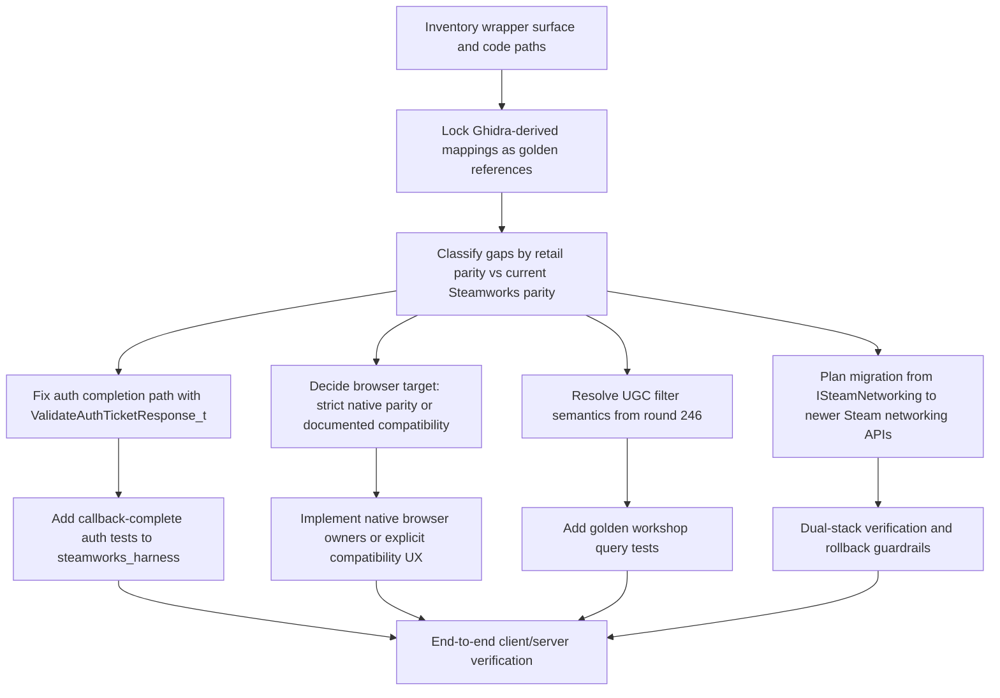

# Steamworks Parity Audit for themuffinator QuakeLive

## Implementation progress

### SteamUserStats float descriptor lane - 2026-06-06

- Added `docs/reverse-engineering/quakelive_steam_mapping_round_383.md`,
  grounded in the retained `users.stats` callback descriptor walk at HLIL
  anchors `0x0046006b`, `0x00460074`, `0x004600ef`, `0x00460103`,
  `0x0046010e`, `0x0046008d`, and `0x00460149`.
- Recovered the 88-row, seven-dword descriptor table rooted at
  `data_55da98`, with `data_55da8c = 0x58` and all shipped row
  discriminators observed as zero.
- Added `QL_Steamworks_GetUserStatFloat` for the client `SteamUserStats`
  vtable slot `0x44 / 4`, plus the disabled output-clearing fallback.
- Converted the client stat catalog into explicit `{ name, isFloat }`
  descriptors and preserved every current retail stat as an integer row.
- Updated the retained `STATS` JSON builder to branch through the float path
  when a descriptor is marked float, while continuing to use slot `0x48 / 4`
  for the current integer catalog.
- Extended executable harness coverage with mock float readback state, the
  `0x44 / 4` vtable slot, enabled/disabled exports, and ctypes assertions for
  guard, success, failure, and disabled fallback behavior.

### SteamUserStats readback harness coverage - 2026-06-06

- Added `docs/reverse-engineering/quakelive_steam_mapping_round_382.md`,
  grounded in the retained `users.stats` callback JSON builder at HLIL
  anchors `0x0046008d`, `0x0046018e`, `0x004601a6`, and `0x004601c6`.
- Extended the Steamworks harness with mock `SteamUserStats` readback slots
  for `GetAchievementDisplayAttribute` at `0x30 / 4`, `GetUserStatInt` at
  `0x48 / 4`, and `GetUserAchievement` at `0x50 / 4`.
- Added deterministic mock state for stat value, achievement state,
  unlock time, display attribute text, last SteamID, last name/key, call
  counts, and result toggles.
- Added enabled/disabled harness exports and ctypes coverage proving
  invalid-input guards, output clearing, success projection, failure
  propagation, SteamID/name/key forwarding, disabled fallback, and
  `NULL` display-attribute normalization to an empty string.
- Added static parity coverage tying the production wrappers, mock vtable
  slots, executable test, Round 188 evidence, retail HLIL anchors, and round
  382 note together.
- No production behavior changed; this pass closes deterministic harness
  evidence for already-reconstructed client stats/achievement readback
  wrappers.

### SteamUserStats clear/reset harness coverage - 2026-06-06

- Added `docs/reverse-engineering/quakelive_steam_mapping_round_375.md`,
  grounded in the retained `stats_clear` command owner at `0x00460520` and
  its `SteamUserStats()` slot `0x54` call at `0x00460531`.
- Extended the Steamworks harness with a mock `ResetAllStats` vtable slot at
  `0x54 / 4`, plus call-count, last-flag, and result controls.
- Added enabled/disabled harness exports and ctypes coverage proving the
  pre-initialisation guard, `achievementsToo ? 1 : 0` forwarding for both
  values, failure propagation, and offline fallback behavior.
- Added static parity coverage tying the production wrapper, mock vtable slot,
  executable test, retail HLIL anchors, and round 375 note together.
- No production behavior changed; this pass closes deterministic harness
  evidence for an already-mapped client stats-clear wrapper.

### Client Steam identity and SteamUtils harness coverage - 2026-06-06

- Added `docs/reverse-engineering/quakelive_steam_mapping_round_373.md`,
  grounded in the retained local SteamID helper at `0x00460550`, persona cvar
  sync helper at `0x00460610`, IP-country helper at `0x00460690`, and
  `SteamUtils()->GetAppID` callsites at `0x00431c48` and `0x00460dd6`.
- Extended the Steamworks harness with direct call counters for SteamFriends
  persona name, SteamUser identity, SteamUtils IP country, and SteamUtils app
  ID.
- Added enabled/disabled harness exports and ctypes coverage for persona
  copying, country copying, app-id forwarding, SteamID low/high projection,
  unavailable-user failure behavior, and offline output clearing.
- Added static parity coverage tying the production wrappers, mock vtable
  slots, executable test, retail HLIL anchors, and round 373 note together.
- No production behavior changed; this pass closes deterministic harness
  evidence for already-mapped client bootstrap identity and utility wrappers.

### SteamFriends friend enumeration and summary harness coverage - 2026-06-06

- Added `docs/reverse-engineering/quakelive_steam_mapping_round_372.md`,
  grounded in the retained `GetFriendList` HLIL block at `0x0043355d` through
  `0x00433a00`.
- Extended the Steamworks harness with mock `SteamFriends` enumeration slots
  for `GetFriendCount` at `0x0c / 4` and `GetFriendByIndex` at `0x10 / 4`.
- Added enabled/disabled harness exports and ctypes coverage for friend-count
  flag forwarding, by-index SteamID projection, invalid-index zeroing,
  persona-name copying, and full retained friend-summary field projection.
- Added static parity coverage tying the production wrappers, mock vtable,
  executable test, HLIL evidence, and round 372 note together.
- No production behavior changed; this pass closes deterministic harness
  evidence for an already-mapped retained browser/social friend-list edge.

### SteamFriends voice-speaking wrapper harness coverage - 2026-06-06

- Added `docs/reverse-engineering/quakelive_steam_mapping_round_368.md`,
  grounded in the retained `SteamFriends` speaking-state slot used at
  `0x00460441` and `0x004604dc` by the `+voice` and `-voice` owners.
- Extended the Steamworks harness with a mock
  `SetInGameVoiceSpeaking` vtable slot at `0x6c / 4`.
- Added enabled/disabled harness exports and ctypes coverage proving SteamID
  word-combination, speaking-on/speaking-off forwarding, call counts, and
  offline fallback behavior.
- Added static parity coverage tying the production wrapper slot, mock vtable,
  executable test, HLIL evidence, and round 368 note together.
- No production behavior changed; this pass closes deterministic harness
  evidence for an already-mapped retained voice-command edge.

### SteamUser voice wrapper harness coverage - 2026-06-06

- Added `docs/reverse-engineering/quakelive_steam_mapping_round_367.md`,
  grounded in retained `SteamUser` voice slots at `0x0046044c`,
  `0x00460459`, `0x004604b1`, `0x00460d4b`, and `0x00461b07`.
- Extended the Steamworks harness with deterministic mock `SteamUser` voice
  slots for start, stop, compressed capture, decompression, and optimal sample
  rate.
- Added enabled/disabled harness exports and ctypes coverage proving payload
  projection, output-size clearing on failures, compressed/uncompressed flag
  forwarding, sample-rate forwarding, and stable offline fallback behavior.
- Added static parity coverage tying the production wrapper slots, mock vtable,
  harness test, retail HLIL evidence, and round 367 note together.
- No production Steamworks wrapper behavior changed; this pass closes harness
  evidence for the retained voice lane rather than claiming live microphone or
  backend validation.

### Legacy P2P read-boundary harness coverage - 2026-06-06

- Added `docs/reverse-engineering/quakelive_steam_mapping_round_366.md`,
  grounded in the retained `SteamNetworking` and
  `SteamGameServerNetworking` HLIL availability/read slots at `0x00461a9d`,
  `0x00461ad8`, `0x00461d8f`, `0x00461dc8`, `0x00466928`, and
  `0x00466961`.
- Extended the client and server legacy P2P harness coverage so a staged
  packet rejected by a too-small read buffer fails deterministically and clears
  stale output size plus remote SteamID state.
- Added static parity coverage pinning the retail import names, client/server
  vtable slots, mock read-output clearing, and round 366 evidence note.
- No production Steamworks wrapper behavior changed; the retail-facing claim
  remains slot ownership and packet-pump topology, while clear-on-reject output
  cleanup is scoped to the deterministic local harness.

### UGC call-result failure projection coverage - 2026-06-06

- Added `docs/reverse-engineering/quakelive_steam_mapping_round_364.md`,
  grounded in the retained `SteamUGC` create/send query HLIL slots and the
  imported `SteamUGCQueryCompleted_t` call-result vtable.
- Extended the Steamworks harness with
  `QLR_SteamworksMock_QueueUGCQueryCompletedEx` so tests can queue raw UGC
  query-completion call results with explicit payload presence and
  `ioFailure` state.
- Added ctypes coverage proving raw failed results, `ioFailure`, no-payload
  failure, and no-payload non-IO failure all preserve the originating call
  handle and project the expected result value into the client callback bundle.
- Added static dispatcher assertions for call-handle, query-handle, row-count,
  cached-data, `ioFailure`, and no-payload branches.
- Remaining UGC work: the raw `GetAllUGC` integer filter semantic remains
  intentionally unpromoted, and live Steam backend timing remains outside this
  local callback-pump pass.

### UGC query result readback harness coverage - 2026-06-06

- Added `docs/reverse-engineering/quakelive_steam_mapping_round_363.md`,
  grounded in the retained `SteamUGC` query/readback HLIL slots at
  `0x00460DF3`, `0x00460E04`, `0x0045FD88`, and `0x0045FDAA`.
- Extended the Steamworks harness so `GetQueryUGCResult`,
  `GetQueryUGCPreviewURL`, and `ReleaseQueryUGCRequest` dispatch through
  mocked `SteamUGC` vtable slots `0x10`, `0x14`, and `0x34`.
- Added mock controls and ctypes coverage for published-file ID, title,
  description, preview URL, query handle, row index, release, failure zeroing,
  and disabled-build offline fallback behavior.
- Remaining UGC work: the raw `GetAllUGC` integer filter semantic remains
  intentionally unpromoted until stronger retail evidence identifies its
  enum/domain, and live Steam backend timing remains outside this harness pass.

### GameServer callback bundle pump coverage - 2026-06-06

- Added `docs/reverse-engineering/quakelive_steam_mapping_round_360.md`,
  grounded in the `SteamServerCallbacks_Init` mapping row, promoted callback
  handler aliases, and imported `SteamServerCallbacks` vtables in the Ghidra
  symbols corpus.
- Extended the Steamworks harness so `SteamServersConnected_t`,
  `SteamServerConnectFailure_t`, `SteamServersDisconnected_t`, and
  server-side `P2PSessionRequest_t` all have retained callback targets.
- Added queue helpers for those four previously unsampled raw server callback
  payloads.
- Added ctypes coverage proving the payloads cross
  `QL_Steamworks_RunServerCallbacks`, including result, retry, and SteamID
  projection.
- Remaining GameServer callback work: live Steam backend connection timing,
  auth policy, VAC behavior, and transport behavior stay intentionally outside
  this static/harness pass.

### Main client callback bundle pump coverage - 2026-06-06

- Added `docs/reverse-engineering/quakelive_steam_mapping_round_359.md`,
  grounded in the `SteamCallbacks_Init` mapping row, the promoted callback
  handler aliases, and the imported `SteamCallbacks` callback/call-result
  vtables in the Ghidra symbols corpus.
- Extended the Steamworks harness so `UserStatsReceived_t`,
  `PersonaStateChange_t`, client-side `P2PSessionRequest_t`,
  `GameServerChangeRequested_t`, and `FriendRichPresenceUpdate_t` all have
  retained callback targets.
- Added queue helpers for those five previously unsampled raw client callback
  payloads.
- Added ctypes coverage proving the payloads cross
  `QL_Steamworks_RunCallbacks`, including friend-summary enrichment and
  server/password string projection.
- Remaining client-callback work: live Steam backend timing, stats validity,
  presence cadence, and P2P networking semantics stay intentionally outside
  this static/harness pass.

### Lobby callback bundle pump coverage - 2026-06-06

- Added `docs/reverse-engineering/quakelive_steam_mapping_round_358.md`,
  grounded in the `SteamLobbyCallbacks_Init` HLIL constructor block at
  `0x004656A0`, the eight imported `SteamLobbyCallbacks` callback vtables in
  Ghidra symbols, and the existing mapping report's lobby callback owner rows.
- Extended the Steamworks harness so all retained lobby callback targets are
  bound during harness registration, not only `LobbyEnter_t`.
- Added queue helpers for `LobbyCreated_t`, `LobbyChatUpdate_t`,
  `LobbyChatMsg_t`, `LobbyDataUpdate_t`, `LobbyGameCreated_t`,
  `LobbyKicked_t`, and `GameLobbyJoinRequested_t`.
- Expanded the callback-bundle harness test so every lobby payload crosses
  `QL_Steamworks_RunCallbacks`, including the chat-message path that retrieves
  the message body through the mocked `GetLobbyChatEntry` vtable slot.
- Remaining lobby callback work: live Steam backend timing, lobby membership
  edge cases, and browser event ordering remain intentionally outside this
  static/harness pass.

### GameServer and P2P vtable ABI normalization - 2026-06-06

- Added `docs/reverse-engineering/quakelive_steam_mapping_round_356.md`,
  grounded in the adjacent GameServer/P2P HLIL dispatches at `0x00465A40`,
  `0x00465A60`, `0x00465B00`, `0x00465B70`, `0x00465D50`, and the outgoing
  packet drain slot.
- Added `QL_STEAMWORKS_FASTCALL` and converted the retained
  `ISteamNetworking`, `ISteamGameServer`, and `ISteamGameServerNetworking`
  vtable typedefs to the explicit `self, unused, ...` ABI shape used by the
  rest of the reconstructed Steam interface wrappers.
- Updated GameServer metadata, identity, logged-on, public-IP,
  incoming/outgoing packet, and legacy P2P call sites to pass the unused second
  argument before their mapped retail parameters.
- Updated the Steamworks harness vtable mocks to the same ABI shape so harness
  execution catches argument ordering instead of only slot presence.
- Remaining ABI work: broader live Steam validation is still intentionally
  bounded by the opt-in online-service policy, but the static x86 C++ vtable
  shape for this server wrapper family is now source-backed.

### GameServer P2P session request active-client gate - 2026-06-06

- Added `docs/reverse-engineering/quakelive_steam_mapping_round_355.md`,
  grounded in `SteamServerCallbacks_OnP2PSessionRequest` (`0x00465B70`), the
  `CS_ACTIVE`-equivalent `*client == 4` comparison, the two-word SteamID match,
  and the `SteamGameServerNetworking` slot `0x0c` accept dispatch.
- Added `SV_FindActiveClientBySteamId` so server-side P2P admission can mirror
  the retail active-slot scan without narrowing the broader SteamID lookup used
  by `ValidateAuthTicketResponse_t` and other pre-active auth callbacks.
- Updated `SV_SteamServerP2PSessionRequestCallback` to use the active-only
  SteamID finder, remove the extra `platformAuthSucceeded` gate, and publish an
  accepted diagnostic before calling the retained server P2P accept wrapper.
- Tightened static parity coverage for the active-client finder, callback
  dispatch, removed auth-success gate, null/missing-player rejection, and
  provider-aware logging.
- Remaining P2P work: live Steam networking callback timing and backend NAT
  behavior remain intentionally bounded until online services have a documented
  open replacement path or explicit opt-in validation pass.

### GameServerStats logged-on request gate - 2026-06-06

- Added `docs/reverse-engineering/quakelive_steam_mapping_round_354.md`,
  grounded in `SteamStats_OnServersConnected` (`0x00467190`), the repeated
  constructor/bootstrap gate at `0x004679d9`, and the observed
  `SteamGameServer` slot `0x20` check before `SteamGameServerStats` slot
  `0x00`.
- Reconstructed `QL_Steamworks_ServerIsLoggedOn` with a disabled fallback stub
  so default builds keep Quake Live online services offline.
- Gated `QL_Steamworks_ServerRequestUserStats` behind the logged-on check
  before dispatching to the retained `SteamGameServerStats` request slot.
- Extended the Steamworks harness with a mocked `SteamGameServer::BLoggedOn`
  slot, result control, call counting, and logged-off suppression coverage.
- Remaining request-gate work: live Steam backend validation remains
  intentionally bounded until online services have a documented open
  replacement path or an explicit opt-in validation pass.

### GameServer incoming UDP packet bridge - 2026-06-06

- Added `docs/reverse-engineering/quakelive_steam_mapping_round_353.md`,
  grounded in `SteamServer_HandleIncomingPacket` (`0x00465d50`), the HLIL
  `SteamGameServer` slot `0x94` dispatch, and the existing outgoing slot
  `0x98` drain.
- Reconstructed `QL_Steamworks_ServerHandleIncomingPacket` with a disabled
  fallback stub so live Steam online services remain opt-in.
- Wired `SV_PacketEvent` through `SV_SteamServerHandleIncomingPacket`, which
  packs IPv4 source bytes in the retail order and forwards the original packet
  buffer and raw source port into the Steam GameServer interface.
- Extended the Steamworks harness with a mocked incoming-packet slot, payload
  capture, endpoint capture, and success/failure coverage.
- Remaining bridge work: live Steam backend validation remains intentionally
  bounded until online services have a documented open replacement path or a
  deliberate opt-in validation pass.

### GameServerStats descriptor replay map - 2026-06-06

- Added `docs/reverse-engineering/quakelive_steam_mapping_round_352.md`,
  grounded in `SteamStats_FlushPendingValues` (`0x004670c0`),
  `SteamStats_OnStatsReceived` (`0x004671d0`), `data_561060`,
  `data_561c00`, and the descriptor stride/type/value offsets.
- Converted the server-owned stats table from bare names to descriptor records
  with retail type IDs `0` (int), `1` (float), and `2` (average-rate).
- Added type-aware server load/flush dispatch across int, float, and
  average-rate wrappers while keeping the 88 recovered qagame stat names as
  int descriptors.
- Kept qagame `AddSteamStat` conservative as an int-delta API; non-int
  descriptors are logged and declined until stronger retail evidence
  identifies a public float/average-rate update owner.
- Remaining stats work: exact non-int descriptor name promotion and live
  backend validation remain bounded.

### GameServerStats value wrapper map - 2026-06-06

- Added `docs/reverse-engineering/quakelive_steam_mapping_round_351.md`,
  grounded in `SteamStats_FlushPendingValues` (`0x004670c0`),
  `SteamStats_OnStatsReceived` (`0x004671d0`), the
  `SteamGameServerStats` import, and the promoted symbol aliases.
- Reconstructed the remaining observed `SteamGameServerStats` value wrappers:
  float get at slot `0x04`, float set at slot `0x10`, and average-rate update
  at slot `0x18`, while preserving the existing int, achievement, request, and
  store slots.
- Extended the disabled stubs and the Steamworks harness so both enabled and
  disabled fixture variants expose the same wrapper surface without promoting
  live online services.
- Added harness coverage for request, int/float read, int/float write,
  average-rate update, achievement, store, and failure zeroing through a mocked
  `SteamGameServerStats` vtable.
- Remaining stats work: full descriptor-table replay and live backend behavior
  remain bounded until a deliberate validation pass is justified.

### GameServer stats callback bootstrap - 2026-06-06

- Added `docs/reverse-engineering/quakelive_steam_mapping_round_350.md`,
  grounded in the `SteamGameServerUtils` import, `idSteamStats`
  `GSStatsReceived_t` / `GSStatsStored_t` callback vtables, and HLIL callback
  registrations at IDs `0x708` and `0x709`.
- Extended `platform_steamworks.[ch]` with public GS stats callback events,
  server callback binding slots, raw payload dispatchers, retained callback
  registration/unregistration, and optional `QL_Steamworks_ServerGetAppID`
  through the observed server-utils slot `0x24`.
- Wired the server stats owner to retain the app id, observe received/stored
  callback results, and re-request values for the retail partial-validation
  result `8` without promoting live Steam services by default.
- Extended the Steamworks harness with mock `SteamGameServerUtils`, queueable
  GS stats callback payloads, and executable callback-pump coverage.
- Remaining stats work: live Steam backend validation and full descriptor-table
  callback replay remain bounded until online services are deliberately
  promoted beyond the current opt-in policy.

### Initial round - 2026-05-24

- Confirmed the current tree already contains the `ValidateAuthTicketResponse_t` wrapper payload, `QL_Steamworks_RegisterServerCallbacks`, server-side pending auth state, and `SV_SteamServerValidateAuthTicketResponseCallback`.
- Added executable harness coverage for the server callback pump: queued `ValidateAuthTicketResponse_t` payloads now dispatch through `QL_Steamworks_RunServerCallbacks`, not only through source-text assertions.
- Added a regression test that registers the retained Steam GameServer callback bundle, queues a VAC-ban auth response, pumps server callbacks, and verifies the captured SteamID, owner SteamID, and auth response code.
- Remaining auth hardening work: add a server-connect lifecycle test that proves a client remains pending until the callback arrives, succeeds only on accepted callback responses, and is dropped on failure responses.

### Follow-up auth hardening - 2026-05-24

- Preserved the retail-observed stats bootstrap owner after rechecking `docs/reverse-engineering/quakelive_steam_mapping_round_04.md`: a successful `BeginAuthSession` creates the per-player `idSteamStats` session in retail.
- Added harness coverage for edge `BeginAuthSession` outcomes so duplicate/replayed, wrong-game, expired, version-mismatch, and unknown auth results remain pending/denied/error instead of becoming optimistic accepts.
- Remaining auth hardening work: add a higher-level server-client lifecycle harness or integration probe for pending-to-callback finalization without contradicting the retail stats-session owner.

### Server auth lifecycle trace - 2026-05-24

- Extended `tools/integration/auth_flow_trace.py` with a server-side `BeginAuthSession` to `ValidateAuthTicketResponse_t` timeline that covers accepted callbacks, denied/VAC callbacks, missing-client callbacks, and immediate begin failures.
- Added source-bound pytest coverage tying that trace back to `SV_BeginPlatformAuthSession`, `SV_VerifyClientSteamAuth`, `SV_DirectConnect`, and `SV_SteamServerValidateAuthTicketResponseCallback`.
- Confirmed the retained contract now has a regression probe: qagame may allow pending auth only before `CS_CONNECTED`, post-connect pending remains denied until the callback, accepted callbacks finalise success, and failed callbacks drop the client.
- Remaining auth hardening work: a true in-process server harness or low-cost dedicated-server runtime probe can still provide stronger end-to-end evidence, but the callback-complete lifecycle is no longer only documented in prose.

### Server auth validation owner diagnostics - 2026-05-24

- Rechecked `docs/reverse-engineering/quakelive_steam_mapping_round_01.md`: the retail validation callback matches the callback SteamID to a live client and accepts/kicks based on allowed response codes.
- Added behavior-neutral lifecycle diagnostics for processed `ValidateAuthTicketResponse_t` callbacks that include target SteamID, owner SteamID, and response code.
- Remaining auth hardening work: owner/family-share policy should stay observational until a stronger retail or documented replacement policy justifies changing acceptance behavior.

### Server auth ownership labeling - 2026-05-24

- Added behavior-neutral ownership labels to `ValidateAuthTicketResponse_t` diagnostics: `self-owned`, `owner-unset`, and `owner-mismatch`.
- Extended the server auth lifecycle trace with an accepted owner-mismatch observation so the current policy remains explicit: owner mismatch is logged, not newly denied.
- Remaining owner-policy work: do not convert owner mismatch into a reject rule without stronger retail evidence or a documented open replacement policy.

### Server auth callback matrix harness - 2026-05-24

- Expanded the Steamworks harness callback-pump regression from one VAC-ban payload into a callback matrix covering OK/self-owned, OK/owner-unset, OK/owner-mismatch, and VAC-denied responses.
- The matrix proves `QL_Steamworks_RunServerCallbacks` preserves the callback SteamID, owner SteamID, and auth response code across accepted and denied server validation payloads.
- Remaining auth hardening work: this is still wrapper/callback-pump evidence, not a full in-process server-client lifecycle probe.

### Client auth ticket API labeling - 2026-05-24

- Rechecked `docs/reverse-engineering/quakelive_steam_mapping_round_93.md`: the retained client ticket lifetime is explicitly `SteamClient_GetAuthSessionTicket` plus `SteamClient_CancelAuthTicket`.
- Added `QL_Steamworks_GetAuthTicketApiLabel` and included the label in client auth payload diagnostics, so the current lane is visibly retail `GetAuthSessionTicket` rather than modern `GetAuthTicketForWebApi`.
- Remaining modern-auth work: this does not add Web API auth; it keeps the retail ticket lane explicit until a documented modern adapter is introduced.

### Client auth modern gap labeling - 2026-05-24

- Rechecked the modern-adapter gap list: the repo still has no native `GetAuthTicketForWebApi` wrapper, and the retained ticket path should remain retail-faithful until an adapter is designed deliberately.
- Added `QL_Steamworks_GetAuthTicketModernGapLabel` and threaded it into client auth payload diagnostics as `missing GetAuthTicketForWebApi adapter`.
- Remaining modern-auth work: this is still an explicit gap label, not a Web API auth implementation or policy decision.

### Workshop callback filtering - 2026-05-24

- Tightened the workshop callback assertions so both installed-item and download-result callbacks explicitly gate mismatched app IDs through `QL_Steamworks_GetAppID()`.
- Corrected the installed-item app-ID rejection diagnostic to name `OnItemInstalled` instead of the neighboring download-result callback.

### SteamDataSource subset formalization - 2026-05-24

- Rechecked `docs/reverse-engineering/quakelive_steam_mapping_round_91.md`: non-avatar URI requests already continue into the launcher/web fallback owner after the bounded SteamDataSource path declines them.
- Updated the non-avatar `steam://` diagnostic to say the bridge is trying the launcher/web fallback, making the supported subset and fallback path explicit.

### SteamDataSource subset labeling - 2026-05-24

- Rechecked `docs/reverse-engineering/quakelive_steam_mapping_round_91.md`: non-avatar URI resources belong to the retained launcher/resource fallback chain, while `steam://avatar/...` remains the SteamDataSource-owned native subset.
- Added an `avatar-only SteamDataSource` ownership label to Steam resource bridge diagnostics so future expansion can distinguish the currently reconstructed subset from a broader live SteamDataSource owner.
- Remaining SteamDataSource work: identify any non-avatar retail SteamDataSource owners before expanding native `steam://` handling beyond avatars.

### SteamDataSource native gap labeling - 2026-05-24

- Rechecked the retained launcher/resource fallback path: non-avatar `steam://` resources still fall through to the launcher/web owner rather than a broader native SteamDataSource implementation.
- Added `CL_GetSteamDataSourceNativeGapLabel` and threaded it into Steam resource bridge unavailable diagnostics as `missing non-avatar SteamDataSource owner`.
- Remaining SteamDataSource work: this keeps the native subset boundary explicit, but does not add new non-avatar resource owners.

### SteamDataSource fallback-owner labeling - 2026-06-05

- Added `docs/reverse-engineering/quakelive_steam_mapping_round_344.md`, grounded in the retained `SteamDataSource`, `QLResourceInterceptor`, and `Awesomium::DataSource::SendResponse` evidence.
- Added `CL_GetSteamDataSourceFallbackOwnerLabel` as `QLResourceInterceptor launcher/web fallback` and published it through `ui_resourceBridgeSteamDataSourceFallbackOwner`.
- Updated the non-avatar `steam://` diagnostic to say the request is routed to the launcher/web fallback owner, while keeping avatars as the only native SteamDataSource subset.
- Remaining SteamDataSource work: the exact retail non-avatar SteamDataSource semantics and live Awesomium delayed-response object remain bounded until stronger evidence or an open replacement path exists.

### UGC GetAllUGC filter harness - 2026-05-24

- Rechecked `docs/reverse-engineering/quakelive_steam_mapping_round_246.md`: the strongest retail-backed contract is pass-through of the single coerced integer into `CreateQueryAllUGCRequest( 1, 0, appId, appId, filter )`, not a bounded page number.
- Added Steamworks harness coverage for `QL_Steamworks_RequestAllUGCQuery` so filters `0`, `1`, and `0xffffffff` all reach the mocked UGC create-query slot, bind a call result, and avoid release-on-success.
- The exact semantic label for the integer remains intentionally unpromoted, but the product behavior is now pinned at the wrapper level instead of only by source-text assertions.

### UGC GetAllUGC contract labeling - 2026-05-24

- Rechecked `docs/reverse-engineering/quakelive_steam_mapping_round_246.md`: the browser `GetAllUGC` integer should stay a raw pass-through value until stronger retail evidence identifies its enum/domain.
- Added `QL_Steamworks_GetAllUGCFilterContractLabel` and client request diagnostics that label the value as a `raw GetAllUGC integer filter`.
- Remaining UGC work: do not reintroduce page-style validation or a stronger enum name unless new retail evidence supports it.

### UGC GetAllUGC semantic gap labeling - 2026-05-24

- Rechecked the round 246-derived UGC gap: the pass-through behavior is pinned, but the integer's source-level semantic name remains unresolved.
- Added `QL_Steamworks_GetAllUGCFilterSemanticGapLabel` and threaded it into the client request diagnostic as `unpromoted GetAllUGC filter semantic`.
- Remaining UGC work: this label does not reinterpret the integer; future enum/domain promotion still needs stronger retail evidence.

### Native server-browser wrapper reconstruction - 2026-05-25

- Added `docs/reverse-engineering/quakelive_steam_mapping_round_297.md`, grounded in the `SteamMatchmakingServers` import, the `JSBrowser` / `JSBrowserDetails` vtables, the alias map, and HLIL offsets for `JSBrowser_RequestServers`, `SteamBrowser_RefreshList`, `JSBrowser_OnServerResponded`, and `JSBrowserDetails_RequestServerDetails`.
- Reconstructed the low-level `ISteamMatchmakingServers` wrapper in `platform_steamworks.[ch]`: list request modes 0-4, retained `gamedir=baseq3` filtering, row lookup, refresh/release, and detail probes through the observed ping/rules/players slots.
- Extended the Steamworks harness to mock the native server-browser vtable and pin disabled stubs, all request modes, filter/app-id forwarding, request lifecycle calls, and the retail detail-probe order `PingServer -> ServerRules -> PlayerDetails`.
- Remaining server-browser work at that point: the client `CL_SteamBrowser_*`
  friends/history path was still the explicit source-browser compatibility
  owner. Later 2026-06-05 list/detail passes wired native-first client owners
  and narrowed this to a provider/request-handle fallback boundary.

### Server-browser row projection reconstruction - 2026-05-25

- Added `docs/reverse-engineering/quakelive_steam_mapping_round_298.md`, normalizing the `JSBrowser_OnServerResponded` field walk into the retail-era `gameserveritem_t` offsets behind `GetServerDetails`.
- Added the public `ql_steam_server_item_t` projection and `QL_Steamworks_ReadServerListDetails`, including AppID validation, bounded string copies, disabled-stub zeroing, and harness coverage for all projected fields.
- Remaining server-browser work after this row-projection pass was empty-name display fallback (`sub_461f10`), client browser publishing, and ping/player/rules query-handle cancellation; round 299 closes the first of those.

### Server-browser display-name fallback reconstruction - 2026-05-25

- Added `docs/reverse-engineering/quakelive_steam_mapping_round_299.md`, mapping `sub_461f10` as the four-slot, 64-byte retail fallback formatter for unnamed server-browser rows.
- Added `displayName` to `ql_steam_server_item_t` so the wrapper preserves both the raw Steam row name and the browser-facing fallback name used by retail.
- Extended the Steamworks harness with an empty-name row test that proves the projection produces the reconstructed `ip:port` display string while AppID rejection still clears it.
- Remaining server-browser work after this display-name pass was client browser publishing and ping/player/rules query-handle cancellation; round 300 adds the low-level cancellation primitive while leaving product wiring open.

### Server-browser query lifecycle wrapper - 2026-05-25

- Added `docs/reverse-engineering/quakelive_steam_mapping_round_300.md`, documenting the `JSBrowserDetails` detail-query callback counters and the absence of an observed retail `CancelServerQuery` call in the committed HLIL slice.
- Added `QL_Steamworks_CancelServerQuery` as a low-level, build-gated wrapper for the SDK-adjacent `ISteamMatchmakingServers` slot `0x40`.
- Extended the Steamworks harness to mock slot `0x40`, ignore query `0`, and prove that returned ping/player/rules query handles can be canceled when a future native browser owner needs that lifecycle primitive.
- Remaining server-browser work: client browser publishing remains open; cancellation is available at the wrapper layer but intentionally not product-wired without stronger retail evidence.

### Server-browser client integration relabeling - 2026-05-25

- Added `docs/reverse-engineering/quakelive_steam_mapping_round_301.md`, reconciling the source-backed client browser telemetry with the low-level `ISteamMatchmakingServers` wrapper reconstructed in rounds 297-300.
- Updated the compatibility marker from a total missing-adapter label to `ISteamMatchmakingServers native list owner unavailable; using source-browser fallback`, preserving the existing `nativeAdapterGap` payload key while making the then-remaining fallback a runtime/provider boundary rather than a wrapper-existence gap. Round 345 later narrows the label to native request-handle unavailability.
- Remaining server-browser work: extend the native detail-query owner beyond the current UDP status fallback with clear ping/player/rules callback ownership and cancellation evidence.

### Server-browser request-mode contract - 2026-05-25

- Added `docs/reverse-engineering/quakelive_steam_mapping_round_302.md`, formalizing the retained `JSBrowser_RequestServers` mode labels and filter behavior from the HLIL switch.
- Added wrapper helpers for request-mode labels and the `gamedir=baseq3` filter predicate, then routed `QL_Steamworks_RequestServerList` through that predicate so LAN stays the only unfiltered native request and invalid/default modes remain internet-filtered.
- Extended the Steamworks harness to pin enabled/disabled labels, LAN no-filter behavior, and invalid/default dispatch through the internet request slot.
- Round 347 later aligned the client retained-mode label with this wrapper
  contract, so invalid/default request modes now publish diagnostics as
  `internet` rather than `unknown`.
- Remaining server-browser work after the native owner passes is live
  friends/history result parity and any distinct WebUI recent-mode evidence.

### Browser favorite-server SteamMatchmaking fallback - 2026-06-05

- Added `docs/reverse-engineering/quakelive_steam_mapping_round_348.md`,
  grounded in the `SetFavoriteServer` qz method row, the `0x00432681` HLIL
  dispatcher branch, and the `SteamMatchmaking` / `SteamUtils` imports.
- Extended the Steamworks harness so the favorite-game add/remove vtable slots
  at `0x08` and `0x0c` are executable evidence, not only source-text mapping.
- Pinned app ID, IP, shared connection/query port, favorite flag, add
  timestamp, remove timestamp absence, disabled-build false returns, and
  provider failure propagation.
- Updated the client bridge so a failed opted-in Steam favorite update logs the
  failure but still mirrors the server into the inherited local favorites
  cache as an explicit open-build compatibility fallback.
- Remaining work: live Steam favorite persistence can still be compared against
  retail if online services are promoted beyond the current opt-in boundary.

### Server-browser owner lifecycle reconstruction - 2026-05-25

- Added `docs/reverse-engineering/quakelive_steam_mapping_round_303.md`, mapping the retained `JSBrowser` active flag and request-handle lifecycle from `RequestServers`, `RefreshList`, and `OnRefreshComplete`.
- Added `ql_steam_server_browser_owner_t` plus init/begin/refresh/complete helpers. Begin now mirrors the retail guard by ignoring already-active owners, releasing an old inactive request before replacement, marking the owner active, and storing the native request handle.
- Extended the Steamworks harness to pin idle-start behavior, active-request suppression, refresh through the live handle, refresh-complete clearing of the active flag without clearing the handle, and release-before-replace after completion.
- Remaining server-browser work: allocate or embed the callback/owner in client code and publish native row/failure/refresh events without regressing the compatibility lane.

### Server-browser response projection - 2026-05-25

- Added `docs/reverse-engineering/quakelive_steam_mapping_round_304.md`, projecting the retained `JSBrowser_OnServerResponded` browser object from the typed Steam row.
- Added `ql_steam_server_browser_response_t`, response-id formatting, row-to-response projection, and read-and-project helpers. The projection carries display name fallback, player counts, ping, map, password/VAC flags, packed IP, unsigned port, decimal SteamID text, tags, gametype string, and lastPlayed.
- Extended the Steamworks harness to pin the response id, display-name fallback, SteamID text, gametype string, AppID rejection, and disabled-build zeroing behavior.
- Remaining server-browser work: wire native row/failure/refresh publication through the client event bridge and reconcile that with the source-browser compatibility publisher.

### Server-browser failure and refresh projections - 2026-05-25

- Added `docs/reverse-engineering/quakelive_steam_mapping_round_305.md`, reconstructing the retained `JSBrowser` failed-to-respond and refresh-complete event identities.
- Added `ql_steam_server_browser_failure_t`, `ql_steam_server_browser_refresh_complete_t`, and helpers for `servers.details.%i.failed` and `servers.refresh.end`.
- Extended the Steamworks harness to pin signed failure ids, failure event-name formatting, refresh-complete identity, disabled-build zeroing, and the owner active-flag clear from round 303.
- Remaining server-browser work: publish these native projections from a client-owned callback adapter without double-publishing the existing source-browser compatibility events.

### Server-browser detail identity projections - 2026-05-25

- Added `docs/reverse-engineering/quakelive_steam_mapping_round_306.md`, reconstructing the retained `JSBrowserDetails` detail id and rules/player event-name contract from the HLIL request and callback offsets.
- Added `ql_steam_server_browser_detail_identity_t`, `ql_steam_server_browser_detail_event_t`, and helpers for `%u_%i` detail ids plus `servers.rules.%s.{response,failed,end}` and `servers.players.%s.{response,failed,end}` event names.
- Extended the Steamworks harness to pin enabled/disabled projection behavior, high-bit signed-port formatting, invalid enum zeroing, and all six rules/player event-name variants.
- Remaining server-browser work: wire native callback publication through a single client owner.

### Server-browser detail response payloads - 2026-05-25

- Added `docs/reverse-engineering/quakelive_steam_mapping_round_307.md`, reconstructing the successful `JSBrowserDetails` rules/player response payload fields from the HLIL callback builders.
- Added `ql_steam_server_browser_rule_response_t`, `ql_steam_server_browser_player_response_t`, and builders for `rule`/`value` plus `name`/`score`/`time` payloads under the existing detail identity/event projection.
- Extended the Steamworks harness to pin enabled/disabled payload projection behavior, null-string normalization, invalid identity zeroing, and the two response event families.
- Remaining server-browser work: wire native callback publication through a single client owner.

### Server-browser detail lifecycle counter - 2026-05-25

- Added `docs/reverse-engineering/quakelive_steam_mapping_round_309.md`, reconstructing the retained `JSBrowserDetails` shared completion counter across ping, rules, and player-detail terminal callbacks.
- Added `QL_STEAM_SERVER_BROWSER_DETAIL_COMPLETION_TARGET`, `ql_steam_server_browser_detail_lifecycle_t`, and helpers to initialize the detail identity plus advance the shared three-callback release decision.
- Extended the Steamworks harness to pin enabled/disabled lifecycle behavior, the `16909060_27960` identity, the first two non-release completions, the third release-ready completion, and post-release clamping.
- Remaining server-browser work: wire the native callback adapter/allocation owner and publish native detail events through one client-owned path.

### Server-browser detail request owner views - 2026-05-25

- Added `docs/reverse-engineering/quakelive_steam_mapping_round_310.md`, reconstructing the retained `JSBrowserDetails` base, `base + 4`, and `base + 8` response views used by `ServerRules`, `PlayerDetails`, and `PingServer`.
- Added response-view offsets, `ql_steam_server_browser_detail_response_views_t`, `ql_steam_server_browser_detail_request_t`, and helpers to begin the detail request bundle plus retire the wrapper sidecar once the shared completion counter reaches three terminal callbacks.
- Extended the Steamworks harness to pin enabled/disabled view building, the retail `PingServer -> ServerRules -> PlayerDetails` launch order, response pointers `base + 8`, `base`, and `base + 4`, active-request suppression, and release-time sidecar clearing.
- Remaining server-browser work at the time: allocate or embed the real callback object in client code and publish native detail events through one client-owned path. The 2026-06-05 detail-owner pass below closes that item for the WebUI `RequestServerDetails` lane.

### WebUI server-browser native detail owner - 2026-06-05

- Added `docs/reverse-engineering/quakelive_steam_mapping_round_343.md`, grounding the client detail owner in the retail `JSBrowserDetails` object layout, callback view offsets, event names, and terminal callback counter.
- Added `QL_Steamworks_ReadServerBrowserPingResponse` so ping-row `gameserveritem_t` payloads share the same app-id gate and WebUI response projection as native list rows.
- Wired `CL_Steam_RequestServerDetails` to try the native `ISteamMatchmakingServers` detail owner first in opted-in Steamworks builds, publishing ping, rules, and players events through the retained WebUI event families before falling back to the UDP status-query path when the native owner is unavailable.
- Extended Steamworks harness, platform-service, and netcode parity guards so the native detail owner, ping projection, callback publication, and fallback boundary are all pinned.
- Remaining server-browser work: live friends/history result parity and any
  distinct WebUI recent-mode semantics still need stronger evidence; the
  Internet/LAN/friends/favorites/history list modes, invalid/default
  `RequestServers` internet default, and WebUI detail lane are no longer
  missing native owner integration.

### Server-browser native request-handle fallback - 2026-06-05

- Added `docs/reverse-engineering/quakelive_steam_mapping_round_345.md`,
  reconciling the round 297/302/303 native owner evidence with the current
  native-first client list path.
- Tightened `QL_Steamworks_BeginServerBrowserOwnerRequest` so a zero
  `ISteamMatchmakingServers` request handle leaves the owner idle and returns
  false, allowing `CL_Steam_RequestServers` to enter the retained source-browser
  fallback instead of timing out a handleless native refresh.
- Relabeled friends/history compatibility telemetry as fallback-only:
  `friends fallback mapped to global source` and
  `history fallback mapped to favorites source` are now reasons used after the
  native request cannot start, not evidence that those modes are permanently
  source-owned.
- Extended the Steamworks harness with a request-result setter and direct
  zero-handle lifecycle coverage.
- Remaining server-browser work: live Steam-enabled result comparison for
  friends/history and evidence for any distinct WebUI recent mode outside the
  observed 0-4 `RequestServers` switch.

### Server-browser invalid/default request-mode labeling - 2026-06-05

- Added `docs/reverse-engineering/quakelive_steam_mapping_round_347.md`,
  rechecking the retail `JSBrowser_RequestServers` HLIL branch where
  `arg2 - 1 u> 3` sends mode `0` and out-of-range values through the internet
  request slot with the `gamedir=baseq3` filter.
- Updated `CL_SteamBrowser_RequestModeLabel` so the client retained-mode label
  now matches both dispatch helpers: invalid/default modes are `internet`, not
  `unknown`.
- Extended the platform-service parity guard to pin the explicit mode-0 and
  default `internet` labels while preserving the native/source dispatch
  behavior.
- Remaining server-browser work: live friends/history result parity and any
  separate WebUI recent-mode semantics remain open; the observed
  invalid/default `RequestServers` behavior is now documented and guarded.

### Server-browser compatibility telemetry - 2026-05-24

- Rechecked `docs/reverse-engineering/quakelive_steam_mapping_round_181.md`: the retained browser methods are reconstructed on the source-owned LAN/global/favorites browser path, while friends/history needed bounded compatibility mappings until native `ISteamMatchmakingServers` ownership was rebuilt.
- Added explicit telemetry for those fallback modes: Steam browser request mode `2` (`friends`) reported that it was serviced through the global source list, and mode `4` (`history`) reported the favorites source list.
- Published a `servers.refresh.compatibility` browser event and provider/policy diagnostic log only for those fallback modes, so compatibility behavior is visible without changing internet/LAN/favorites refresh semantics.
- Remaining server-browser work after the 2026-06-05 native-first pass is live
  friends/history result parity and any distinct WebUI recent-mode semantics.

### Server-browser compatibility owner labeling - 2026-05-24

- Rechecked `docs/reverse-engineering/quakelive_steam_mapping_round_181.md`: friends/history browser modes were intentionally source-backed compatibility mappings before the native list owner was wired.
- Added stable compatibility-owner and missing-native-owner labels to the browser fallback telemetry payload: `source-browser compatibility` and `ISteamMatchmakingServers`.
- Remaining server-browser work after the native list-owner pass is keeping the
  fallback owner explicit when the native request handle is unavailable.

### Server-browser compatibility reason labeling - 2026-05-24

- Rechecked `docs/reverse-engineering/quakelive_steam_mapping_round_181.md`: mode `2` fell back to the global source list and mode `4` fell back to the favorites source list when native ownership was not yet available.
- Added reason labels to the compatibility log/event payload so friends/history fallback reasons now say `friends fallback mapped to global source` or `history fallback mapped to favorites source` alongside the missing native owner.
- Remaining server-browser work after the native list-owner pass is stronger
  live evidence for friends/history result parity, not absence of the native
  `ISteamMatchmakingServers` wrapper or client owner.

### Server-browser native adapter gap labeling - 2026-05-24

- Rechecked the server-browser compatibility lane: friends/history published through retained source-backed lists before the native list owner was wired.
- Added `CL_SteamBrowser_NativeAdapterGapLabel` and threaded it into the compatibility log/event payload as the explicit native adapter gap marker. Round 345 updates the value again after native list/detail client ownership so the label now points at native request-handle unavailability.
- Remaining server-browser work: this label keeps the provider/request-handle
  fallback explicit without hiding the native-first owner now present in the
  client.

### Client P2P peer guard - 2026-05-24

- Rechecked `docs/reverse-engineering/quakelive_steam_mapping_round_01.md`: retail `SteamCallbacks_OnP2PSessionRequest` accepts a client-side P2P session only when the incoming SteamID matches the currently tracked peer target.
- Tightened `CL_Steam_Client_OnP2PSessionRequest` to resolve the retained server SteamID configstring, ignore missing or mismatched peer callbacks with provider-aware diagnostics, and call `QL_Steamworks_AcceptP2PSession` only for the tracked server peer.
- Added source-bound regressions in the client lobby and voice parity tests so the callback guard remains tied to the same server SteamID used by the retained voice send path.
- Remaining P2P work: keep the legacy `ISteamNetworking` stress/migration track open, including a documented adapter path for `ISteamNetworkingSockets` or `ISteamNetworkingMessages` rather than expanding arbitrary legacy P2P acceptance.

### Legacy P2P transport labeling - 2026-05-24

- Rechecked the retained P2P owner surface: both client voice packets and server GameServer P2P maintenance still run through the legacy `ISteamNetworking` wrapper slots documented in the mapping rounds.
- Added `QL_Steamworks_GetP2PTransportLabel` so diagnostics can explicitly distinguish the retail-faithful legacy transport from any future `ISteamNetworkingSockets` or `ISteamNetworkingMessages` adapter.
- Threaded that label through client voice transport failures, server P2P maintenance diagnostics, and server P2P session-request diagnostics.
- Remaining P2P work: this does not migrate transport behavior; it makes the retained owner visible and test-pinned before a dual-stack or replacement adapter is introduced.

### Legacy P2P modern gap labeling - 2026-05-24

- Rechecked the modern-adapter gap list: the retained P2P transport still has no `ISteamNetworkingSockets` or `ISteamNetworkingMessages` adapter.
- Added `QL_Steamworks_GetP2PModernGapLabel` and threaded it through client voice transport, server networking maintenance, and server P2P session-request diagnostics as `missing ISteamNetworkingSockets/ISteamNetworkingMessages adapter`.
- Remaining P2P work: this label does not alter legacy packet handling; it keeps the migration target explicit before any dual-stack adapter is designed.

### Legacy P2P vtable harness coverage - 2026-06-05

- Added `docs/reverse-engineering/quakelive_steam_mapping_round_349.md`,
  grounded in the retained `SteamNetworking` / `SteamGameServerNetworking`
  import evidence and the HLIL availability/read/send call sites.
- Extended the Steamworks harness with executable client
  `SteamAPI_SteamNetworking` send, availability, read, and accept slots, plus
  equivalent `SteamGameServerNetworking` slots instead of the prior null mock.
- Added a one-shot mock for the retained `SteamGameServer::GetNextOutgoingPacket`
  wrapper slot, including packet payload, IP, port, and call-count assertions.
- Added enabled/disabled ctypes coverage proving legacy packet payloads,
  SteamIDs, send types, channels, availability/read outputs, accept failures,
  and outgoing UDP packet behavior.
- Remaining P2P work: live Steam runtime comparison and any
  `ISteamNetworkingSockets` / `ISteamNetworkingMessages` adapter remain
  intentionally separate from this retail-era wrapper mapping.

### GameServer version override - 2026-05-24

- Rechecked `docs/reverse-engineering/quakelive_steam_mapping_round_01.md`: the retail bootstrap owner calls `SteamGameServer_Init`, applies account/login policy, sets product/game-dir strings, and then proceeds into the published server path.
- Preserved the observed retail default version string as `QL_STEAM_GAMESERVER_DEFAULT_VERSION` while adding `QL_Steamworks_ServerInitWithVersion` so startup code can pass an explicit value instead of baking the string into the wrapper call site.
- Added `sv_steamServerVersion`, defaulting to the retained retail string, and wired `Com_InitSteamGameServer` through the new version-aware wrapper.
- Extended the Steamworks harness to prove both the default `QL_Steamworks_ServerInit` path and an overridden version string reach the mocked `SteamGameServer_Init` import.
- Remaining version work: identify the exact retail source of the Steam init version string before promoting a stronger name or coupling it to another engine build/protocol cvar.

### GameServer version diagnostics - 2026-05-24

- Kept `sv_steamServerVersion` as the explicit startup owner and resolved empty values back to `QL_STEAM_GAMESERVER_DEFAULT_VERSION` before calling the Steam GameServer init wrapper.
- Added a debug bootstrap diagnostic that records the version string plus provider/policy labels before the init attempt.
- Remaining version work: the log improves observability, but the exact retail source/name of the default string is still unpromoted.

### GameServer version source labeling - 2026-05-24

- Added a behavior-neutral bootstrap source label for the Steam GameServer version string: `retail observed default` for the retained `1069` lane and `sv_steamServerVersion override` for explicit non-default values.
- Threaded that label into the existing debug bootstrap diagnostic without changing the selected version string or Steam init call.
- Remaining version work: the source label improves auditability, but the exact retail owner/name of the default still remains unpromoted until stronger evidence is found.

### GameServer version owner gap labeling - 2026-05-24

- Rechecked the retained GameServer version path: `sv_steamServerVersion` still defaults to the observed retail `1069` string, while the exact retail owner/name of that default remains unidentified.
- Added `Com_GetSteamGameServerVersionOwnerGapLabel` and threaded it into the bootstrap diagnostic as `unpromoted retail default version owner`.
- Remaining version work: this label does not promote a new owner or alter the selected version; it keeps the unresolved default-source evidence visible.

### Modern adapter gap guard - 2026-05-24

- Added a source-bound pytest guard that keeps the current modern-SDK gaps explicit: no native `GetAuthTicketForWebApi`, `ISteamNetworkingSockets`, or `ISteamNetworkingMessages` adapter is present yet, and the server-browser fallback label remains visible for profiles where the native Steam list owner is unavailable.
- The same guard pins the labels that describe the retained owners and explicit gaps: `retail GetAuthSessionTicket`, `missing GetAuthTicketForWebApi adapter`, `legacy ISteamNetworking`, `missing ISteamNetworkingSockets/ISteamNetworkingMessages adapter`, `raw GetAllUGC integer filter`, `unpromoted GetAllUGC filter semantic`, `avatar-only SteamDataSource`, `missing non-avatar SteamDataSource owner`, `QLResourceInterceptor launcher/web fallback`, missing-native-owner `ISteamMatchmakingServers`, and `ISteamMatchmakingServers native request handle unavailable; using source-browser fallback`.
- Remaining modern-adapter work: future native adapter implementations should update this guard deliberately instead of silently replacing a retail-faithful compatibility owner.

## Executive summary

The repository contains a broad Steamworks compatibility surface centered on `src/common/platform/platform_steamworks.[ch]`, with higher-level client, browser, auth, workshop, and server code paths layered above it. The public wrapper surface covers Steam API bootstrap, friends/overlay, lobbies, UGC/workshop, avatars, app ownership checks, game-server registration, legacy P2P networking, voice, and auth ticket flows. The project also ships a purpose-built Steamworks harness, which is strong evidence that this surface is intentional and test-oriented rather than incidental. fileciteturn35file0 fileciteturn36file0 fileciteturn45file0 fileciteturn46file0 fileciteturn50file0

Against the repo’s own Ghidra-derived reverse-engineering references, most low-level wrapper mappings are **strongly aligned**. The Ghidra rounds consistently show the same owner objects, callback registration patterns, and vtable-level behaviors that the checked-in wrapper reproduces for rich presence, friends, lobbies, stats, workshop, avatars, and game-server setup. In other words, the wrapper layer is generally a **good retail-behavior reconstruction**. fileciteturn32file0 fileciteturn33file0 fileciteturn34file0 fileciteturn15file0 fileciteturn25file0 fileciteturn26file0 fileciteturn27file0

The material parity gaps are concentrated in **product behavior around the wrapper**, not in the existence of wrapper calls themselves. The three most important gaps are these. First, the repo self-labels the Steamworks path as a **"compatibility" / "heuristic"** lane rather than a strict native-equivalence lane, which matters because some browser/resource behavior intentionally retains fallback owners. Second, the server browser now has native list/detail owners, but friends/history result parity and any distinct recent-mode semantics still need live Steam-enabled evidence. Third, the server auth flow now exposes and pumps **`ValidateAuthTicketResponse_t` completion callbacks**, so the remaining auth gap is stronger runtime/ownership-policy evidence plus a deliberate modern Web API adapter. The highest-value unfinished areas are live server-browser semantic validation, modern transport/auth adapters, and clearly documented bounded compatibility.    citeturn21view2turn11view1

A secondary but important observation is that the implementation appears to target an **older retail-era Steamworks ABI generation**. The clearest signal is the wrapper use of `GetAuthSessionTicket` without the newer remote-identity argument that appears in the current public documentation. That is not automatically wrong for Quake Live retail parity, but it does mean the code is best understood as **retail-faithful, modern-SDK-partial** rather than universally current-SDK-faithful. fileciteturn46file0 citeturn11view0turn11view1

2026-06-05 update: the broad server-browser ownership gap above has narrowed.
The WebUI Internet/LAN/friends/favorites/history list modes and
`RequestServerDetails` lane now have native `ISteamMatchmakingServers` owners
in opted-in Steamworks builds. The remaining browser gap is live
friends/history result parity, any distinct recent-mode semantics, and deliberate
compatibility documentation for fallback-only modes.

## Scope, assumptions, and method

This audit treated the repository’s reverse-engineering rounds in `docs/reverse-engineering/quakelive_steam_mapping_round_*.md` as the authoritative Ghidra-derived reference set, and the current Valve Steamworks documentation as the authoritative public API reference. I did **not** have a live retail binary, a local Ghidra project database, or runtime traces, so any claim about unresolved semantics is labeled accordingly. fileciteturn15file0 fileciteturn24file0 citeturn25view0turn25view2

Two assumptions materially affect interpretation. The first is that the repository’s objective is mixed: it clearly aims to reproduce observed Quake Live Steam behavior, but it also openly describes its platform-service policy as **compatibility-only / compatibility-opt-in heuristic Steamworks**, which means some deviations are intentional rather than accidental. The second is that current official docs represent a newer public SDK surface than the one originally embedded in retail Quake Live, so “parity with Ghidra” and “parity with modern Steamworks docs” are sometimes different answers. fileciteturn47file0 fileciteturn46file0 citeturn11view0turn27view3

I used four parity labels throughout the report. **Full parity** means the checked-in repo behavior matches the Ghidra reference and does not materially diverge from the documented API contract for the observed path. **Partial parity** means the observed retail path is covered, but the implementation is subsetted, heuristic, missing async completion, or appears tied to an older ABI generation. **Missing** means no native Steamworks implementation for that owner/path was found, and the repo instead uses a fallback or retained non-Steam path. **Unknown** means the repo itself documents unresolved semantics, or available evidence was too weak to make a stronger call. fileciteturn24file0 fileciteturn27file0

## Repository inventory and Steamworks code paths

The Steamworks implementation is spread across a small number of high-value source files plus the reverse-engineering documentation. The central wrapper lives in `platform_steamworks.[ch]`; runtime provider selection is in `platform_services.c`; browser/live-resource handling is in `cl_steam_resources.c`; and client auth dispatch is in `ql_auth.c`. Reverse-engineering rounds map specific retail owners for callback registration, rich presence, lobby plumbing, server browser flows, stats, workshop, avatars, and overlay behaviors. The harness in `tests/steamworks_harness.c` stubs friends, overlay, lobby, server, auth, stats, UGC, and avatar behavior. fileciteturn35file0 fileciteturn36file0 fileciteturn47file0 fileciteturn48file0 fileciteturn49file0 fileciteturn50file0

| Repo path | Steamworks role | Key evidence |
|---|---|---|
| `src/common/platform/platform_steamworks.h` | Public Steamworks wrapper surface and callback payload types | Exposes the full wrapper API for friends, lobby, stats, UGC, avatar, server, networking, voice, and auth. fileciteturn35file0 fileciteturn36file0 |
| `src/common/platform/platform_steamworks.c` | Runtime loading, vtable dispatch, buffer helpers, auth/server/networking implementation | Uses dynamically loaded Steam entry points and direct interface/vtable dispatch for wrapper calls. fileciteturn45file0 fileciteturn46file0 |
| `src/common/platform/platform_services.c` | Provider/policy layer | Labels Steamworks as a “compatibility-opt-in heuristic” lane, not a strict native lane. fileciteturn47file0 |
| `src/code/client/cl_steam_resources.c` | Steam resource bridge, avatar loading, SteamDataSource subset | Handles avatar URLs natively and routes non-avatar `steam://` requests into the launcher/web fallback path. fileciteturn48file0 |
| `src/code/client/ql_auth.c` | Client ticket request, validation dispatch, hybrid fallback | Requests Steam tickets and routes auth through Steamworks or fallback backends. fileciteturn49file0 |
| `docs/reverse-engineering/quakelive_steam_mapping_round_*.md` | Ghidra-derived retail reference | Maps retail owners and decomp/inferred signatures for rich presence, lobby, browser, stats, workshop, avatars, callbacks, and overlay. fileciteturn32file0 fileciteturn33file0 fileciteturn34file0 fileciteturn15file0 fileciteturn25file0 fileciteturn26file0 fileciteturn27file0 |
| `tests/steamworks_harness.c` | Mock runtime for regression testing | Mocks callback registration, avatars, lobbies, server bootstrap, rich presence, auth tickets, and UGC flows. fileciteturn50file0 |

The public wrapper surface found in the repo comprises the following symbol groups.

**Core/bootstrap and provider surface:** `QL_Steamworks_Init`, `QL_Steamworks_Shutdown`, `QL_Steamworks_RunCallbacks`, `QL_Steamworks_RunServerCallbacks`, `QL_Steamworks_InitGameServer`, `QL_Steamworks_ShutdownGameServer`, `QL_Steamworks_FreeBuffer`, plus provider selection in `platform_services.c`. fileciteturn35file0 fileciteturn36file0 fileciteturn47file0

**Friends, overlay, presence, and ownership:** `QL_Steamworks_GetPersonaName`, `QL_Steamworks_SetRichPresence`, `QL_Steamworks_ActivateGameOverlayToUser`, `QL_Steamworks_ActivateGameOverlayToWebPage`, `QL_Steamworks_GetFriendCount`, `QL_Steamworks_GetFriendByIndex`, `QL_Steamworks_GetFriendPersonaName`, `QL_Steamworks_GetFriendGamePlayed`, `QL_Steamworks_GetFriendRichPresence`, `QL_Steamworks_InviteUserToGame`, `QL_Steamworks_IsSubscribedApp`, `QL_Steamworks_RegisterFriendsCallbacks`, and `QL_Steamworks_UnregisterFriendsCallbacks`. fileciteturn35file0

**Lobby and matchmaking:** `QL_Steamworks_CreateLobby`, `QL_Steamworks_LeaveLobby`, `QL_Steamworks_JoinLobby`, `QL_Steamworks_SetLobbyData`, `QL_Steamworks_SetLobbyGameServer`, `QL_Steamworks_GetLobbyOwner`, `QL_Steamworks_GetLobbyDataCount`, `QL_Steamworks_GetLobbyDataByIndex`, `QL_Steamworks_GetNumLobbyMembers`, `QL_Steamworks_GetLobbyMemberLimit`, `QL_Steamworks_GetLobbyMemberByIndex`, `QL_Steamworks_InviteUserToLobby`, `QL_Steamworks_SendLobbyChatMsg`, `QL_Steamworks_GetLobbyChatEntry`, `QL_Steamworks_AddFavoriteGame`, `QL_Steamworks_RemoveFavoriteGame`, `QL_Steamworks_RegisterMatchmakingCallbacks`, and `QL_Steamworks_UnregisterMatchmakingCallbacks`. fileciteturn35file0

**Stats, workshop, and avatar surface:** `QL_Steamworks_RequestUserStats`, `QL_Steamworks_GetUserAchievementAndUnlockTime`, `QL_Steamworks_GetUserStatInt32`, `QL_Steamworks_RegisterStatsCallbacks`, `QL_Steamworks_UnregisterStatsCallbacks`, `QL_Steamworks_CreateQueryAllUGCRequest`, `QL_Steamworks_ReleaseQueryUGCRequest`, `QL_Steamworks_SendQueryUGCRequest`, `QL_Steamworks_GetQueryUGCResult`, `QL_Steamworks_GetQueryUGCPreviewURL`, `QL_Steamworks_GetItemState`, `QL_Steamworks_GetItemInstallInfo`, `QL_Steamworks_GetItemDownloadInfo`, `QL_Steamworks_GetNumSubscribedItems`, `QL_Steamworks_GetSubscribedItems`, `QL_Steamworks_SubscribeItem`, `QL_Steamworks_UnsubscribeItem`, `QL_Steamworks_DownloadItem`, `QL_Steamworks_RegisterUGCCallbacks`, `QL_Steamworks_UnregisterUGCCallbacks`, `QL_Steamworks_RequestAvatarImage`, `QL_Steamworks_LoadAvatarRGBA`, `QL_Steamworks_RegisterAvatarCallbacks`, and `QL_Steamworks_UnregisterAvatarCallbacks`. fileciteturn35file0 fileciteturn36file0

**Game server, networking, voice, and auth:** `QL_Steamworks_ServerSetDedicated`, `QL_Steamworks_ServerLogOnAnonymous`, `QL_Steamworks_ServerLogOn`, `QL_Steamworks_ServerSetProduct`, `QL_Steamworks_ServerSetGameDir`, `QL_Steamworks_ServerSetGameDescription`, `QL_Steamworks_ServerSetMaxPlayerCount`, `QL_Steamworks_ServerSetBotPlayerCount`, `QL_Steamworks_ServerSetServerName`, `QL_Steamworks_ServerSetMapName`, `QL_Steamworks_ServerSetPasswordProtected`, `QL_Steamworks_ServerEnableHeartbeats`, `QL_Steamworks_ServerGetSteamID`, `QL_Steamworks_ServerSetGameTags`, `QL_Steamworks_ServerSetKeyValue`, `QL_Steamworks_ServerSetKeyValuesFromInfoString`, `QL_Steamworks_ServerUpdateUserData`, `QL_Steamworks_ServerGetPublicIP`, `QL_Steamworks_SendP2PPacket`, `QL_Steamworks_IsP2PPacketAvailable`, `QL_Steamworks_ReadP2PPacket`, `QL_Steamworks_AcceptP2PSession`, `QL_Steamworks_ServerSendP2PPacket`, `QL_Steamworks_ServerIsP2PPacketAvailable`, `QL_Steamworks_ServerReadP2PPacket`, `QL_Steamworks_ServerGetNextOutgoingPacket`, `QL_Steamworks_ServerAcceptP2PSession`, `QL_Steamworks_StartVoiceRecording`, `QL_Steamworks_StopVoiceRecording`, `QL_Steamworks_GetCompressedVoice`, `QL_Steamworks_DecompressVoice`, `QL_Steamworks_GetVoiceOptimalSampleRate`, `QL_Steamworks_RequestAuthTicket`, `QL_Steamworks_CancelAuthTicket`, `QL_Steamworks_ServerBeginAuthSession`, `QL_Steamworks_ServerEndAuthSession`, and `QL_Steamworks_ValidateTicket`. fileciteturn36file0 fileciteturn45file0 fileciteturn46file0

Notably absent from the public wrapper surface are native wrappers for **`ISteamNetworkingSockets`**, **`ISteamNetworkingMessages`**, and **`ISteamUser::GetAuthTicketForWebApi`**. The native `ISteamMatchmakingServers` wrapper/list/detail owners now exist, so the browser gap is no longer in that wrapper's existence.   citeturn27view3turn11view1

2026-05-25 update: `ISteamMatchmakingServers` now has a low-level wrapper for
the observed retail list/detail slots. The remaining native wrapper absences in
this paragraph are `ISteamNetworkingSockets`, `ISteamNetworkingMessages`, and
`ISteamUser::GetAuthTicketForWebApi`.

2026-06-05 update: the WebUI Internet/LAN server list and
`RequestServerDetails` lanes now have native client owners in opted-in
Steamworks builds. The remaining Steam browser compatibility scope is live
friends/history result parity and any distinct recent-mode behavior, plus modern
networking/auth adapters outside the retail-era `ISteamMatchmakingServers`
owner. Round 346 tightened the native detail-query failure boundary so partial
ping/rules/player query allocation cancels valid partial handles and falls back
to the retained UDP status-query lane. Round 347 aligned the client
invalid/default mode label with the retail internet-default dispatcher.

## Parity assessment against Ghidra references and Steamworks APIs

### Core, friends, overlay, and ownership

The core bootstrap and friends/overlay surface is the strongest part of the implementation. It lines up well with the Ghidra rounds and with current Steamworks docs for the calls that are exposed. The most important caveat is that the repo implements this inside a compatibility wrapper and appears to target an older ABI generation. fileciteturn47file0 fileciteturn33file0 citeturn25view0turn8view0turn8view1turn8view2turn8view3turn29view0

| Repo symbol(s) | Ghidra reference | Official Steamworks API | Parity | Audit note |
|---|---|---|---|---|
| `QL_Steamworks_Init`, `QL_Steamworks_Shutdown`, `QL_Steamworks_RunCallbacks` | Retail startup/callback owners in the wrapper layer; reverse-engineering rounds consistently assume Steam bootstrap and per-frame callback dispatch | `SteamAPI_Init`, `SteamAPI_Shutdown`, `SteamAPI_RunCallbacks` | Full | The wrapper exposes the same lifecycle and Valve documents the same bootstrap/callback model, including frequent callback dispatch. fileciteturn35file0 fileciteturn47file0 citeturn25view0turn25view1 |
| `QL_Steamworks_GetPersonaName` | Friends owner mapping appears in the repo header and friends rounds | `ISteamFriends::GetPersonaName` | Full | Straightforward identity surface; no material gap was found. fileciteturn35file0 citeturn9view2 |
| `QL_Steamworks_SetRichPresence` | Round 07 maps the retail owner to the Steam friends rich-presence path and callback registration lane | `ISteamFriends::SetRichPresence` | Full | The implementation matches the retail owner and the documented key/value contract. fileciteturn33file0 fileciteturn35file0 citeturn8view0 |
| `QL_Steamworks_ActivateGameOverlayToUser`, `QL_Steamworks_ActivateGameOverlayToWebPage`, `QL_Steamworks_InviteUserToGame` | Round 188 maps overlay/profile/invite actions to the Steam friends owner | `ISteamFriends::ActivateGameOverlayToUser`, `ISteamFriends::ActivateGameOverlayToWebPage`, `ISteamFriends::InviteUserToGame` | Full | This is one of the better reconstructed areas. It matches both retail mapping and official behavior descriptions. fileciteturn20file0 fileciteturn35file0 citeturn8view1turn8view2turn8view3 |
| `QL_Steamworks_GetFriendCount`, `QL_Steamworks_GetFriendByIndex`, `QL_Steamworks_GetFriendPersonaName`, `QL_Steamworks_GetFriendGamePlayed`, `QL_Steamworks_GetFriendRichPresence` | Round 09 maps friends-list enumeration and friend game info; round 188 continues rich-presence/game-join analysis | `ISteamFriends::GetFriendCount`, `GetFriendByIndex`, `GetFriendPersonaName`, `GetFriendGamePlayed`, `GetFriendRichPresence` | Full | Ghidra mapping and official docs are aligned here. fileciteturn34file0 fileciteturn20file0 fileciteturn35file0 citeturn9view0turn9view1turn9view2turn9view3turn8view0 |
| `QL_Steamworks_RegisterFriendsCallbacks`, `QL_Steamworks_UnregisterFriendsCallbacks` | Round 01 shows retail callback registration for join/server-change owners; rounds 07 and 188 extend that owner set | Steam callback registration for friend/game join events | Full | Representative Ghidra evidence: `_SteamAPI_RegisterCallback(..., 0x150)` and `_SteamAPI_RegisterCallback(..., 0x154)` in the retail callback owner path, which the repo reconstructs through typed callback bindings. fileciteturn32file0 fileciteturn35file0 citeturn8view3 |
| `QL_Steamworks_IsSubscribedApp` | Wrapper/header evidence only | `ISteamApps::BIsSubscribedApp` | Full | The wrapper exists and the official purpose is a simple ownership check for another related app. fileciteturn35file0 citeturn29view0 |

### Matchmaking, browser, and lobby paths

2026-05-25 update: the low-level `ISteamMatchmakingServers` wrapper now
exists for the retail list/detail slots, including the adjacent query-cancel
primitive. The parity weakness in this section has narrowed to higher-level
client browser integration, not total absence of a native wrapper.

2026-06-05 update: the WebUI Internet/LAN/friends/favorites/history list modes
and `RequestServerDetails` lane now have native client owners. The remaining
browser integration weakness is live friends/history result parity,
any distinct recent-mode behavior, and deliberate fallback documentation.

The lobby surface itself is reconstructively strong. The larger weakness is the **server-browser behavior around it**: native server-list/detail ownership is now present, but result parity for friends/history and fallback behavior still need runtime evidence and documentation.

| Repo symbol(s) | Ghidra reference | Official Steamworks API | Parity | Audit note |
|---|---|---|---|---|
| `QL_Steamworks_CreateLobby`, `QL_Steamworks_JoinLobby`, `QL_Steamworks_LeaveLobby` | Round 178 maps the retail owner chain for create/find-active-lobby/join/leave | `ISteamMatchmaking::CreateLobby`, `JoinLobby`, `LeaveLobby` | Full | The wrapper coverage matches the observed retail owner and the documented lobby lifecycle. fileciteturn15file0 fileciteturn35file0 citeturn14view2turn15view2 |
| `QL_Steamworks_SetLobbyData`, `QL_Steamworks_SetLobbyGameServer` | Round 178 maps the retail owner’s metadata and lobby-to-server publication path | `ISteamMatchmaking::SetLobbyData`, `SetLobbyGameServer` | Full | Strong wrapper parity; official docs agree on lobby metadata semantics and `LobbyGameCreated_t` behavior. fileciteturn15file0 fileciteturn35file0 citeturn14view1turn14view3 |
| `QL_Steamworks_GetLobbyOwner`, `GetLobbyDataCount`, `GetLobbyDataByIndex`, `GetNumLobbyMembers`, `GetLobbyMemberLimit`, `GetLobbyMemberByIndex` | Round 178 | `ISteamMatchmaking::GetLobbyOwner`, `GetLobbyDataCount`, `GetLobbyDataByIndex`, `GetNumLobbyMembers`, `GetLobbyMemberLimit`, `GetLobbyMemberByIndex` | Full | This is a good example of broad retail reconstruction done correctly. fileciteturn15file0 fileciteturn35file0 citeturn16view0turn16view1turn16view2turn15view3 |
| `QL_Steamworks_InviteUserToLobby`, `QL_Steamworks_SendLobbyChatMsg`, `QL_Steamworks_GetLobbyChatEntry` | Round 178 | `ISteamMatchmaking::InviteUserToLobby`, `SendLobbyChatMsg`, `GetLobbyChatEntry` | Full | Wrapper/API parity is solid for invite and chat message retrieval. fileciteturn15file0 fileciteturn35file0 citeturn14view2turn16view3turn15view4 |
| `QL_Steamworks_AddFavoriteGame`, `QL_Steamworks_RemoveFavoriteGame` | Round 179 ties these into popup/browser entry paths | `ISteamMatchmaking::AddFavoriteGame`, `RemoveFavoriteGame` | Partial | The low-level calls exist, but the broader browser pipeline is not a native Steam matchmaking-servers implementation. Valve documents these as local favorites/history helpers, which matches their repo use but not full retail browser parity. fileciteturn25file0 fileciteturn35file0 citeturn14view4turn15view2 |
| Friends/history/recent browser modes around the above wrappers | Round 181 plus rounds 297-303, 343, 345, and 347 | Closest official analogue is the now-reconstructed `ISteamMatchmakingServers` list/detail owner | Partial | Modes 0-4 have native-first client wiring in opted-in Steamworks builds, including friends/history, and invalid/default `RequestServers` values are documented as internet-default. Remaining uncertainty is live friends/history result parity, any distinct recent-mode semantics, and source-browser fallback behavior when native requests fail.   |

2026-05-25 row note: the older `Friends/history/recent` row now has `Partial`
native-wrapper parity rather than `Missing` at the platform layer. Round 298
also promotes the retained server-row layout into a typed projection, round
299 adds the retail empty-name display fallback, round 300 exposes query
cancellation, round 301 relabels the client telemetry as a wiring gap, round
302 names the retained request-mode/filter contract, round 303 adds the native
owner lifecycle helper, round 304 projects the native row response payload,
round 305 adds failure/refresh-complete callback projections, round 306 adds
detail rules/player identity projections, and round 307 adds successful
rules/player detail response payload projections. Round 309 adds the retained
`JSBrowserDetails` shared three-terminal-callback lifecycle counter, round 310
adds the response-view request sidecar for the retained detail probe bundle,
and round 343 wires the WebUI native detail callback owner in client code.
Round 345 tightens the native request-handle failure path, and round 346
tightens the native detail query-handle failure path. Round 347 aligns the
client invalid/default request-mode label with the retail internet-default
dispatcher. The table row above is historical; remaining client browser
follow-up is now focused on live friends/history parity, any distinct
recent-mode semantics, and fallback documentation rather than missing native
owner integration.

### Workshop, avatars, and stats

2026-05-24 update: round 246 and the harness now pin the `GetAllUGC` integer behavior as direct pass-through into `CreateQueryAllUGCRequest( 1, 0, appId, appId, filter )`. The older table row below should be read as "enum label intentionally unknown," not as an unresolved behavior gap.

The stats surface is strong. Workshop query/download/subscription coverage is broad, but one UGC query semantic remains openly unresolved in the repo docs. The avatar flow is a good reconstruction for the observed retail path, but the broader `steam://` resource owner remains a subset implementation. fileciteturn26file0 fileciteturn19file0 fileciteturn24file0 fileciteturn30file0 fileciteturn31file0 fileciteturn48file0

| Repo symbol(s) | Ghidra reference | Official Steamworks API | Parity | Audit note |
|---|---|---|---|---|
| `QL_Steamworks_RequestUserStats`, `GetUserAchievementAndUnlockTime`, `GetUserStatInt32`, `RegisterStatsCallbacks`, `UnregisterStatsCallbacks` | Round 180 | `ISteamUserStats::RequestUserStats`, `GetUserAchievementAndUnlockTime`, `GetUserStat` | Full | Strong parity. The repo reconstructed both the request/call-result flow and later stat retrieval surface. fileciteturn26file0 fileciteturn35file0 citeturn31view0turn31view1turn31view2 |
| `QL_Steamworks_CreateQueryAllUGCRequest`, `ReleaseQueryUGCRequest`, `SendQueryUGCRequest`, `GetQueryUGCResult`, `GetQueryUGCPreviewURL` | Round 187 and round 246 | `ISteamUGC::CreateQueryAllUGCRequest`, `ReleaseQueryUGCRequest`, `SendQueryUGCRequest`, `GetQueryUGCResult`, `GetQueryUGCPreviewURL` | Partial / Unknown | Coverage exists, but round 246 leaves the exact meaning of an integer filter argument unresolved. That is the clearest remaining UGC semantic gap in the repo’s own references. fileciteturn19file0 fileciteturn24file0 fileciteturn35file0 citeturn18view2turn18view3turn18view4 |
| `QL_Steamworks_GetItemState`, `GetItemInstallInfo`, `GetItemDownloadInfo`, `DownloadItem` | Round 70 and round 187 | `ISteamUGC::GetItemState`, `GetItemInstallInfo`, `GetItemDownloadInfo`, `DownloadItem` | Full | This is well-covered and matches current docs closely for the observed path. fileciteturn22file0 fileciteturn19file0 fileciteturn35file0 citeturn19view2turn19view1turn19view3turn18view1 |
| `QL_Steamworks_GetNumSubscribedItems`, `GetSubscribedItems`, `SubscribeItem`, `UnsubscribeItem`, `RegisterUGCCallbacks`, `UnregisterUGCCallbacks` | Round 70 and round 187 | `ISteamUGC::GetNumSubscribedItems`, `GetSubscribedItems`, `SubscribeItem`, `UnsubscribeItem` | Partial | Retail/Ghidra parity looks good, but current docs expose newer locally-disabled semantics on subscription enumeration, and the repo appears to target an older ABI generation. fileciteturn22file0 fileciteturn19file0 fileciteturn36file0 citeturn19view0turn19view2turn19view4 |
| `QL_Steamworks_RequestAvatarImage`, `LoadAvatarRGBA`, `RegisterAvatarCallbacks`, `UnregisterAvatarCallbacks` | Rounds 176, 177, 182, 183 | Friends/avatar image path and `AvatarImageLoaded_t` callback | Full for observed avatar path | The repo’s later rounds close the earlier image-ready gap and the client code now tracks pending avatar state and retries after callback delivery. fileciteturn30file0 fileciteturn31file0 fileciteturn16file0 fileciteturn17file0 fileciteturn48file0 |
| General `steam://` data-source behavior in browser/resource code | Rounds 182 and 183 cover the avatar subset | No single direct Steamworks API equivalent; this is a reconstructed client owner | Missing outside avatars | The code handles avatar URLs, labels the supported subset as `avatar-only SteamDataSource`, and lets non-avatar `steam://` requests continue into launcher/web fallback. That is still subset parity, not full native SteamDataSource parity. fileciteturn48file0 |

### Auth, game-server, voice, and networking

2026-05-24 update: the Steam GameServer init version string still defaults to the retained retail value, but it is no longer hard-coded at the wrapper call site. `Com_InitSteamGameServer` now passes `sv_steamServerVersion` through `QL_Steamworks_ServerInitWithVersion`; the remaining gap is the exact retail source/name of that default string.

2026-05-24 update: the server auth path now has a visible `ValidateAuthTicketResponse_t` callback payload, registration path, server callback pump coverage, and a source-bound pending-to-callback lifecycle trace. Remaining auth work is stronger in-process/runtime evidence and modern Web API adapter design, not the earlier absence of a validation callback surface.

This section contains the most important parity and risk findings. The wrapper coverage is broad and the game-server bootstrap is good, but there are two material gaps: **modern auth completeness** and **continued dependence on deprecated legacy P2P networking**. fileciteturn45file0 fileciteturn46file0 citeturn25view2turn27view3turn11view1turn21view2

| Repo symbol(s) | Ghidra reference | Official Steamworks API | Parity | Audit note |
|---|---|---|---|---|
| `QL_Steamworks_InitGameServer`, `ShutdownGameServer`, `RunServerCallbacks` | Server lifecycle owners documented across the reverse-engineering rounds | `SteamGameServer_Init`, `SteamGameServer_Shutdown`, `SteamGameServer_RunCallbacks` | Full | Core server bootstrap matches Valve’s documented sequence. fileciteturn35file0 fileciteturn47file0 citeturn25view2turn25view3 |
| `QL_Steamworks_ServerSetDedicated`, `ServerLogOnAnonymous`, `ServerLogOn`, `ServerEnableHeartbeats` | Server setup owners in round 01 and later server rounds | `ISteamGameServer::SetDedicatedServer`, `LogOnAnonymous`, `LogOn`, `EnableHeartbeats` | Full | Good parity for the observed server registration flow. fileciteturn32file0 fileciteturn36file0 fileciteturn45file0 citeturn21view1turn21view4 |
| `QL_Steamworks_ServerSetProduct`, `ServerSetGameDir`, `ServerSetGameDescription`, `ServerSetGameTags`, `ServerSetKeyValue`, `ServerSetServerName`, `ServerSetMapName`, `ServerSetPasswordProtected`, `ServerSetMaxPlayerCount` | Server metadata owner from repo and harness | `ISteamGameServer::SetProduct`, `SetModDir`, `SetGameDescription`, `SetGameTags`, `SetKeyValue`, `SetServerName`, `SetMapName`, `SetPasswordProtected`, `SetMaxPlayerCount` | Full with one caveat | The wrapper coverage is broad and matches Valve’s server metadata model. The caveat is that the repo hard-codes a version string for init, which may become stale operationally. fileciteturn45file0 fileciteturn50file0 citeturn21view1turn25view2 |
| `QL_Steamworks_RequestAuthTicket`, `CancelAuthTicket` | Round 93 tracks the retail ticket lane | `ISteamUser::GetAuthSessionTicket`, `CancelAuthTicket` | Partial | The repo requests tickets using an older-looking `GetAuthSessionTicket` wrapper shape, while current docs show a remote-identity-aware variant and recommend `GetAuthTicketForWebApi` for Web API auth. This is fine for retail-style peer/server auth, but not modern-complete parity. fileciteturn23file0 fileciteturn46file0 citeturn11view0turn11view1turn11view2 |
| `QL_Steamworks_ServerBeginAuthSession`, `ServerEndAuthSession`, `ValidateTicket` | Round 93 | `ISteamGameServer::BeginAuthSession`, `EndAuthSession`; `ISteamUser::BeginAuthSession`, `EndAuthSession` plus `ValidateAuthTicketResponse_t` callback ownership | Partial and medium priority | The code now exposes and pumps `ValidateAuthTicketResponse_t`, keeps post-connect clients pending until callback resolution, and logs processed owner SteamID/response codes. Remaining work is stronger in-process/runtime evidence and a documented policy for ownership/family-share responses, not the earlier absence of a callback surface. fileciteturn46file0 fileciteturn23file0 fileciteturn35file0 citeturn21view2turn11view1 |
| `QL_Steamworks_SendP2PPacket`, `IsP2PPacketAvailable`, `ReadP2PPacket`, `AcceptP2PSession`, and server equivalents | Wrapper/header plus runtime implementation | `ISteamNetworking::SendP2PPacket`, `IsP2PPacketAvailable`, `ReadP2PPacket`, `AcceptP2PSessionWithUser` | Partial | The code matches the legacy API, but Valve now marks `ISteamNetworking` deprecated and recommends `ISteamNetworkingSockets` or `ISteamNetworkingMessages`. Retail parity is good; future-proof Steamworks parity is not. fileciteturn36file0 fileciteturn45file0 fileciteturn46file0 citeturn27view0turn27view1turn27view2turn27view3 |
| `QL_Steamworks_StartVoiceRecording`, `StopVoiceRecording`, `GetCompressedVoice`, `DecompressVoice`, `GetVoiceOptimalSampleRate` | Wrapper/header and runtime implementation | `ISteamUser::StartVoiceRecording`, `StopVoiceRecording`, `GetVoice`, `DecompressVoice`, `GetVoiceOptimalSampleRate` | Full | This surface is well covered and conforms closely to the current docs. fileciteturn36file0 fileciteturn45file0 fileciteturn46file0 citeturn11view3turn12view0turn12view1turn11view4 |

## Priority gaps, impacts, and risk

The repo’s own service-policy code is explicit that Steamworks is being treated as a **compatibility/heuristic lane**. That framing matters because it explains why the most important issues are not “missing wrappers” so much as “behavior that is sufficient for observed retail paths but not complete Steamworks ownership.” fileciteturn47file0

2026-05-24 reconciliation, updated 2026-06-05: the original table below should now be read as a current gap list, not a snapshot of the earlier auth/resource/browser state. Server auth callback completion, SteamDataSource fallback labeling, UGC pass-through labeling, P2P owner labeling, browser compatibility owner labeling, GameServer version diagnostics, and native server-browser list/detail ownership now have source/test coverage. The remaining high-value gaps are modern adapters, live friends/history/recent browser semantic evidence, stronger runtime auth evidence, and unpromoted retail semantics.

| Issue | Parity status | Functional impact | Compatibility impact | Security impact | Severity | Exploitability |
|---|---|---|---|---|---|---|
| Server auth validation is now callback-complete but still needs stronger runtime/ownership-policy evidence | Partial | Source-bound tests cover pending-to-callback finalization; an in-process or low-cost dedicated probe would provide stronger end-to-end evidence | Aligns better with Valve’s documented lifecycle, while modern Web API auth remains absent | Lower optimistic-acceptance risk; owner/family-share policy remains observational | Medium | Low to Medium |
| Friends/history/recent browser behavior still needs live semantic parity evidence and fallback documentation | Partial | Browser results can differ from retail Steam friend/history/recent behavior when native requests fail or an unobserved recent-mode route is used | Native-first ownership is present for observed modes 0-4; compatibility risk is now in result equivalence and fallback transparency | Low direct security risk | High | Low |
| Continued dependence on deprecated `ISteamNetworking` P2P surface | Partial | Legacy P2P can still work now, and diagnostics now label that owner explicitly, but it is not future-facing | Valve marks this API deprecated and recommends newer replacements | Low direct risk unless mixed with old auth assumptions | High | Low to Medium |
| General `steam://` resource owner is avatar-only; non-avatar requests fall through to launcher/web fallback | Missing | Some browser-integrated Steam resources still do not resolve through a native SteamDataSource owner | Feature subset may surprise UI code or regress retail edge cases | Low | Medium | Low |
| UGC query integer filter semantics remain intentionally unpromoted | Unknown | Pass-through behavior is pinned, but the safest enum/domain name is still unresolved | Potential drift only if future code reinterprets the raw integer without new evidence | Low | Medium | Low |
| Older-looking `GetAuthSessionTicket` wrapper shape and no `GetAuthTicketForWebApi` wrapper | Partial | Fine for retail-style peer/server auth, and diagnostics now label the retained ticket API, but it is not enough for modern service-auth needs | Suggests older ABI targeting | Lower misuse risk from clearer labeling, but Web API auth remains absent | Medium | Medium |
| Game-server init version source remains unpromoted | Partial | Server visibility/version checks can now be overridden and diagnostics label default-vs-override source, but the exact retail owner for the default still needs evidence | Reduces stale-version operational risk while preserving retail default behavior | Low | Medium | Low |
| Manual vtable/struct reconstruction rather than SDK-typed interfaces | Partial | Works for retail reconstruction, but maintenance cost is high | Increases ABI drift risk across SDK generations | Bug-induced memory/layout mistakes are possible during future changes | Medium | Medium |

Two representative examples show the difference between **good retail reconstruction** and **remaining parity risk**.

A **good reconstruction example** is callback registration. The Ghidra-derived round shows retail code registering callback IDs directly through `_SteamAPI_RegisterCallback`, including join/server-change owners, and the repo mirrors that through explicit callback binding surfaces. That is strong parity with the retail design. fileciteturn32file0 fileciteturn35file0 citeturn8view3

A **reduced but still open partial-parity example** is auth. The repo now routes `ValidateAuthTicketResponse_t` through the server callback surface and keeps connected clients pending until it resolves, but stricter runtime evidence and a documented modern auth-adapter policy are still open. fileciteturn46file0 citeturn21view2turn11view1

A **bounded browser/resource example** is the Steam resource bridge. The code explicitly handles avatar URLs, tracks pending avatar callbacks, loads RGBA avatar data, and routes non-avatar `steam://` requests toward launcher/web fallback. That is a valid subset implementation, not a full native SteamDataSource owner. fileciteturn48file0

A **compatibility-lane example** is the browser stack. The reverse-engineering notes for the browser/server modes describe exact parity in some paths and compatibility-owned substitutions in others, especially when native requests are unavailable. The current tree is native-first for observed list/detail modes, but it still needs live Steam-enabled evidence before claiming strict Steam result parity.

## Remediation, tests, and verification

The highest-value remediation is to make authentication **asynchronous and callback-complete**. Keep the `ValidateAuthTicketResponse_t` wrapper and callback-registration path covered by harness/source tests; keep a connecting player in a `pending` state after `BeginAuthSession`; only promote to fully authenticated after the validation callback confirms success; and forcibly end the session on failure, app mismatch, or ownership policy failure. This change would align the repo with Valve’s documented lifecycle and materially reduce the largest parity and security gap found in the audit. fileciteturn46file0 citeturn21view2turn11view1

The second remediation is architectural: separate **retail-faithful wrappers** from **modern-SDK adapters**. Keep the existing Ghidra-faithful vtable/owner mappings for regression purposes, but introduce a typed adapter layer that can explicitly express newer API shapes, including `GetAuthTicketForWebApi` and eventually `ISteamNetworkingSockets`/`ISteamNetworkingMessages`. This preserves retail fidelity while making current-SDK behavior deliberate and testable rather than accidental. fileciteturn35file0 fileciteturn46file0 citeturn11view1turn27view3

The third remediation is product-level: validate whether the native-first Steam browser path gives **strict Steam browser parity** or needs **documented compatibility** for specific provider/fallback cases. If strict parity is the goal, compare friends/history/recent results against a Steam-enabled retail environment. If bounded compatibility is the goal, keep fallback telemetry explicit and avoid presenting fallback-owned modes as indistinguishable from retail Steam behavior.

The fourth remediation is narrower but worthwhile: formalize the **SteamDataSource subset**. Either expand non-avatar `steam://` handling to cover all observed retail resource owners, or explicitly reject unsupported schemes with deterministic UI fallback rather than a generic unavailable path. The current code is serviceable but ambiguous from a parity standpoint. fileciteturn48file0

The repo is already well positioned for test hardening because the harness covers most subsystems. The best next tests are not “more wrapper smoke tests,” but **golden parity tests** that encode the Ghidra findings and the official API contract differences.

| Test case | Purpose | Expected result |
|---|---|---|
| Auth ticket accepted only after validation callback | Close the highest-risk gap | Connection remains pending until callback success; failure callback disconnects and logs reason |
| Expired / replayed / wrong-app / family-share ticket tests | Exercise edge cases that immediate `BeginAuthSession` alone may not fully resolve | No optimistic acceptance; state transitions are explicit and auditable |
| Friends/history browser mode parity test | Compare native-first and fallback browser results vs retail Steam expectations | Either native parity is confirmed or UI labels/reporting clearly denote compatibility mode |
| Avatar pending/retry regression | Validate the bounded async avatar reconstruction | Initial pending response returns no image; callback clears pending state; retry succeeds |
| UGC filter golden tests | Resolve round 246’s open semantic question | Query results match retail reference cases across all filter values used by UI |
| UGC callback app-ID filtering tests | Ensure all-item callbacks do not bleed across apps | Event handlers ignore mismatched app IDs |
| Legacy P2P stress and migration tests | Validate current behavior and prepare replacement path | Existing behavior remains stable while dual-stack or replacement path is introduced |
| Server version-string listing test | Catch operational listing regressions | Server only advertises expected version and fails loudly on mismatch |

A practical remediation flow is below.

Verification should happen at three layers. First, add harness assertions to `tests/steamworks_harness.c` for every newly exposed callback and for negative auth cases. Second, add source-level golden tests that assert each wrapper/category is still mapped to the intended Ghidra reference owner. Third, run live manual verification for bootstrap, overlay, lobby invite/join, workshop download/update, avatar loading, auth accept/deny, and dedicated-server registration. The harness is already broad enough to make this tractable. fileciteturn50file0

## Open questions and limitations

2026-05-24 update: the `GetAllUGC` pass-through behavior is now covered by the Steamworks harness. What remains open is only the safest source-level name for that integer, so future work should avoid reintroducing page-style validation unless new retail evidence supports it.

The largest unresolved technical question left by the repo itself is the **exact semantic meaning of at least one integer filter argument in the `CreateQueryAllUGCRequest` reconstruction**. The reverse-engineering notes explicitly leave that open, so I have marked the associated UGC query parity as partial/unknown rather than guessing. fileciteturn24file0

I also could not positively determine the **exact original Steamworks SDK version** from the repo alone. My best-supported conclusion is that the wrapper surface is intentionally aligned to an older retail-era ABI generation, while the official docs I used are current public docs. That is why several areas are “full parity to Ghidra, partial parity to current docs.” fileciteturn46file0 citeturn11view0turn11view1

Finally, I did not independently inspect a live Ghidra project file or retail binary outside the repository. This report therefore treats the repo’s reverse-engineering markdown as the primary Ghidra reference corpus. That is a reasonable assumption for an implementation audit of this repository, but it is still a limitation. fileciteturn32file0 fileciteturn15file0 fileciteturn27file0
