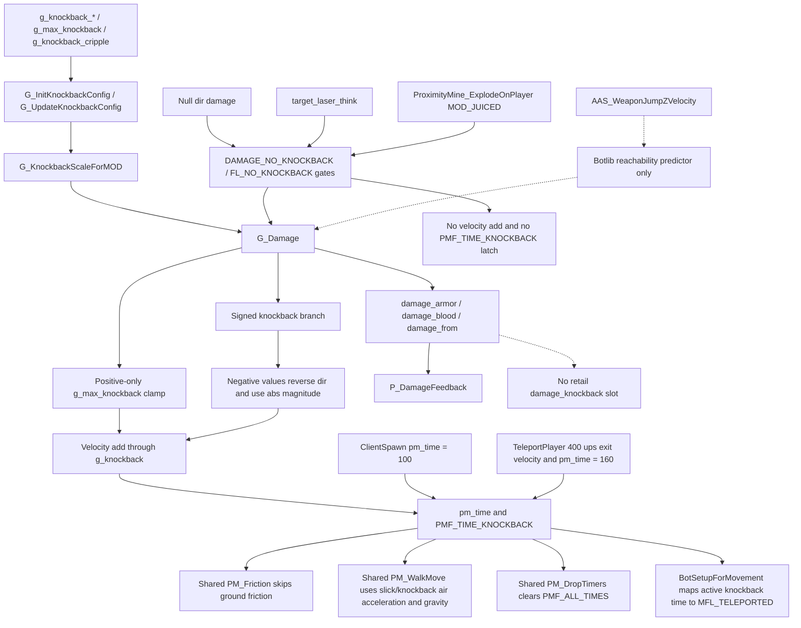

# Qagame Knockback Reconstruction - 2026-05-26

## Scope

This pass rechecked the retail qagame knockback path from damage application
through playerState movement blocking:

- `G_KnockbackScaleForMOD` at `0x10048A10`
- `G_Damage` at `0x10048C30`
- `ClientSpawn`, `TeleportPlayer`, `BotSetupForMovement`, `PM_Friction`,
  `PM_WalkMove`, and `PM_DropTimers` as the related playerstate producers,
  bot movement initializer, and shared pmove consumers of
  `PMF_TIME_KNOCKBACK`
- `target_laser_think`, `ProximityMine_ExplodeOnPlayer`, null-direction
  damage callers, and the fatal `FL_NO_KNOCKBACK` latch as the documented
  no-knockback producer and gate side of the graph
- the botlib weapon-jump predictor around `AAS_WeaponJumpZVelocity`, which is
  companion reachability wiring rather than the live gameplay damage path
- `P_DamageFeedback` and the `G_Damage` frame-feedback record adjacent to the
  velocity/timer side effects
- the retail knockback cvar rows for `g_knockback_*`, `g_max_knockback`,
  `g_knockback_z`, `g_knockback_z_self`, and `g_knockback_cripple`

## Evidence

Observed facts:

- `metadata.txt` identifies `qagamex86.dll` as the owning binary for the
  damage-side path; `functions.csv` carries `FUN_10048a10`,
  `FUN_10048b50`, `FUN_10048c00`, and `FUN_10048c30` in the same combat slab.
- Binary Ninja HLIL part02 shows `sub_10048A10` selecting per-MOD
  `g_knockback_%s` values, with explicit self-damage overrides for rocket and
  plasma.
- The `G_Damage` HLIL computes a signed integer knockback value, clamps only
  positive values against `data_105990ec` (`g_max_knockback`), then zeroes
  knockback for `FL_NO_KNOCKBACK` and `DAMAGE_NO_KNOCKBACK`.
- `G_Damage` turns a null `dir` argument into `DAMAGE_NO_KNOCKBACK` before the
  scale/clamp path, so crush, telefrag-style, and target-kill damage do not
  enter the velocity/timer branch.
- Negative knockback is not discarded: the retail branch negates the incoming
  damage direction, applies the absolute value to velocity through
  `data_1059a9a8` (`g_knockback`), and then uses the absolute magnitude for
  the `PMF_TIME_KNOCKBACK` timer.
- `g_knockback_cripple` is read only when the timer is newly latched. It acts
  as a minimum `pm_time` floor before the 200 ms cap, not as a crouch or low
  health velocity reduction.
- The `G_Damage` HLIL slice does not read `g_knockback_z` or
  `g_knockback_z_self`; those cvars are still present in the retail
  registration table, but no damage-path consumer is visible in the committed
  corpus.
- The shared pmove path consumes the server-written state in three places:
  `PM_Friction` skips normal grounded friction while `PMF_TIME_KNOCKBACK` is
  set, `PM_WalkMove` routes slick/knockback ground movement through
  `pm_airaccelerate` plus gravity, and `PM_DropTimers` clears
  `PMF_ALL_TIMES` when `pm_time` expires.
- `ClientSpawn` also seeds `PMF_TIME_KNOCKBACK` with `pm_time = 100` for the
  short spawn movement block. That path shares the same pmove consumer
  contract, but it is independent from damage-side knockback magnitude.
- `TeleportPlayer` seeds the same movement-blocking flag with `pm_time = 160`
  after applying the 400 ups exit velocity, so teleport launches share the
  pmove consumer contract without passing through `G_Damage`.
- `BotSetupForMovement` mirrors active `PMF_TIME_KNOCKBACK` plus positive
  `pm_time` into `MFL_TELEPORTED` before the waterjump branch, so bot movement
  setup treats knockback-blocked players as unable to make a normal grounded
  move decision until the shared timer expires.
- `target_laser_think` supplies `DAMAGE_NO_KNOCKBACK` with
  `MOD_TARGET_LASER`; `ProximityMine_ExplodeOnPlayer` uses the same flag for
  the `MOD_JUICED` invulnerability discharge. Those callers still apply
  damage and feedback, but intentionally do not write velocity or
  `PMF_TIME_KNOCKBACK`.
- The fatal damage tail sets `FL_NO_KNOCKBACK` only after the current
  knockback/self-damage path, preserving rocket-jump style impulse on the hit
  that caused the damage while blocking later impulses against the dead
  player.
- The engine-owned botlib helper `AAS_WeaponJumpZVelocity` is a separate AAS
  reachability estimator. It uses the 90 degree look-down trace, 500-unit
  shot distance, self-damage halving, `mass = 200`, and `1600 * knockback /
  mass` vertical velocity formula before adding `aassettings.phys_jumpvel`.
- Retail `G_Damage` stores the per-frame feedback record as armor total,
  blood total, and `damage_from` immediately afterward. The committed HLIL and
  Ghidra slices show no surviving `damage_knockback` feedback field or reset in
  `P_DamageFeedback`; that source member was inherited Quake III dead storage,
  not Quake Live retail state.

Inference:

- The safest source analogue keeps the cvar table and cached config entries for
  table/custom-setting parity, but limits `G_Damage` to the observed signed
  knockback, positive clamp, blocking gates, and timer-floor behavior.

## Wiring Map

The graph separates live gameplay knockback from two adjacent lanes that can
look similar in source: no-knockback damage producers still call `G_Damage`
but intentionally skip the velocity/timer side effects, while
`AAS_WeaponJumpZVelocity` predicts weapon-jump reachability for bot routing
without consuming the qagame knockback cvar cache.

## Source Reconstruction

- `src/code/game/g_combat.c` now preserves signed knockback. Negative values
  flip the direction and apply the absolute magnitude instead of being ignored.
- The applied velocity now uses the rounded integer magnitude that retail feeds
  into the velocity math and timer latch.
- `FL_NO_KNOCKBACK`, `DAMAGE_NO_KNOCKBACK`, and null-direction damage still
  zero the value before velocity or timer side effects.
- The non-retail vertical boost and crouch/low-health cripple reduction helpers
  were removed from `G_Damage`. `g_knockback_cripple` remains as the
  `PMF_TIME_KNOCKBACK` timer floor.
- `src/game/g_config.c` keeps the retail cvars registered and cached, with help
  text updated to match the observed damage-path usage.
- `src/code/game/bg_pmove.c` already matched the retail knockback-blocking
  consumer shape. The additional tests now pin the contract explicitly:
  no ground-friction drop while blocked, air-accelerate/gravity handling while
  walking under knockback time, and timer expiry through `PMF_ALL_TIMES`.
- `src/code/game/ai_dmq3.c` already matched the retail bot move setup
  contract by translating active knockback time into `MFL_TELEPORTED`; the
  symbol map and tests now pin that related wiring explicitly.
- `src/code/game/g_target.c` and `src/code/game/g_missile.c` already matched
  the retail no-knockback producer paths for target lasers and juiced prox
  discharge; the qagame symbol map and tests now call out those side doors
  explicitly.
- `src/code/botlib/be_aas_move.c` and `src/code/botlib/be_ai_move.c` already
  matched the mapped engine-owned botlib predictor and teleported-blocking
  behavior. The source sentinels now connect those retained botlib paths back
  to the knockback graph without conflating them with live `G_Damage` cvars.
- `src/code/game/g_local.h`, `src/code/game/g_combat.c`, and
  `src/code/game/g_active.c` now remove the stale `damage_knockback` feedback
  slot/write/reset. Damage view feedback remains driven by armor, blood,
  `damage_from`, and `damage_fromWorld`.
- The source-only `g_debugDamage` knockback summary print was removed after the
  HLIL/string corpus showed only the retail health/damage/armor debug print in
  `G_Damage`.

## Verification

Added/updated focused source sentinels in
`tests/test_game_weapon_parity.py` to pin:

- the signed negative knockback branch in HLIL and source,
- `PMF_TIME_KNOCKBACK` latching through `pm_flags | 0x40`,
- absence of `g_knockback_z` / `g_knockback_z_self` reads inside retail
  `G_Damage`,
- absence of the removed non-retail vertical/cripple helper path,
- `g_knockback_cripple` as timer-floor wiring.
- shared pmove consumption in `PM_Friction`, `PM_WalkMove`, and
  `PM_DropTimers`, plus the spawn-side and teleport-side
  `PMF_TIME_KNOCKBACK` seeds.
- bot-side move initialization through the `PMF_TIME_KNOCKBACK` to
  `MFL_TELEPORTED` bridge.
- target-laser and juiced-prox `DAMAGE_NO_KNOCKBACK` producers, null-direction
  blocking, and fatal `FL_NO_KNOCKBACK` ordering.
- the engine botlib `AAS_WeaponJumpZVelocity` predictor and teleported move
  suppression that sit beside the qagame gameplay path.
- absence of the inherited `damage_knockback` feedback slot and its stale
  write/reset around `G_Damage` and `P_DamageFeedback`.
- absence of the source-only knockback debug summary instrumentation that is
  not present in the retail string corpus.

Parity estimate for this scoped knockback application, movement-blocking, and
adjacent feedback lane: before **82%**, after **98%**. The remaining gap is
broader `G_Damage` control-flow parity outside knockback, not this signed
knockback seam.
